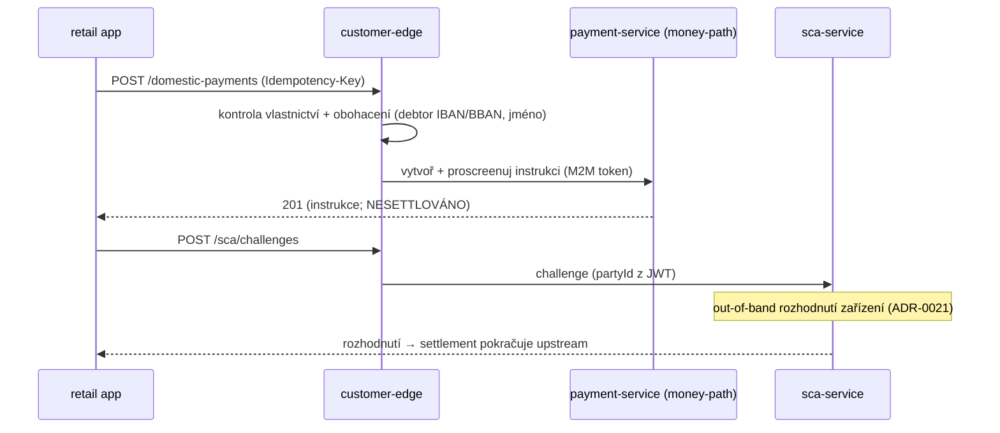

# Compliance

> **Money-path status:** `openbank-customer-edge` **NENÍ** v `rules.yaml: money_path_services`. Nedrží žádný peněžní stav a nehýbe penězi — platební cesty instrukci jen *vytvoří a proscreenují*; settlement je samostatný krok pod SCA v upstream platebních službách (ty money-path **jsou**). Edge je ale **internet-facing hranicí důvěry**, takže jeho bezpečnostní a datově-tokové kontroly jsou prvořadé.

## Regulatorní rámec

| Regulace | Vztah k této službě | Implementace |
|---|---|---|
| **PSD2** (Reg. (EU) 2015/2366) | Zákaznický přístup + SCA + iniciace plateb | dedikovaný zákaznický realm (ADR-0065); proxy registrace/challenge SCA (ADR-0021); KYC brána před vydáním IBANu |
| **SCA / RTS (čl. 97)** | Silné ověření zákazníka pro platby | cesty `/sca/*` proxují na sca-service (decoupled schválení zařízením, ADR-0021); pohyb peněz zůstává pod SCA |
| **AMLD / AML6D** | Žádný IBAN před KYC | `POST /onboarding/account` vynucuje party `status == ACTIVE` před přeposláním na account-service |
| **GDPR** | PII tranzituje edgem za letu | bezstavová (bez úložiště), IDOR ochrana vlastnictví, odpověď profilu je už zákaznicky bezpečná (bez AML/rodného čísla/risk polí) |
| **DORA** (Reg. (EU) 2022/2554) | Operační odolnost internet-facing vstupního bodu | health probey, explicitní timeouty, jeden sdílený connection pool, cache M2M tokenu, BuildInfo v `/api/v1/info` |
| **NIS2** | Síťová a informační bezpečnost | oddělení realmů, deny-by-default allow-list, oddělený management port (8085), připnutý issuer, mTLS in-cluster (Istio) |

## Kontroly hranice důvěry (ADR-0065)

Edge je jediná cesta z nedůvěryhodných retailových zařízení do flotily, takže koncentruje zákaznicko-stranové bezpečnostní kontroly:

- ✅ **Oddělení realmů** — validuje se příchozí JWT `openbank-customers`; token operátorského realmu se zákazníkovi nikdy nevystaví; edge razí vlastní M2M token (`UpstreamClient`).
- ✅ **Připnutý issuer** — `iss` se validuje vůči veřejnému KC hostu nezávisle na in-cluster URL pro fetch JWKS.
- ✅ **Deny-by-default allow-list** — existují jen cesty v této službě; cokoli jiného je 404.
- ✅ **Vynucení IDOR** — vlastnictví kontrolováno na edge pro cesty účet/zůstatek/transakce/výpis/platba; `partyId` injektován z JWT (nikdy z těla) pro device/challenge/otevření účtu; 403 (ne 404), aby se předešlo existenčnímu oraclu.
- ✅ **Minimalizace anonymní plochy** — neautentizovaný je jen `POST /onboarding/start`, izolovaný ve vlastní resource třídě.
- ✅ **Rate limiting per IP** na ingressu; hlubší bot/abuse hardening onboardingu je follow-up Fáze 2 ADR-0069.
- ✅ **Allow-listing vstupu** — výpisová `currency` (tvar ISO-4217) a `format` (CAMT_053/MT940/PDF) v allow-listu; `cursor` URL-enkódovaný proti injekci query parametrů.

## Mapování GDPR

### Role

Edge je **průchozí processor**: neukládá osobní data (viz [04 — Data](./04-data.md)). Controllery uložených záznamů jsou upstream služby (party, account, …).

### Právní základ (čl. 6)

- **Smlouva** (čl. 6 odst. 1 písm. b) — poskytování vlastních bankovních dat zákazníkovi a iniciace jeho plateb.
- **Právní povinnost** (čl. 6 odst. 1 písm. c) — KYC/AML brána před otevřením účtu; SCA pro platby.

### Práva subjektu údajů

| Právo | Aplikace na edge |
|---|---|
| Přístup (čl. 15) | `GET /privacy/gdpr-export` vrací kompletní export přístupu subjektu (party + KYC + karty, ADR-0118 §6); `GET /profile`, `GET /accounts`, … vrací tatáž data po částech (omezeno na party / vynuceno vlastnictví) |
| Oprava (čl. 16) | upstream (party-service) — edge profilová data neukládá |
| Výmaz (čl. 17) | upstream controllery; AMLD přebíjí kde aplikovatelné (10 let) — edge neukládá nic |
| Přenositelnost (čl. 20) | `GET /privacy/portability-export` — pouze data na základě souhlasu/smlouvy, IBANy protistran redigované dle čl. 20 odst. 4; přímý přenos dle čl. 20 odst. 2 se nenabízí (ADR-0204 D4) |
| Omezení / Námitka | upstream controllery; edge nedrží žádné záznamy |

### Datové toky

| Tok | Data | Controller |
|---|---|---|
| app → edge → account/balance/transaction/statement | accountId, IBAN, částky | tentýž controller (intra-OpenBank), M2M token + `X-Customer-Party-Id` |
| app → edge → party-service | legalName/email/phone/address/kycStatus | party-service |
| app → edge → platební služby | debtor/creditor IBAN/BBAN, částka, jména | platební služby |
| app → edge → sca-service | credentialId, veřejný klíč, podpis | sca-service |
| app → edge → notification-service | push token, metadata zařízení | notification-service |

Žádná data neopouští region EU/EHP. Edge nic z výše uvedeného neperzistuje.

## Mapování DORA (Reg. (EU) 2022/2554)

| Článek | Téma | Implementace |
|---|---|---|
| čl. 5 | Řízení ICT rizik | služba v centrálním registru; bezstavová, horizontálně škálovatelná |
| čl. 6 | Rámec ICT rizik | závislost = openbank-libs (centralizováno) |
| čl. 9 | Identifikace | `BuildInfo` (gitCommit, buildTime, version) v `/api/v1/info` |
| čl. 9/10 | Ochrana & detekce | explicitní connect/request timeouty, HTTP/1.1, sdílený pool; degradace na 502 pozorovatelná metrikami |
| čl. 11 | Odezva & obnova | bezstavová ⇒ restart je obnovou; runbooky v [05 — Provoz](./05-operations.md) |
| čl. 28 | Riziko třetích stran | žádné SaaS třetích stran — všechny upstreamy self-hosted; Keycloak self-hosted |

## SCA & platby (PSD2)

Edge platby neautorizuje ani nesettluje. Edge:

1. **Iniciuje** platební instrukci (`/domestic-payments`, `/sepa-payments`) — jen vytvoření + screening, žádný pohyb peněz.
2. **Proxuje SCA** — registrace zařízení a challenge/decision přes sca-service (ADR-0021, decoupled out-of-band schválení zařízením; žádné auto-approve).
3. Settlement iniciované platby je samostatný krok **pod SCA**, prováděný money-path platebními službami.

## Známé mezery / follow-upy

- ⚠️ **`getChallenge` není na edge kontrolován na vlastnictví** — neprůhledné id challenge, odpověď nenese žádná citlivá data kromě status/method/expires; sledováno v threat modelu.
- ⚠️ **OPA sidecar** — vlastnictví pro čtení účtu/zůstatku se nyní spoléhá na upstream omezení přes `X-Customer-Party-Id` plus edge ochranu; plné vynucení OPA je follow-up fleet sweepu ADR-0034 (ADR-0065 §3).
- ⚠️ **Hardening proti zneužití onboardingu** — proof-of-work / brána ověření e-mailem na anonymním `POST /onboarding/start` je follow-up Fáze 2 ADR-0069; rate limiting per IP na ingressu je současnou první linií obrany.
- ⚠️ **Self-creation Keycloak uživatele** — Fáze 1 vytváří KC uživatele operátorským/seed krokem; auto-creation z `POST /onboarding/start` je Fáze 2 ADR-0069.

## Threat model

Edge **není** money-path, takže brána 2 schválení + povinný threat model (`rules.yaml`) ho nezavazuje. Vzhledem k jeho pozici internet-facing hranice důvěry je threat model pod `docs/threat-models/` přesto doporučen; zdroj už jeden zmiňuje pro follow-upy `getChallenge` a OPA.
