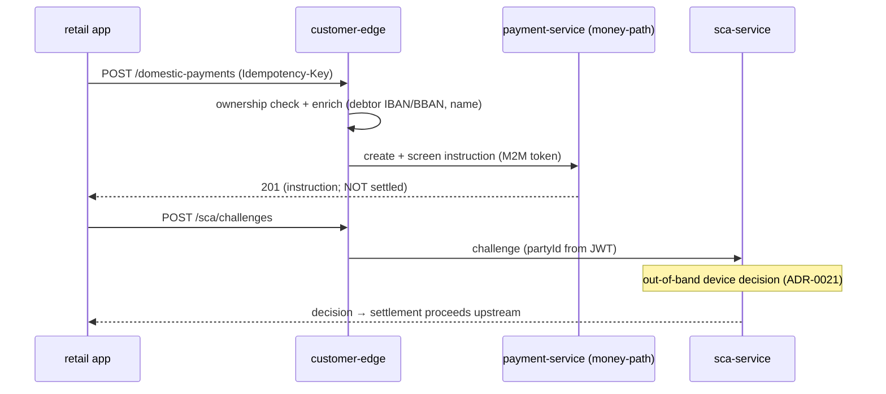

# Compliance

> **Money-path status:** `openbank-customer-edge` is **NOT** in `rules.yaml: money_path_services`. It holds no money state and moves no money — payment routes only *create and screen* an instruction; settlement is a separate, SCA-gated step in the upstream payment services (which **are** money-path). The edge is, however, the **internet-facing trust boundary**, so its security and data-flow controls are first-class.

## Regulatory framework

| Regulation | Relation to this service | Implementation |
|---|---|---|
| **PSD2** (Reg. (EU) 2015/2366) | Customer-facing access + SCA + payment initiation | dedicated customer realm (ADR-0065); SCA enrolment/challenge proxy (ADR-0021); KYC gate before IBAN issuance |
| **SCA / RTS (Art. 97)** | Strong customer authentication for payments | `/sca/*` routes proxy to sca-service (decoupled device approval, ADR-0021); money movement stays SCA-gated |
| **AMLD / AML6D** | No IBAN before KYC | `POST /onboarding/account` enforces party `status == ACTIVE` before forwarding to account-service |
| **GDPR** | PII transits the edge in flight | stateless (no storage), IDOR ownership guard, profile response is already customer-safe (no AML/national-id/risk fields) |
| **DORA** (Reg. (EU) 2022/2554) | Operational resilience of an internet-facing entry point | health probes, explicit timeouts, single shared connection pool, M2M token caching, BuildInfo in `/api/v1/info` |
| **NIS2** | Network & info security | realm separation, deny-by-default allow-list, separate management port (8085), pinned issuer, mTLS in-cluster (Istio) |

## Trust-boundary controls (ADR-0065)

The edge is the only path from untrusted retail devices to the fleet, so it concentrates the customer-side security controls:

- ✅ **Realm separation** — inbound `openbank-customers` JWT validated; the operator-realm token is never exposed to the customer; the edge mints its own M2M token (`UpstreamClient`).
- ✅ **Pinned issuer** — `iss` validated against the public KC host independently of the in-cluster JWKS-fetch URL.
- ✅ **Deny-by-default allow-list** — only the routes in this service exist; anything else is 404.
- ✅ **IDOR enforcement** — ownership checked at the edge for account/balance/transaction/statement/payment routes; `partyId` injected from the JWT (never the body) for device/challenge/account-open; 403 (not 404) to avoid an existence oracle.
- ✅ **Anonymous surface minimised** — only `POST /onboarding/start` is unauthenticated, isolated in its own resource class.
- ✅ **Per-IP rate limiting** at the ingress; deeper bot/abuse hardening on onboarding is an ADR-0069 Phase 2 follow-up.
- ✅ **Input allow-listing** — statement `currency` (ISO-4217 shape) and `format` (CAMT_053/MT940/PDF) allow-listed; `cursor` URL-encoded to prevent query-param injection.

## GDPR mapping

### Role

The edge is a **processor pass-through**: it does not store personal data (see [04 — Data](./04-data.md)). The controllers of the stored records are the upstream services (party, account, …).

### Lawful basis (Art. 6)

- **Contract** (Art. 6(1)(b)) — serving the customer their own banking data and initiating their payments.
- **Legal obligation** (Art. 6(1)(c)) — the KYC/AML gate before account opening; SCA for payments.

### Data subject rights

| Right | Application at the edge |
|---|---|
| Access (Art. 15) | `GET /privacy/gdpr-export` returns the full subject-access export (party + KYC + cards, ADR-0118 §6); `GET /profile`, `GET /accounts`, … return the same data piecemeal (party-scoped / ownership-enforced) |
| Rectification (Art. 16) | upstream (party-service) — the edge does not store profile data |
| Erasure (Art. 17) | upstream controllers; AMLD overrides where applicable (10 years) — the edge stores nothing |
| Portability (Art. 20) | `GET /privacy/portability-export` — consent/contract-basis data only, counterparty IBANs redacted per Art. 20(4); Art. 20(2) direct transmission not offered (ADR-0204 D4) |
| Restriction / Object | upstream controllers; the edge holds no records |

### Data flows

| Flow | Data | Controller |
|---|---|---|
| app → edge → account/balance/transaction/statement | accountId, IBAN, amounts | same controller (intra-OpenBank), M2M token + `X-Customer-Party-Id` |
| app → edge → party-service | legalName/email/phone/address/kycStatus | party-service |
| app → edge → payment services | debtor/creditor IBAN/BBAN, amount, names | payment services |
| app → edge → sca-service | credentialId, public key, signature | sca-service |
| app → edge → notification-service | push token, device metadata | notification-service |

No data leaves the EU/EEA region. The edge persists none of the above.

## DORA mapping (Reg. (EU) 2022/2554)

| Article | Topic | Implementation |
|---|---|---|
| Art. 5 | ICT risk management | service in the central register; stateless, horizontally scalable |
| Art. 6 | ICT risk framework | dependency = openbank-libs (centralised) |
| Art. 9 | Identification | `BuildInfo` (gitCommit, buildTime, version) in `/api/v1/info` |
| Art. 9/10 | Protection & detection | explicit connect/request timeouts, HTTP/1.1, shared pool; 502 degradation observable via metrics |
| Art. 11 | Response & recovery | stateless ⇒ restart is recovery; runbooks in [05 — Operations](./05-operations.md) |
| Art. 28 | Third-party risk | no third-party SaaS — all upstreams self-hosted; Keycloak self-hosted |

## SCA & payments (PSD2)

The edge does not authorise or settle payments. It:

1. **Initiates** a payment instruction (`/domestic-payments`, `/sepa-payments`) — creation + screening only, no money movement.
2. **Proxies SCA** — device enrolment and challenge/decision via sca-service (ADR-0021, decoupled out-of-band device approval; no auto-approve).
3. Settlement of an initiated payment is a separate, **SCA-gated** step performed by the money-path payment services.

## Known gaps / follow-ups

- ⚠️ **`getChallenge` not ownership-checked at the edge** — opaque challenge id, response carries no sensitive data beyond status/method/expires; tracked in the threat model.
- ⚠️ **OPA sidecar** — ownership for account/balance reads currently relies on upstream scoping by `X-Customer-Party-Id` plus the edge guard; full OPA enforcement is an ADR-0034 fleet-sweep follow-up (ADR-0065 §3).
- ⚠️ **Onboarding abuse hardening** — proof-of-work / email-verification gate on the anonymous `POST /onboarding/start` is an ADR-0069 Phase 2 follow-up; per-IP ingress rate limiting is the current first line of defence.
- ⚠️ **Keycloak user self-creation** — Phase 1 creates the KC user via an operator/seed step; auto-creation from `POST /onboarding/start` is ADR-0069 Phase 2.

## Threat model

The edge is **not** money-path, so the 2-approval + mandatory threat-model gate (`rules.yaml`) does not bind it. Given its position as the internet-facing trust boundary, a threat model under `docs/threat-models/` is nonetheless recommended; the source already references one for the `getChallenge` and OPA follow-ups.
