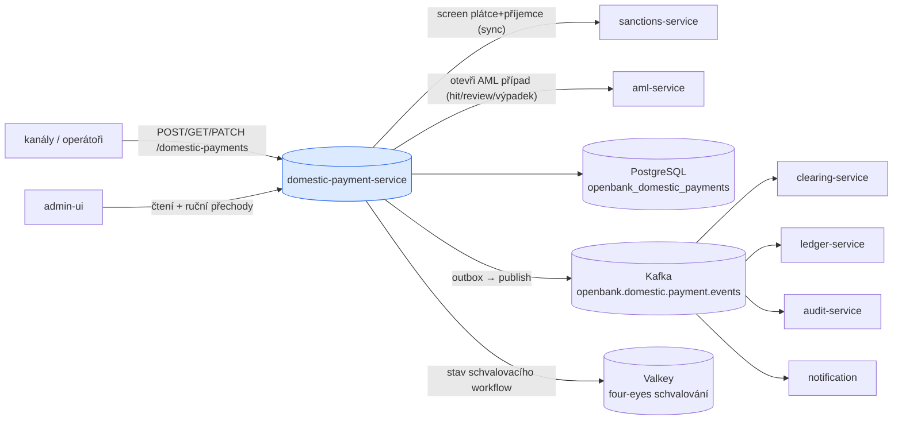
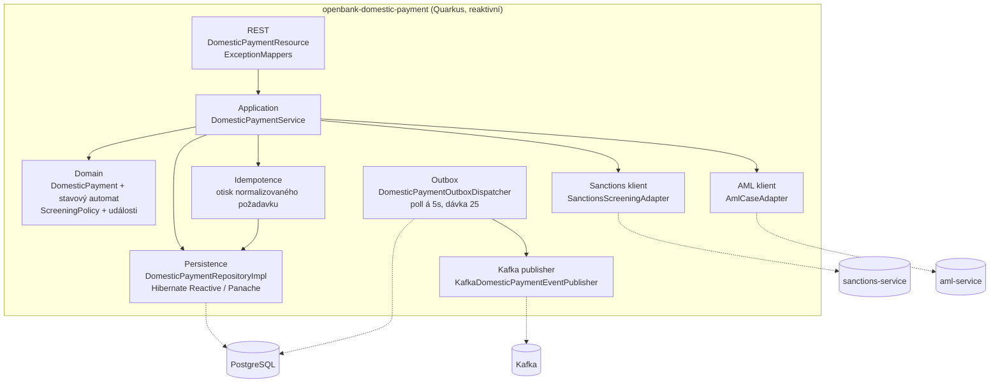
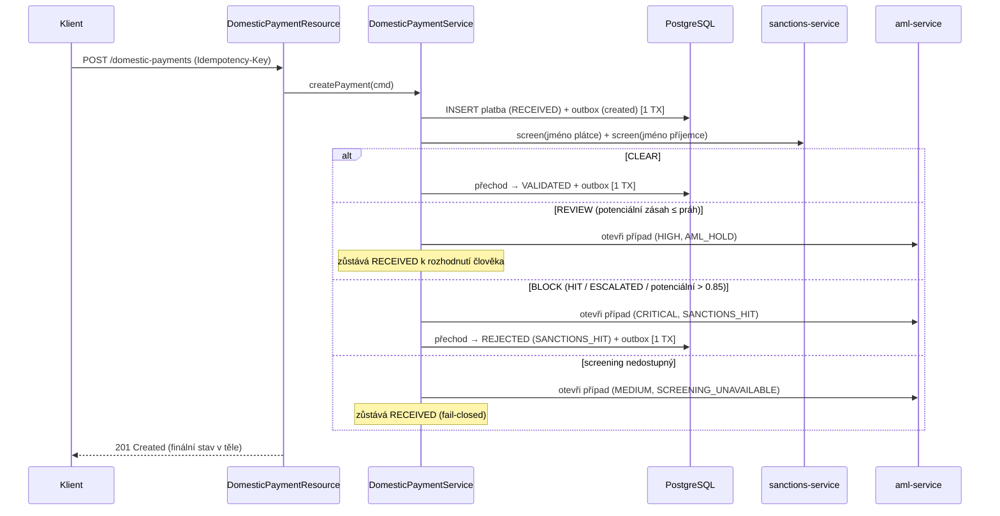
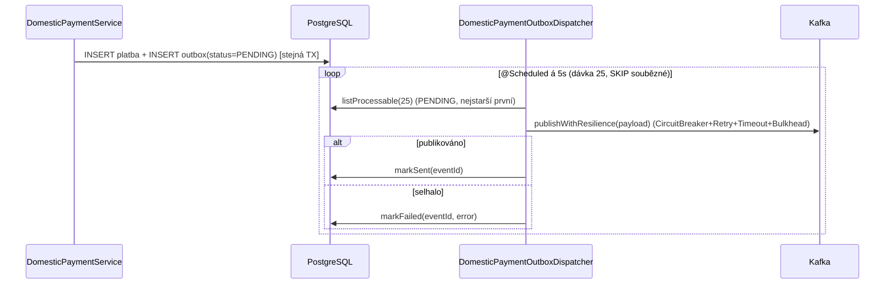

# Architektura

## C4 — Systémový kontext



## C4 — Kontejner (vnitřní struktura)



## Hexagonální vrstvy

Struktura balíčků odráží **ports-and-adapters** (ADR-0002):

```
com.openbank.domestic/
├── domain/                    ◄── jádro — bez závislostí na frameworku
│   ├── model/                 DomesticPayment, enumy stav / priorita / scope / důvod zamítnutí,
│   │                          transitionTo() + canTransitionTo() (stavový automat)
│   ├── event/                 DomesticPaymentCreatedEvent, DomesticPaymentStatusChangedEvent
│   └── screening/             ScreeningPolicy (čisté rozhodnutí), ScreeningResult, ScreeningDecision
│
├── application/               ◄── orchestrace use-case
│   ├── port/in/               DomesticPaymentUseCase + příkazy / dotazy
│   ├── port/out/              DomesticPaymentRepository, OutboxRepository, EventPublisher,
│   │                          SanctionsScreeningPort, AmlCasePort
│   └── usecase/               DomesticPaymentService (založení → persist → screening → přechod)
│
└── infrastructure/            ◄── adaptéry
    ├── rest/                  DomesticPaymentResource, DTO, ExceptionMappers
    ├── persistence/           implementace repository, JPA entity, mappery
    ├── outbox/                DomesticPaymentOutboxDispatcher (scheduled, fault-tolerant)
    ├── kafka/                 KafkaDomesticPaymentEventPublisher
    ├── approval/              ApprovalConfig (pouze four-eyes workflow v Redisu)
    ├── client/               SanctionsServiceClient + adaptér, AmlServiceClient + adaptér
    └── authz/                AuthzProducer (OPA, ADR-0034)
```

**Pravidlo závislostí:** `domain` ← `application` ← `infrastructure`. Doména nikdy neimportuje balíček sanctions-service — `ScreeningMatchStatus` je lokální zrcadlový enum; adaptér mapuje vzdálený stav na něj.

## Screeningová brána (ADR-0032)

Screening je první krok zpracování a běží synchronně, **až poté**, co je řádek `RECEIVED` trvale uložen, takže platba se nikdy neztratí, pokud screening následně selže:



`ScreeningPolicy.decide()` je čistá funkce: **BLOCK** dominuje **REVIEW** dominuje **CLEAR**. BLOCK = jakýkoliv `HIT`/`ESCALATED` nebo `POTENTIAL_HIT` striktně nad `POTENTIAL_HIT_BLOCK_THRESHOLD` (0.85); REVIEW = jakýkoliv jiný `POTENTIAL_HIT`; CLEAR = `CLEAR`/`WHITELISTED` nebo prázdné. Otevření AML případu je best-effort — výpadek úložiště případů nesmí změnit screeningový verdikt.

## Outbox tok



**Proč outbox:** transakční konzistence mezi zápisem do DB a publikací do Kafky. Doručení at-least-once; konzumenti musí být idempotentní. Volání publish je obalené MicroProfile fault-tolerance (`@CircuitBreaker`, `@Retry`, `@Timeout`, `@Bulkhead`).

## Klíčové porty (application/port/out)

| Port | Odpovědnost |
|---|---|
| `DomesticPaymentRepository` | persist/find/list plateb; `save`/`update` přijímají outbox zprávu, takže řádek a událost commitnou atomicky |
| `DomesticPaymentOutboxRepository` | drénování outboxu — `listProcessable`, `markSent`, `markFailed` |
| `DomesticPaymentEventPublisher` | serializace payloadů `created`/`status-changed` při zápisu; `publish` je transportní volání při drénování |
| `SanctionsScreeningPort` | screening jména; vyhazuje `ScreeningUnavailableException`, když je sanctions-service nedostupná (→ fail-closed) |
| `AmlCasePort` | otevření AML případu (úroveň rizika + kód alertu + matched entity) |

## Komponenty z `openbank-libs`

| Modul | Použití zde |
|---|---|
| `libs.persistence.outbox` | konvence outbox entity/repository |
| `libs.api.error.ApiError` / `ErrorCode` | jednotná chybová obálka (404 NOT_FOUND, 409 CONFLICT) |
| `libs.authz.@Authorize` | OPA autorizace při přechodu stavu (ADR-0034) |
| `libs.web.ServiceInfoResource` | `/api/v1/info` build metadata |
| `libs.docs.DocsResource` | **tato dokumentace** (`/q/openbank/docs`) |

## Principy

1. **Hranice agregátu = DomesticPayment** — stavový automat (`transitionTo`/`canTransitionTo`) je jediná legální cesta mutace.
2. **Persist před screeningem** — řádek `RECEIVED` + outbox jsou commitnuty před synchronním screeningovým voláním, takže platba se nikdy neztratí.
3. **Fail closed** — výpadek sanctions-service drží platbu v `RECEIVED`; nikdy se automaticky neuvolní.
4. **Žádné vzdálené volání uvnitř perzistenční transakce** — screening a volání AML případu probíhají mezi transakcemi.
5. **Trvalá idempotence svázaná s aktérem** — `Idempotency-Key` je povinný; Postgres uloží otisk normalizovaného požadavku atomicky s platbou/outboxem, přesný replay vrátí tento řádek a odlišný požadavek skončí 409.
