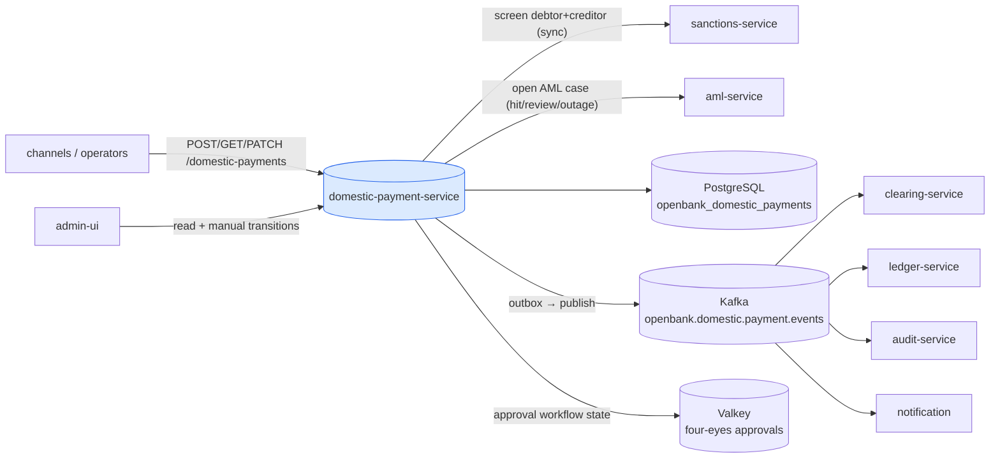
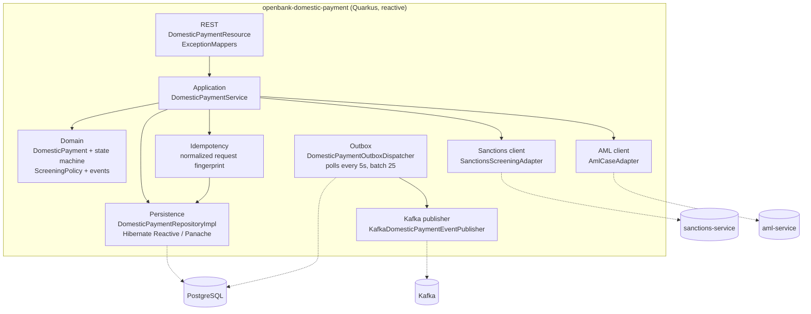
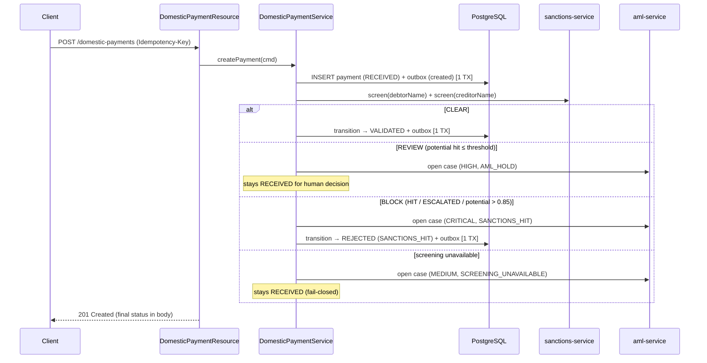
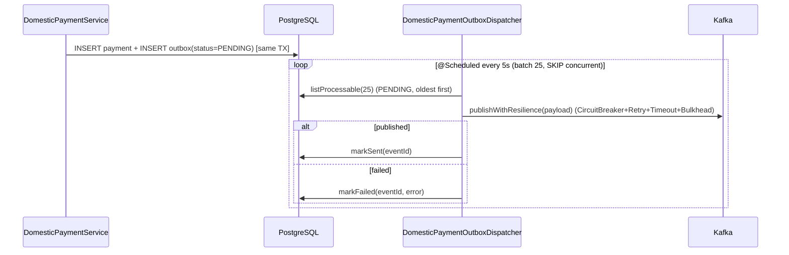

# Architecture

## C4 — System Context



## C4 — Container (internal structure)



## Hexagonal layers

The package structure reflects **ports-and-adapters** (ADR-0002):

```
com.openbank.domestic/
├── domain/                    ◄── core — no framework dependencies
│   ├── model/                 DomesticPayment, status / priority / scope / reject enums,
│   │                          transitionTo() + canTransitionTo() (the state machine)
│   ├── event/                 DomesticPaymentCreatedEvent, DomesticPaymentStatusChangedEvent
│   └── screening/             ScreeningPolicy (pure decision), ScreeningResult, ScreeningDecision
│
├── application/               ◄── use-case orchestration
│   ├── port/in/               DomesticPaymentUseCase + commands / queries
│   ├── port/out/              DomesticPaymentRepository, OutboxRepository, EventPublisher,
│   │                          SanctionsScreeningPort, AmlCasePort
│   └── usecase/               DomesticPaymentService (create → persist → screen → transition)
│
└── infrastructure/            ◄── adapters
    ├── rest/                  DomesticPaymentResource, DTOs, ExceptionMappers
    ├── persistence/           repository impls, JPA entities, mappers
    ├── outbox/                DomesticPaymentOutboxDispatcher (scheduled, fault-tolerant)
    ├── kafka/                 KafkaDomesticPaymentEventPublisher
    ├── approval/              ApprovalConfig (Redis-backed four-eyes workflow only)
    ├── client/               SanctionsServiceClient + adapter, AmlServiceClient + adapter
    └── authz/                AuthzProducer (OPA, ADR-0034)
```

**Dependency rule:** `domain` ← `application` ← `infrastructure`. The domain never imports the sanctions-service package — `ScreeningMatchStatus` is a local mirror enum; the adapter maps the remote status onto it.

## The screening gate (ADR-0032)

Screening is the first processing step and runs synchronously, **after** the `RECEIVED` row is durably persisted so the payment is never lost if screening then fails:



`ScreeningPolicy.decide()` is a pure function: **BLOCK** dominates **REVIEW** dominates **CLEAR**. BLOCK = any `HIT`/`ESCALATED` or a `POTENTIAL_HIT` strictly above `POTENTIAL_HIT_BLOCK_THRESHOLD` (0.85); REVIEW = any other `POTENTIAL_HIT`; CLEAR = `CLEAR`/`WHITELISTED` or empty. Opening the AML case is best-effort — a case-store outage must not flip the screening verdict.

## Outbox flow



**Why outbox:** transactional consistency between the DB write and the Kafka publish. At-least-once delivery; consumers must be idempotent. The publish call is wrapped in MicroProfile fault-tolerance (`@CircuitBreaker`, `@Retry`, `@Timeout`, `@Bulkhead`).

## Key ports (application/port/out)

| Port | Responsibility |
|---|---|
| `DomesticPaymentRepository` | persist/find/list payments; `save`/`update` take the outbox message so the row and event commit atomically |
| `DomesticPaymentOutboxRepository` | drain the outbox — `listProcessable`, `markSent`, `markFailed` |
| `DomesticPaymentEventPublisher` | serialize `created`/`status-changed` payloads at write time; `publish` is the transport call at drain time |
| `SanctionsScreeningPort` | screen a name; throws `ScreeningUnavailableException` when the sanctions service is unreachable (→ fail-closed) |
| `AmlCasePort` | open an AML case (risk level + alert code + matched entity) |

## Components from `openbank-libs`

| Module | Use here |
|---|---|
| `libs.persistence.outbox` | outbox entity/repository conventions |
| `libs.api.error.ApiError` / `ErrorCode` | unified error envelope (404 NOT_FOUND, 409 CONFLICT) |
| `libs.authz.@Authorize` | OPA-backed authorization on status transition (ADR-0034) |
| `libs.web.ServiceInfoResource` | `/api/v1/info` build metadata |
| `libs.docs.DocsResource` | **this documentation** (`/q/openbank/docs`) |

## Principles

1. **Aggregate boundary = DomesticPayment** — the status state machine (`transitionTo`/`canTransitionTo`) is the only legal mutation path.
2. **Persist before screen** — the `RECEIVED` row + outbox are committed before the synchronous screening call, so a payment is never lost.
3. **Fail closed** — a sanctions-service outage holds the payment in `RECEIVED`; it is never auto-released.
4. **No remote call inside the persistence transaction** — screening and AML-case calls happen between transactions.
5. **Durable, actor-bound idempotency** — `Idempotency-Key` is mandatory; Postgres stores its normalized request fingerprint atomically with the payment/outbox, exact replays return that row, and mismatches fail with 409.
