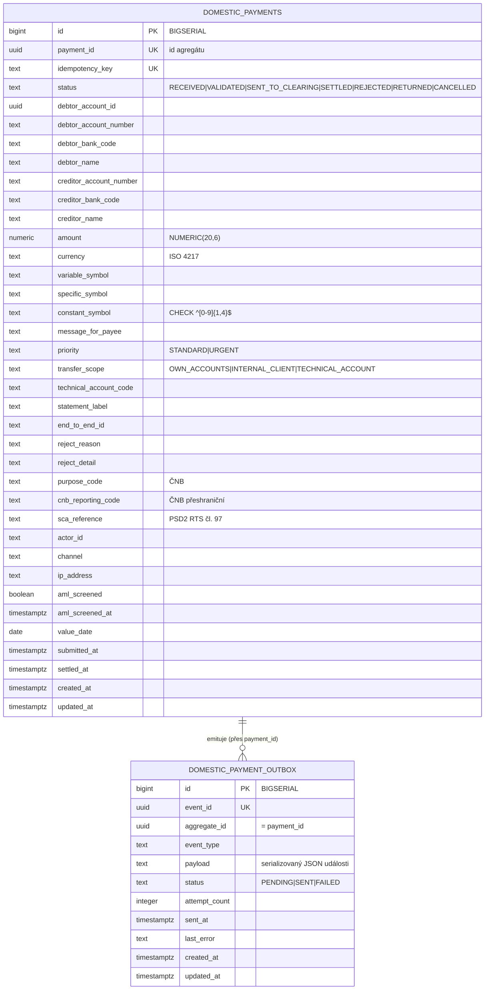

# Data

## Schéma

Dedikovaná PostgreSQL databáze `openbank_domestic_payments` (reaktivní PG klient + JDBC pro Flyway). Governance manifest ([`governance.yaml`](../../../../governance.yaml)) deklaruje logické jméno schématu `domestic_schema`, klasifikaci dat `confidential`, retenci `7 let`, lineage roli `both`.

> Hibernate Reactive + Panache alokují id ze sekvence `<table>_seq` (allocationSize 50); sloupce `BIGSERIAL` vytvořily jen `<table>_id_seq`, proto `V5` přidává `domestic_payments_seq` a `domestic_payment_outbox_seq` (`INCREMENT BY 50`) — bez nich by každý INSERT za běhu selhal.

## Migrace

Flyway, immutable forward-only skripty (`migrate-at-start: true`):

| Skript | Co dělá |
|---|---|
| `V1__create_domestic_payments.sql` | tabulka `domestic_payments` + indexy (status, debtor_account_id, created_at) |
| `V2__compliance_fields.sql` | ČNB / české platební compliance sloupce (purpose_code, cnb_reporting_code, sca_reference, actor_id, channel, ip_address, aml_screened/_at, value_date) + CHECK na `constant_symbol` + parciální indexy |
| `V3__create_domestic_payment_outbox.sql` | tabulka `domestic_payment_outbox` + indexy (status+created_at, aggregate_id) |
| `V4__transfer_scope_and_technical_account_code.sql` | `transfer_scope` (NOT NULL default `INTERNAL_CLIENT`) + `technical_account_code` |
| `V5__hibernate_sequences.sql` | `domestic_payments_seq`, `domestic_payment_outbox_seq` (`INCREMENT BY 50`). **Rollback:** `DROP SEQUENCE domestic_payments_seq, domestic_payment_outbox_seq;` |

> Nikdy nepřepisuj aplikovanou migraci (checksum mismatch → pád startu); `QUARKUS_FLYWAY_REPAIR_AT_START=true` použij jen jako dočasnou nápravu.

## Indexy

- `domestic_payments(payment_id)` UNIQUE — lookup podle id agregátu
- `domestic_payments(idempotency_key)` UNIQUE — deduplikace při založení
- `domestic_payments(status)` — výpis podle stavu
- `domestic_payments(debtor_account_id)` — výpis podle plátce
- `domestic_payments(created_at DESC)` — výpis nejnovějších první
- `domestic_payments(actor_id) WHERE actor_id IS NOT NULL` — parciální
- `domestic_payments(aml_screened) WHERE aml_screened = FALSE` — parciální, fronta screeningu
- `domestic_payments(cnb_reporting_code) WHERE cnb_reporting_code IS NOT NULL` — parciální, ČNB reporting
- `domestic_payment_outbox(status, created_at ASC)` — poll dispatcheru (PENDING nejstarší první)
- `domestic_payment_outbox(aggregate_id)` — trace událostí na platbu

## Retence

| Tabulka | Retence | Důvod |
|---|---|---|
| `domestic_payments` | 7 let (governance manifest) — pozn. AMLD-6 vyžaduje 10 let pro AML-relevantní záznamy; sladit v compliance review | bankovní právo, AML, audit |
| `domestic_payment_outbox` | krátkodobě po `SENT` (okno pro troubleshooting / replay) | transakční outbox je provozní, ne zdroj pravdy |

## PII pole (GDPR)

| Pole | Klasifikace | Poznámky |
|---|---|---|
| `debtor_name`, `creditor_name` | PII (přímý identifikátor) — zároveň screenované subjekty | screenováno proti sankčním seznamům; maskovat v logu |
| `debtor_account_number`, `creditor_account_number`, `*_bank_code` | PII (finanční identifikátor) | maskovat v logu |
| `ip_address` | PII (online identifikátor) | zachyceno pro fraud/audit (kontext kanálu) |
| `actor_id`, `sca_reference` | pseudonymizované reference | nezobrazovat v plaintextu |
| `amount`, `currency`, symboly, `purpose_code`, `cnb_reporting_code` | non-PII transakční data | — |

GDPR **právo na výmaz** se nevztahuje na zúčtované platební záznamy — AML record-keeping má přednost; viz [06 — Compliance](./06-compliance.md).
