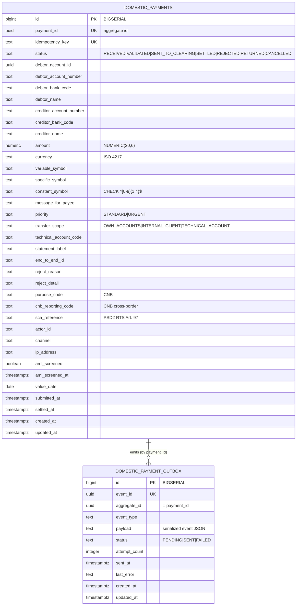

# Data

## Schema

Dedicated PostgreSQL database `openbank_domestic_payments` (reactive PG client + JDBC for Flyway). The governance manifest ([`governance.yaml`](../../../../governance.yaml)) declares the logical schema name `domestic_schema`, data classification `confidential`, retention `7 years`, lineage role `both`.

> Hibernate Reactive + Panache allocate ids from a sequence `<table>_seq` (allocationSize 50); the `BIGSERIAL` columns only created `<table>_id_seq`, so `V5` adds `domestic_payments_seq` and `domestic_payment_outbox_seq` (`INCREMENT BY 50`) — without them every INSERT would fail at runtime.

## Migrations

Flyway, immutable forward-only scripts (`migrate-at-start: true`):

| Script | What it does |
|---|---|
| `V1__create_domestic_payments.sql` | `domestic_payments` table + indexes (status, debtor_account_id, created_at) |
| `V2__compliance_fields.sql` | CNB / Czech-payment compliance columns (purpose_code, cnb_reporting_code, sca_reference, actor_id, channel, ip_address, aml_screened/_at, value_date) + `constant_symbol` CHECK + partial indexes |
| `V3__create_domestic_payment_outbox.sql` | `domestic_payment_outbox` table + indexes (status+created_at, aggregate_id) |
| `V4__transfer_scope_and_technical_account_code.sql` | `transfer_scope` (NOT NULL default `INTERNAL_CLIENT`) + `technical_account_code` |
| `V5__hibernate_sequences.sql` | `domestic_payments_seq`, `domestic_payment_outbox_seq` (`INCREMENT BY 50`). **Rollback:** `DROP SEQUENCE domestic_payments_seq, domestic_payment_outbox_seq;` |

> Never rewrite an applied migration (checksum mismatch → startup fail); use `QUARKUS_FLYWAY_REPAIR_AT_START=true` only as a transient remedy.

## Indexes

- `domestic_payments(payment_id)` UNIQUE — lookup by aggregate id
- `domestic_payments(idempotency_key)` UNIQUE — create-time dedupe
- `domestic_payments(status)` — list-by-status
- `domestic_payments(debtor_account_id)` — list-by-debtor
- `domestic_payments(created_at DESC)` — recent-first listing
- `domestic_payments(actor_id) WHERE actor_id IS NOT NULL` — partial
- `domestic_payments(aml_screened) WHERE aml_screened = FALSE` — partial, screening backlog
- `domestic_payments(cnb_reporting_code) WHERE cnb_reporting_code IS NOT NULL` — partial, CNB reporting
- `domestic_payment_outbox(status, created_at ASC)` — dispatcher poll (PENDING oldest first)
- `domestic_payment_outbox(aggregate_id)` — per-payment event trace

## Retention

| Table | Retention | Reason |
|---|---|---|
| `domestic_payments` | 7 years (governance manifest) — note AMLD-6 mandates 10y for AML-relevant records; reconcile in compliance review | banking law, AML, audit |
| `domestic_payment_outbox` | short-lived after `SENT` (troubleshooting / replay window) | transactional outbox is operational, not a record of truth |

## PII fields (GDPR)

| Field | Classification | Notes |
|---|---|---|
| `debtor_name`, `creditor_name` | PII (direct identifier) — also the screened subjects | screened against sanctions lists; mask in logs |
| `debtor_account_number`, `creditor_account_number`, `*_bank_code` | PII (financial identifier) | mask in logs |
| `ip_address` | PII (online identifier) | captured for fraud/audit (channel context) |
| `actor_id`, `sca_reference` | pseudonymized references | not displayed in plaintext |
| `amount`, `currency`, symbols, `purpose_code`, `cnb_reporting_code` | non-PII transaction data | — |

GDPR **right to erasure** does not apply to settled payment records — AML record-keeping overrides it; see [06 — Compliance](./06-compliance.md).
