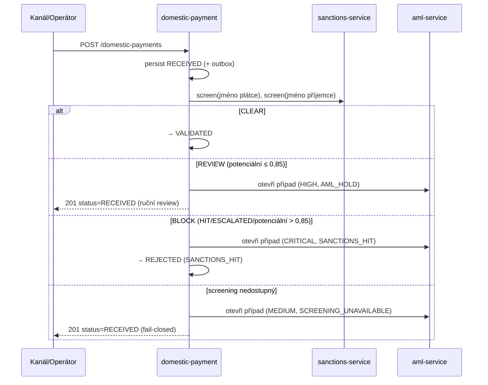

# Compliance

Toto je **money-path** služba ([`rules.yaml: money_path_services`](../../../../openbank-libs/governance/rules.yaml)). Iniciuje převod hodnoty příjemci — primární cíl podvodů a obcházení sankcí. Změny vyžadují 2 schválení + threat model ([`docs/threat-models/openbank-domestic-payment.md`](../../../../docs/threat-models/openbank-domestic-payment.md), STRIDE/DFD dle ADR-0030).

## Regulatorní rámec

| Regulace | Vztah ke službě | Implementace |
|---|---|---|
| **AMLD** (směrnice proti praní špinavých peněz) | Každá platba je screenována; zásahy/potenciály otevírají AML případ | synchronní sankční screening při založení ([ADR-0032](../../../../docs/adr/0032-synchronous-sanctions-aml-screening-gate-in-payment-execution.md)); `AmlCasePort` otevírá případy (`SANCTIONS_HIT` / `AML_HOLD` / `SCREENING_UNAVAILABLE`); sloupce `aml_screened`/`aml_screened_at` |
| **EU/UN/OFAC sankce** | Jméno plátce + příjemce screenováno před uvolněním | `SanctionsScreeningPort` → sanctions-service; BLOCK práh `ScreeningPolicy` zrcadlí `isHighRisk` sanctions-service (0,85); **fail-closed** při výpadku |
| **PSD2** (nař. (EU) 2015/2366) | Iniciace platby; SCA očekáváno výše u zákaznicky iniciovaných plateb | zaznamenává se `sca_reference` (PSD2 RTS čl. 97); SCA provádí `sca-service` ([ADR-0021](../../../../docs/adr/0021-sca-decoupled-device-approval-no-auto-approve.md)) |
| **GDPR** | Jména plátce/příjemce + čísla účtů + IP jsou PII | maskování v logu, klasifikace `confidential`, retenční politika, intra-OpenBank správce |
| **DORA** (nař. (EU) 2022/2554) | Provozní odolnost platební cesty | health probes, circuit breaker/retry/timeout, outbox, audit události, T0 always-on tier, SLO + runbooky |
| **NIS2** | Síťová a informační bezpečnost | mTLS v clusteru, OIDC, OPA authz, security hlavičky (CSP/HSTS/X-Frame-Options), audit log |
| **ČNB / český platební systém** | CZ-specifické rails | CHECK na konstantní symbol (`^[0-9]{1,4}$`), `cnb_reporting_code`, `purpose_code`, variabilní/specifický/konstantní symboly, kódy bank |

## GDPR mapování

### Právní základ (čl. 6)

- **Smlouva** (čl. 6(1)(b)) — provedení platební instrukce je nezbytné pro plnění smlouvy o platebních službách.
- **Právní povinnost** (čl. 6(1)(c)) — AML screening, AML uchovávání záznamů, ČNB reporting.

### Práva subjektu údajů

| Právo | Aplikace |
|---|---|
| Přístup (čl. 15) | `GET /api/v1/domestic-payments?debtorAccountId=...` vrací platby subjektu |
| Oprava (čl. 16) | platební instrukce je po přijetí neměnná; opravy se dělají novou platbou / přechodem stavu (auditováno) |
| Výmaz (čl. 17) | **Neaplikuje se** na zúčtované platební záznamy — AML uchovávání záznamů má přednost |
| Omezení (čl. 18) | platbu lze držet v `RECEIVED` / `REJECTED` do AML rozhodnutí |
| Přenositelnost (čl. 20) | N/A (platební záznamy nejsou uživatelem poskytnutá přenositelná data) |
| Námitka (čl. 21) | N/A (žádné marketingové zpracování) |

### Toky dat ven

- → **sanctions-service** (sync REST): **jména** plátce + příjemce ke screeningu — stejný správce, intra-OpenBank.
- → **aml-service** (sync REST): id platby, účet plátce, reference zákazníka, kód alertu, matched entity — stejný správce.
- → **clearing-service / ledger-service / audit-service / notification** (Kafka `openbank.domestic.payment.events`): události životního cyklu platby — stejný správce.

Žádná data neopouští region EU/EHP.

### Retence (čl. 5(1)(e))

| Záznam | Retence | Pozn. |
|---|---|---|
| `domestic_payments` | 7 let (governance manifest) | AMLD-6 vyžaduje 10 let pro AML-relevantní záznamy — sladit hodnotu manifestu v compliance review (označeno jako TBD) |
| `domestic_payment_outbox` | provozní okno po `SENT` | není zdroj pravdy |

## DORA mapování (nař. (EU) 2022/2554)

| Článek | Téma | Implementace |
|---|---|---|
| čl. 5 | Řízení ICT rizik | služba v centrálním registru; money-path guardrails |
| čl. 6 | Rámec řízení rizik | závislost = openbank-libs (centralizovaná plumbing) |
| čl. 9 | Identifikace | `BuildInfo` (gitCommit, buildTime, version) v `/api/v1/info` |
| čl. 10 | Detekce | Micrometer/Prometheus metriky, alerting na chybovost + latenci |
| čl. 11 | Odezva & obnova | runbooky v `05-operations.md`; circuit breaker + retry; fail-closed screening |
| čl. 16/17 | Řízení & reporting incidentů | každá změna stavu → audit-service přes Kafka události |
| čl. 28 | Riziko třetích stran | žádný third-party SaaS — sanctions/AML jsou self-hosted OpenBank služby |

## PSD2 / SCA (ADR-0021)

Tato služba **neprovádí** silné ověření zákazníka. U zákaznicky iniciovaných plateb se SCA očekává výše v řetězci (`sca-service`, decoupled schválení zařízením, žádné auto-approve); výsledný `sca_reference` se ukládá na platbu jako důkaz (PSD2 RTS čl. 97) a vstupuje do řetězce nepopiratelnosti/auditu.

## Sankční / AML screeningová brána (ADR-0032)

Otevření AML případu je best-effort: výpadek úložiště případů se zaloguje, ale nesmí změnit screeningový verdikt.

## Auditní stopa

Každá mutace emituje doménovou událost (`domestic.payment.created`, `domestic.payment.status-changed`), drénovanou přes transakční outbox do Kafky, kde ji `audit-service` perzistuje s tamper-evident řetězcem. To poskytuje obranu proti nepopiratelnosti iniciace platby (volající popírá iniciaci) spolu se sloupci `actor_id`, `channel`, `ip_address` a `sca_reference`.

## Bezpečnostní kontroly

- ✅ Validace vstupu (Bean Validation; CHECK na konstantní symbol v DB)
- ✅ AuthN: Keycloak OIDC, RS256 JWT
- ✅ AuthZ: `@RolesAllowed` + `@Authorize` OPA politika při přechodu stavu (ADR-0034, defaultně advisory — `AUTHZ_ENFORCE`)
- ✅ Sankční screening: synchronní, fail-closed (ADR-0032)
- ✅ Idempotence: povinná při založení; DB-atomický otisk požadavku/aktéra + unikátní klíč
- ✅ Transakční outbox: řádek platby + událost commitnou atomicky
- ✅ Security hlavičky: CSP, HSTS, X-Frame-Options DENY, X-Content-Type-Options nosniff, Referrer-Policy, Permissions-Policy
- ✅ Resilience: circuit breaker / retry / timeout na odchozích voláních a publikaci outboxu
- ✅ Tajemství: dev placeholdery nutno přepsat v produkci (Vault); non-root kontejner
- ⚠️ SCA je vynucováno výše v řetězci, ne v této službě — ověř, že `sca_reference` je vyplněn pro zákaznicky iniciované kanály (threat-model follow-up)
