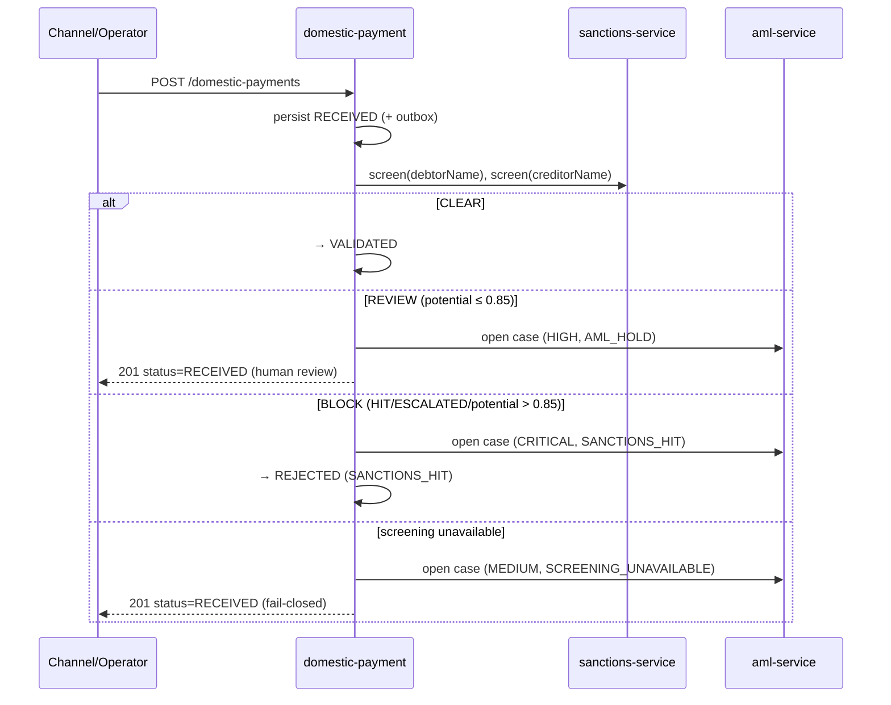

# Compliance

This is a **money-path** service ([`rules.yaml: money_path_services`](../../../../openbank-libs/governance/rules.yaml)). It initiates value transfer to a beneficiary — a primary fraud and sanctions-evasion target. Changes require 2 approvals + the threat model ([`docs/threat-models/openbank-domestic-payment.md`](../../../../docs/threat-models/openbank-domestic-payment.md), STRIDE/DFD per ADR-0030).

## Regulatory framework

| Regulation | Relation to this service | Implementation |
|---|---|---|
| **AMLD** (Anti-Money Laundering Directive) | Every payment is screened; hits/potentials open an AML case | synchronous sanctions screening on create ([ADR-0032](../../../../docs/adr/0032-synchronous-sanctions-aml-screening-gate-in-payment-execution.md)); `AmlCasePort` opens cases (`SANCTIONS_HIT` / `AML_HOLD` / `SCREENING_UNAVAILABLE`); `aml_screened`/`aml_screened_at` columns |
| **EU/UN/OFAC sanctions** | Debtor + creditor names screened before release | `SanctionsScreeningPort` → sanctions-service; `ScreeningPolicy` BLOCK threshold mirrors the sanctions service's `isHighRisk` (0.85); **fail-closed** on outage |
| **PSD2** (Reg. (EU) 2015/2366) | Payment initiation; SCA expected upstream for customer-initiated payments | `sca_reference` recorded (PSD2 RTS Art. 97); SCA performed by `sca-service` ([ADR-0021](../../../../docs/adr/0021-sca-decoupled-device-approval-no-auto-approve.md)) |
| **GDPR** | Debtor/creditor names + account numbers + IP are PII | log masking, classification `confidential`, retention policy, intra-OpenBank controller |
| **DORA** (Reg. (EU) 2022/2554) | Operational resilience of a payment path | health probes, circuit breaker/retry/timeout, outbox, audit events, T0 always-on tier, SLO + runbooks |
| **NIS2** | Network & info security | mTLS in-cluster, OIDC, OPA authz, security headers (CSP/HSTS/X-Frame-Options), audit log |
| **CNB / Czech payment system** | CZ-specific rails | constant-symbol CHECK (`^[0-9]{1,4}$`), `cnb_reporting_code`, `purpose_code`, variable/specific/constant symbols, bank codes |

## GDPR mapping

### Lawful basis (Art. 6)

- **Contract** (Art. 6(1)(b)) — executing a payment instruction is necessary to perform the payment-services contract.
- **Legal obligation** (Art. 6(1)(c)) — AML screening, AML record-keeping, CNB reporting.

### Data subject rights

| Right | Application |
|---|---|
| Access (Art. 15) | `GET /api/v1/domestic-payments?debtorAccountId=...` returns the subject's payments |
| Rectification (Art. 16) | a payment instruction is immutable once accepted; corrections are made by a new payment / status transition (audit-logged) |
| Erasure (Art. 17) | **Not applicable** to settled payment records — AML record-keeping overrides |
| Restriction (Art. 18) | a payment can be held in `RECEIVED` / `REJECTED` pending an AML decision |
| Portability (Art. 20) | N/A (payment records are not user-provided portable data) |
| Object (Art. 21) | N/A (no marketing processing) |

### Data flows out

- → **sanctions-service** (sync REST): debtor + creditor **names** for screening — same controller, intra-OpenBank.
- → **aml-service** (sync REST): payment id, debtor account, customer reference, alert code, matched entity — same controller.
- → **clearing-service / ledger-service / audit-service / notification** (Kafka `openbank.domestic.payment.events`): payment lifecycle events — same controller.

No data leaves the EU/EEA region.

### Retention (Art. 5(1)(e))

| Record | Retention | Note |
|---|---|---|
| `domestic_payments` | 7 years (governance manifest) | AMLD-6 mandates 10 years for AML-relevant records — reconcile the manifest value in the compliance review (flagged as TBD) |
| `domestic_payment_outbox` | operational window after `SENT` | not a record of truth |

## DORA mapping (Reg. (EU) 2022/2554)

| Article | Topic | Implementation |
|---|---|---|
| Art. 5 | ICT risk management | service in the central register; money-path guardrails |
| Art. 6 | Risk framework | dependency = openbank-libs (centralized plumbing) |
| Art. 9 | Identification | `BuildInfo` (gitCommit, buildTime, version) in `/api/v1/info` |
| Art. 10 | Detection | Micrometer/Prometheus metrics, error-rate + latency alerting |
| Art. 11 | Response & recovery | runbooks in `05-operations.md`; circuit breaker + retry; fail-closed screening |
| Art. 16/17 | Incident management & reporting | every state change → audit-service via Kafka events |
| Art. 28 | Third-party risk | no third-party SaaS — sanctions/AML are self-hosted OpenBank services |

## PSD2 / SCA (ADR-0021)

This service does **not** perform Strong Customer Authentication. For customer-initiated payments SCA is expected upstream (`sca-service`, decoupled device approval, no auto-approve); the resulting `sca_reference` is stored on the payment as evidence (PSD2 RTS Art. 97) and feeds the repudiation/audit chain.

## Sanctions / AML screening gate (ADR-0032)

Opening the AML case is best-effort: a case-store outage is logged but must not flip the screening verdict.

## Audit trail

Every mutation emits a domain event (`domestic.payment.created`, `domestic.payment.status-changed`) drained via the transactional outbox to Kafka, where `audit-service` persists it with a tamper-evident chain. This provides the repudiation defence for payment initiation (caller denies initiating) together with the `actor_id`, `channel`, `ip_address`, and `sca_reference` columns.

## Security controls

- ✅ Input validation (Bean Validation; constant-symbol CHECK at the DB)
- ✅ AuthN: Keycloak OIDC, RS256 JWT
- ✅ AuthZ: `@RolesAllowed` + `@Authorize` OPA policy on status transition (ADR-0034, advisory by default — `AUTHZ_ENFORCE`)
- ✅ Sanctions screening: synchronous, fail-closed (ADR-0032)
- ✅ Idempotency: required on create; DB-atomic request/actor fingerprint + unique key
- ✅ Transactional outbox: payment row + event commit atomically
- ✅ Security headers: CSP, HSTS, X-Frame-Options DENY, X-Content-Type-Options nosniff, Referrer-Policy, Permissions-Policy
- ✅ Resilience: circuit breaker / retry / timeout on outbound calls and the outbox publish
- ✅ Secrets: dev placeholders must be overridden in prod (Vault); non-root container
- ⚠️ SCA is enforced upstream, not in this service — verify the `sca_reference` is populated for customer-initiated channels (threat-model follow-up)
