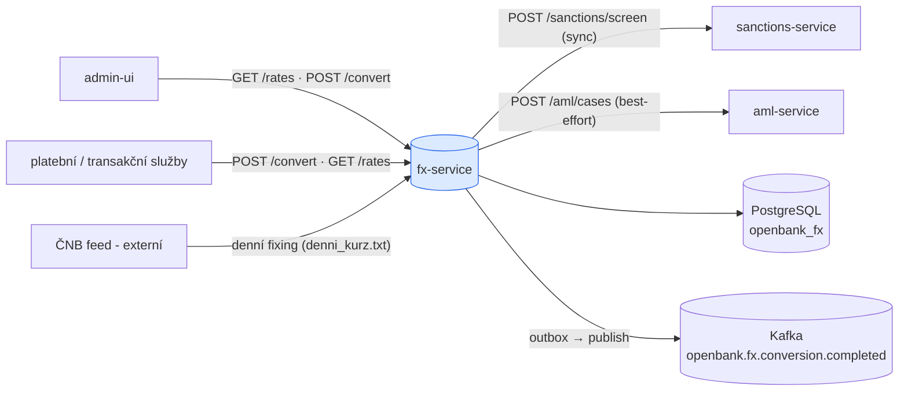
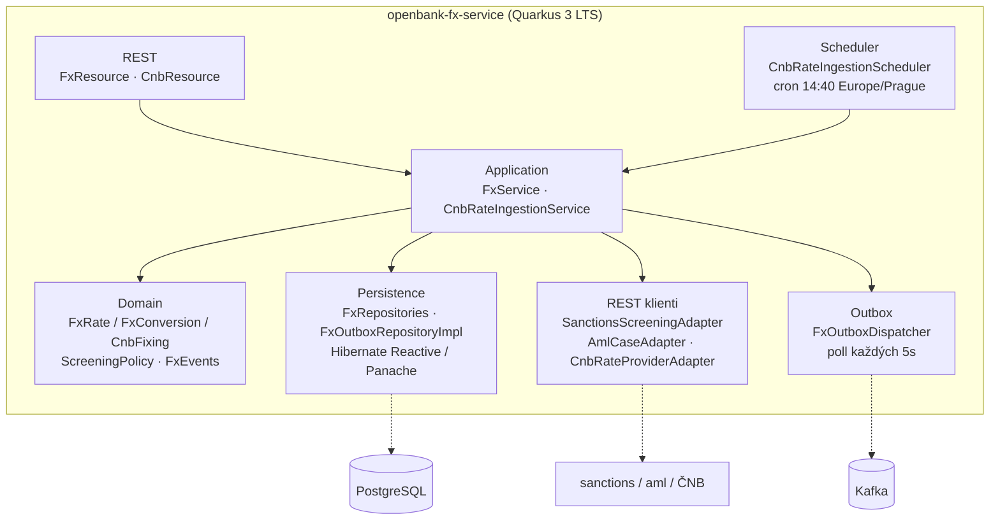
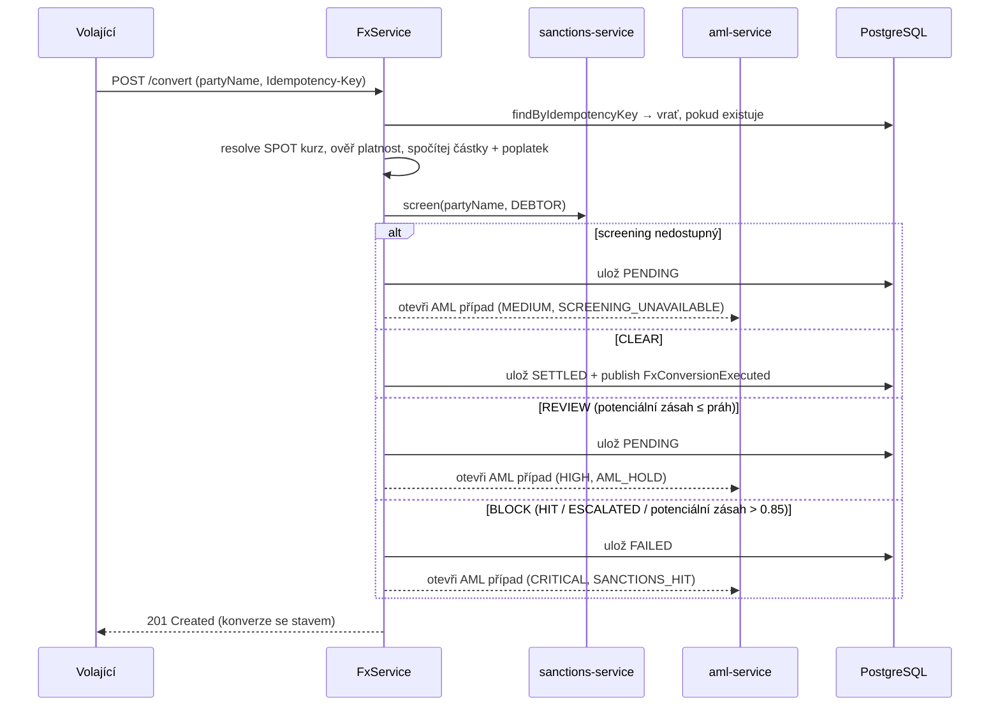
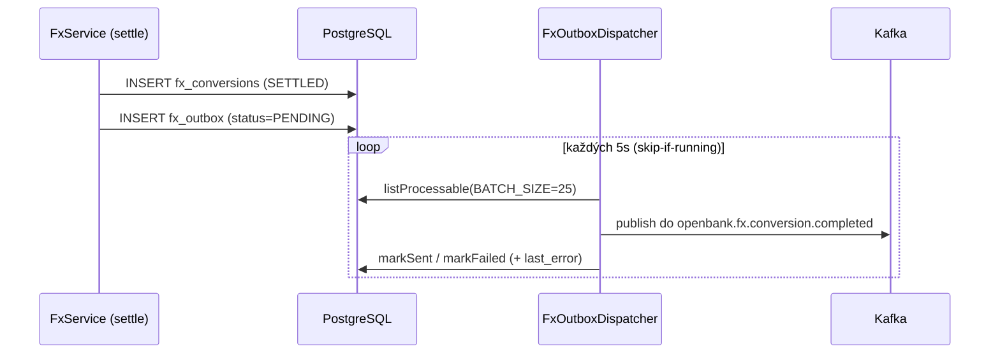

# Architektura

## C4 — Systémový kontext



## C4 — Kontejner (vnitřní struktura)



## Hexagonální vrstvy

Rozložení balíčků odráží **ports-and-adapters** (ADR-0002):

```
com.openbank.fx/
├── domain/                    ◄── jádro — bez frameworkových závislostí
│   ├── model/                 FxRate, FxConversion, RateType, RateSource, FxConversionStatus
│   ├── cnb/                   CnbFixing, CnbFixingRate, CnbFixingParser (čistý parser)
│   ├── screening/             ScreeningPolicy (čisté decide()), ScreeningResult/Decision
│   └── event/                 FxRatePublished, FxConversionExecuted
│
├── application/               ◄── orchestrace use-casů
│   ├── port/in/               FxUseCase, CnbRateIngestionUseCase + příkazy/dotazy
│   ├── port/out/              FxRateRepository, FxConversionRepository, FxEventPublisher,
│   │                          SanctionsScreeningPort, AmlCasePort, FxOutbox*, CnbRateProvider
│   └── usecase/               FxService, CnbRateIngestionService
│
└── infrastructure/            ◄── adaptéry
    ├── rest/                  FxResource, CnbResource (JAX-RS, @RolesAllowed)
    ├── persistence/           FxRateEntity, FxOutboxEntity, repozitáře
    ├── outbox/                FxOutboxDispatcher (scheduled, fault-tolerant)
    ├── kafka/                 KafkaFxOutboxEventPublisher (@Channel fx-events-out)
    ├── client/                Sanctions/Aml/Cnb REST-client adaptéry
    └── schedule/              CnbRateIngestionScheduler
```

**Pravidlo závislostí:** `domain` ← `application` ← `infrastructure`. Doménový kód nikdy nevidí JPA, Kafku, REST ani balíček jiné služby — např. `screening.ScreeningMatchStatus` je lokální zrcadlo enumu sanctions-service, aby ho doména nemusela importovat.

## Screening gate (ADR-0032)

Rozhodnutí o konverzi je srdcem služby. `FxService.convert` zjistí a ověří kurz, spočítá částky a 0,5% poplatek, poté předá `applyScreening`:



`ScreeningPolicy.decide` je čistá funkce: **BLOCK** dominuje **REVIEW** dominuje **CLEAR**; práh blokace (`POTENTIAL_HIT_BLOCK_THRESHOLD = 0.85`) zrcadlí `isHighRisk` sanctions-service, aby se obě hodnoty nerozešly. Otevření AML případu je **best-effort** — výpadek `aml-service` se zaloguje, ale nikdy nesmí překlopit verdikt screeningu.

## Outbox tok



Dispatcher obaluje Kafka publish přes MicroProfile Fault Tolerance: `@Bulkhead(1)`, `@CircuitBreaker(volume=10, ratio=0.5, delay=5s)`, `@Retry(max=2)`, `@Timeout(3000ms)`. Selhání publishe se zapíše do řádku (`status`, `last_error`, `attempt_count`) a opakuje při dalším pollu — at-least-once doručení, očekávají se idempotentní konzumenti.

> **Pozn. (aktuální kód):** `KafkaFxEventPublisher` (adaptér doménové události `FxEventPublisher` volaný přímo z `settle`) je nyní no-op stub; živá Kafka cesta je *outbox* dispatcher (`KafkaFxOutboxEventPublisher` na kanálu `fx-events-out`). Propojení obou je známý follow-up.

## ČNB ingest (ADR-0046)

`CnbRateIngestionScheduler` spouští cron ve **14:40 Europe/Prague** (těsně po ~14:30 publikaci) a volá `CnbRateIngestionService.ingest`. Čistý `CnbFixingParser` parsuje feed `denni_kurz.txt`; každá konfigurovaná měna (`openbank.cnb.currencies`, default `EUR,USD,GBP`) je upsertnuta jako kurz `source = CNB`, `rateType = INDICATIVE` kótovaný v CZK, `bid = ask = mid = ratePerUnit`, platný pro obchodní den fixingu. Ingest je **idempotentní na `(source=CNB, pair, validFrom)`**, takže opakovaný či vynechaný běh je neškodný; `POST /api/v1/fx/cnb/ingest` pokrývá ruční backfill.

## Principy

1. **Zafixuj kurz** — každá konverze ukládá `rateId` + `appliedRate` (`askRate`), aby byl peněžní výsledek rekonstruovatelný (obrana sporů/audit).
2. **Fail closed** — nikdy nevypořádej konverzi, která nebyla prověřena jako CLEAR.
3. **Best-effort vedlejší efekty** — otevření AML případu nesmí změnit verdikt.
4. **Žádná vzdálená volání mimo request** — async propagace přes outbox + Kafka.
5. **Čistá doména** — kurzová matematika, parsování fixingu a rozhodnutí screeningu jsou bez frameworku a unit-testovány.
