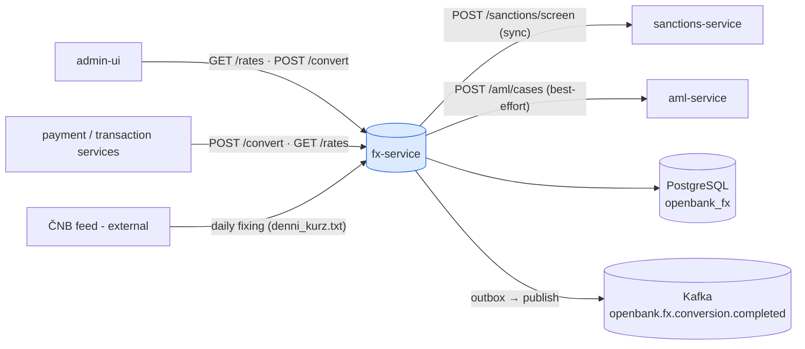
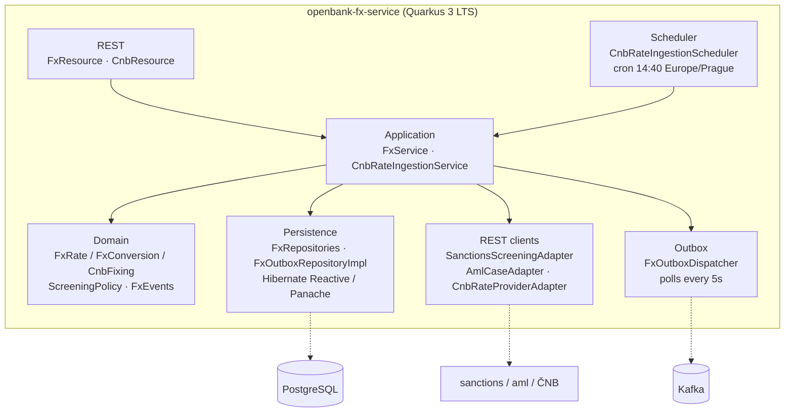
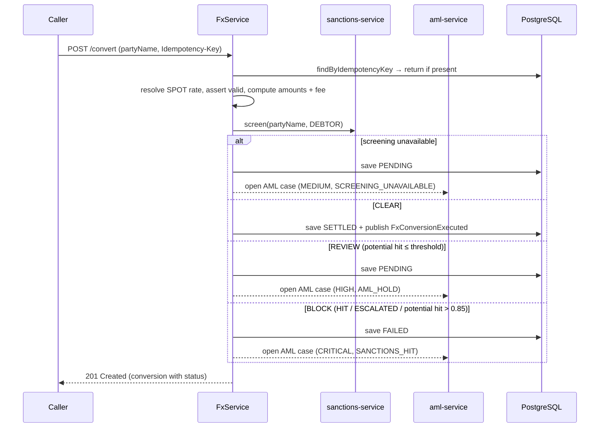
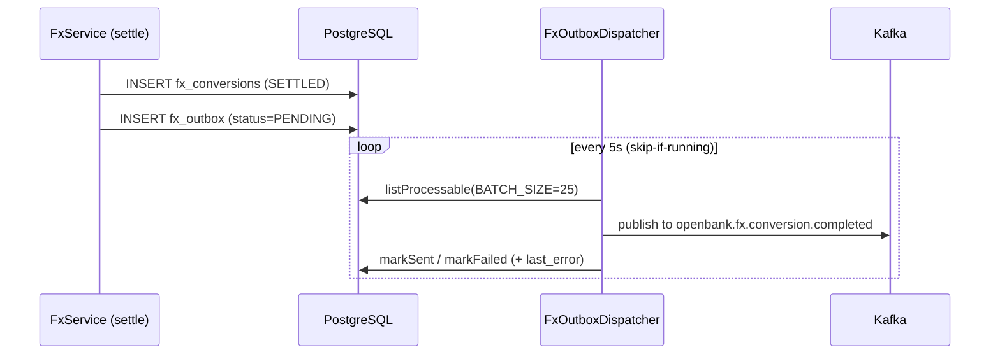

# Architecture

## C4 — System Context



## C4 — Container (internal structure)



## Hexagonal layers

The package layout reflects **ports-and-adapters** (ADR-0002):

```
com.openbank.fx/
├── domain/                    ◄── core — no framework dependencies
│   ├── model/                 FxRate, FxConversion, RateType, RateSource, FxConversionStatus
│   ├── cnb/                   CnbFixing, CnbFixingRate, CnbFixingParser (pure parser)
│   ├── screening/             ScreeningPolicy (pure decide()), ScreeningResult/Decision
│   └── event/                 FxRatePublished, FxConversionExecuted
│
├── application/               ◄── use-case orchestration
│   ├── port/in/               FxUseCase, CnbRateIngestionUseCase + commands/queries
│   ├── port/out/              FxRateRepository, FxConversionRepository, FxEventPublisher,
│   │                          SanctionsScreeningPort, AmlCasePort, FxOutbox*, CnbRateProvider
│   └── usecase/               FxService, CnbRateIngestionService
│
└── infrastructure/            ◄── adapters
    ├── rest/                  FxResource, CnbResource (JAX-RS, @RolesAllowed)
    ├── persistence/           FxRateEntity, FxOutboxEntity, repositories
    ├── outbox/                FxOutboxDispatcher (scheduled, fault-tolerant)
    ├── kafka/                 KafkaFxOutboxEventPublisher (@Channel fx-events-out)
    ├── client/                Sanctions/Aml/Cnb REST-client adapters
    └── schedule/              CnbRateIngestionScheduler
```

**Dependency rule:** `domain` ← `application` ← `infrastructure`. Domain code never sees JPA, Kafka, REST, or another service's package — e.g. `screening.ScreeningMatchStatus` is a local mirror of the sanctions-service enum so the domain never imports it.

## The screening gate (ADR-0032)

The conversion decision is the heart of the service. `FxService.convert` resolves and validates the rate, computes amounts and the 0.5% fee, then defers to `applyScreening`:



`ScreeningPolicy.decide` is a pure function: **BLOCK** dominates **REVIEW** dominates **CLEAR**; the block threshold (`POTENTIAL_HIT_BLOCK_THRESHOLD = 0.85`) mirrors the sanctions service's own `isHighRisk` so the two never drift. Opening the AML case is **best-effort** — an `aml-service` outage is logged but must never flip the screening verdict.

## Outbox flow



The dispatcher wraps the Kafka publish with MicroProfile Fault Tolerance: `@Bulkhead(1)`, `@CircuitBreaker(volume=10, ratio=0.5, delay=5s)`, `@Retry(max=2)`, `@Timeout(3000ms)`. A publish failure is recorded on the row (`status`, `last_error`, `attempt_count`) and retried on the next poll — at-least-once delivery, idempotent consumers expected.

> **Note (current code):** `KafkaFxEventPublisher` (the `FxEventPublisher` domain-event adapter invoked directly by `settle`) is presently a no-op stub; the *outbox* dispatcher (`KafkaFxOutboxEventPublisher` on channel `fx-events-out`) is the live Kafka path. Wiring the two is a known follow-up.

## ČNB ingestion (ADR-0046)

`CnbRateIngestionScheduler` fires a cron at **14:40 Europe/Prague** (just after the ~14:30 publication), calling `CnbRateIngestionService.ingest`. The pure `CnbFixingParser` parses the `denni_kurz.txt` feed; each configured currency (`openbank.cnb.currencies`, default `EUR,USD,GBP`) is upserted as a `source = CNB`, `rateType = INDICATIVE` rate quoted in CZK, `bid = ask = mid = ratePerUnit`, valid for the fixing's business day. Ingestion is **idempotent on `(source=CNB, pair, validFrom)`**, so a repeated or missed run is harmless; `POST /api/v1/fx/cnb/ingest` covers manual backfill.

## Principles

1. **Pin the rate** — every conversion stores `rateId` + `appliedRate` (the `askRate`) so the monetary outcome is reconstructible (dispute/audit defence).
2. **Fail closed** — never settle a conversion that was not screened CLEAR.
3. **Best-effort side effects** — AML case opening must not change the verdict.
4. **No remote calls outside the request** — async propagation via outbox + Kafka.
5. **Pure domain** — rate maths, fixing parsing, and the screening decision are framework-free and unit-tested.
