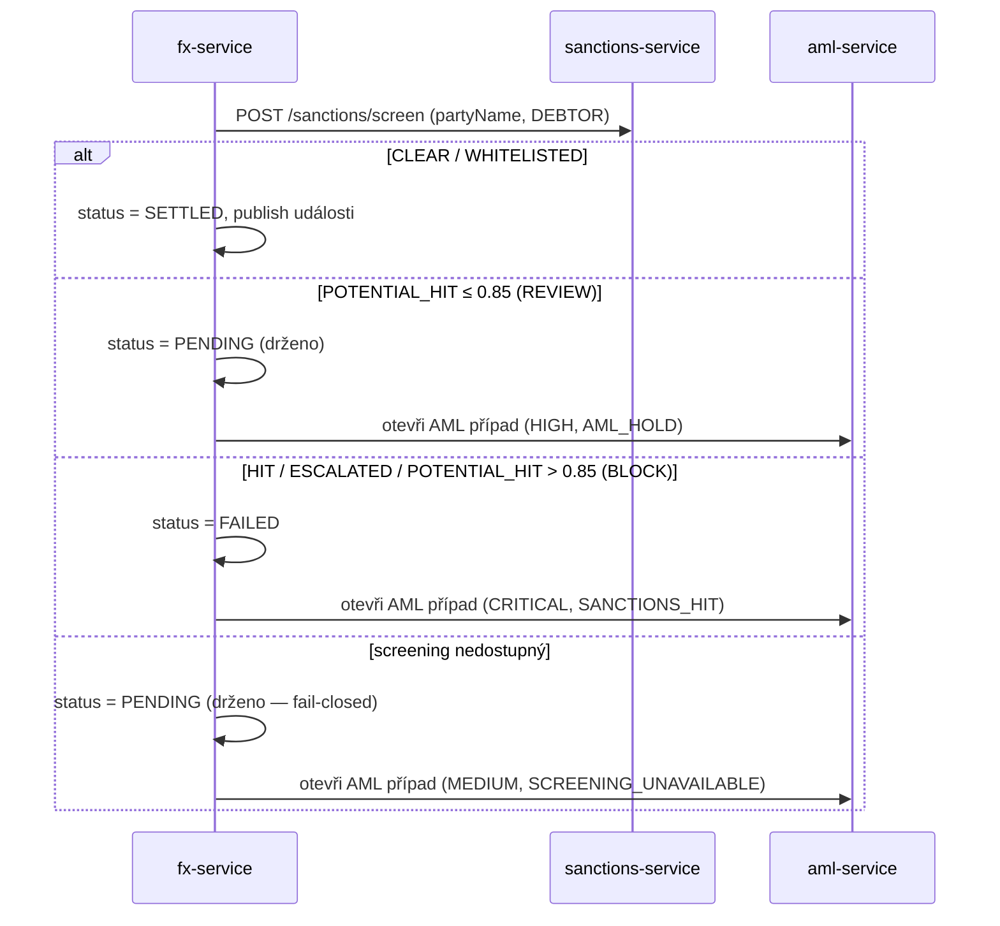

# Compliance

`openbank-fx-service` je **money-path** služba (`rules.yaml: money_path_services`): integrita kurzu přímo určuje peněžní výsledky a každá konverze prochází synchronní sankční bránou. Threat model existuje v [`docs/threat-models/openbank-fx-service.md`](../../../../docs/threat-models/openbank-fx-service.md) (ADR-0030); změny vyžadují 2 schválení + přezkum threat modelu.

## Regulatorní rámec

| Regulace | Vztah ke službě | Implementace |
|---|---|---|
| **AMLD** (směrnice proti praní peněz) | Každá konverze prověřena proti sankčním seznamům; zásahy/nejisté drženy & eskalovány | synchronní screen přes `sanctions-service` (ADR-0032); AML případ v `aml-service` (CRITICAL/HIGH/MEDIUM) |
| **Sankce EU/UN/OFAC** | Konvertující klient nesmí být sankcionovaný subjekt | `ScreeningPolicy` (BLOCK při HIT/ESCALATED/potenciál>0.85); fail-closed při výpadku screeningu |
| **GDPR** | `partyName` je PII (prověřeno za běhu, neukládáno); `party_id`/`account_id` pseudonymní | jméno neperzistováno v fx tabulkách; identifikátory jsou UUID; logy bez surového PII |
| **PSD2** | FX může stát za platebním tokem | fx-service poskytuje kurz/konverzi interním platebním službám; žádný přímý TPP povrch |
| **DORA** (Reg. (EU) 2022/2554) | Provozní odolnost money-path služby | health probes, fault-tolerant outbox, OTEL tracing, SLO, runbooky, T0 always-on |
| **NIS2** | Síťová & informační bezpečnost | mTLS v clusteru, bezpečnostní response hlavičky, deny-by-default role |
| **ČNB / kurzy** | Oficiální fixing centrální banky ingestnut denně | ingest ČNB fixingu ADR-0046 (`source=CNB`, `INDICATIVE`, CZK) |

## ADR-0032 — synchronní sankční/AML brána

Definující compliance kontrola. Při `POST /convert` je jméno konvertujícího klienta prověřeno **dříve**, než smí být konverze vypořádána:

Klíčové invarianty:
- **Fail-closed** — konverze se **nikdy** nevypořádá bez výsledku CLEAR. Nedostupná sanctions-service ji drží v PENDING.
- **Žádný drift** — `POTENTIAL_HIT_BLOCK_THRESHOLD = 0.85` zrcadlí `isHighRisk` sanctions-service.
- **Best-effort eskalace** — otevření AML případu nesmí změnit verdikt (výpadek úložiště případů se zaloguje, nepropaguje).

## Mapování GDPR

### Právní základ (čl. 6)

- **Smlouva** (čl. 6(1)(b)) — provedení měnové konverze, kterou klient požádal.
- **Právní povinnost** (čl. 6(1)(c)) — AML/sankční prověrka a uchovávání záznamů.

### Práva subjektu údajů

| Právo | Aplikace |
|---|---|
| Přístup (čl. 15) | `GET /api/v1/fx/conversions/{id}`; konverze filtrovatelné dle `party_id` |
| Oprava (čl. 16) | záznamy kurzů/konverzí jsou neměnné finanční fakty; korekce přes reversal/nový záznam |
| Výmaz (čl. 17) | **Nepoužije se na záznamy konverzí** — uchovávání AML záznamů má přednost v retenčním okně |
| Omezení (čl. 18) | konverze označeného klienta drženy v PENDING (AML případ) |
| Přenositelnost (čl. 20) | historie konverzí exportovatelná na žádost |
| Námitka (čl. 21) | N/A (žádné marketingové zpracování) |

### Minimalizace PII

Jméno konvertujícího klienta (`partyName`) se **v `fx_conversions` neukládá** — je posláno do `sanctions-service` k prověrce za běhu a perzistováno pouze `aml-service` při otevření případu. fx tabulky drží jen pseudonymní UUID `party_id`/`account_id` a finanční fakty.

### Toky dat ven

- → **sanctions-service** (sync REST): `partyName` k prověrce — stejný správce, intra-OpenBank.
- → **aml-service** (sync REST, best-effort): detaily klienta/konverze + matched entity při otevření případu — stejný správce.
- → **Kafka** (`openbank.fx.conversion.completed`): událost konverze pro downstream (transaction/audit) — stejný správce.
- → **ČNB** (externí, jen příchozí): čte se denní fixing feed; **žádná data klientů se ČNB neposílají**.

Žádná data klientů neopouštějí region EU/EHP.

## Mapování DORA (Reg. (EU) 2022/2554)

| Článek | Téma | Implementace |
|---|---|---|
| čl. 5/6 | Rámec řízení ICT rizik | centralizováno přes `openbank-libs`; služba v governance registru |
| čl. 9 | Identifikace | `BuildInfo` (gitCommit, buildTime, version) na `/api/v1/info` |
| čl. 10 | Detekce | metriky Micrometer/Prometheus, OTEL tracing, alerting na chybovost/latenci/outbox lag |
| čl. 11 | Reakce & obnova | runbooky v [05 — Provoz](./05-operations.md); fault-tolerant outbox; T0 always-on |
| čl. 16/17 | Řízení & reporting incidentů | události konverzí + AML případy tvoří audit/důkazní stopu |
| čl. 28 | Riziko třetích stran | jediná externí závislost je feed ČNB (read-only, veřejná data); žádný third-party SaaS pro data klientů |

## Auditní stopa

Každá konverze je finanční záznam (`fx_conversions`) fixující `rate_id`/`applied_rate`. Vypořádané konverze vysílají `FxConversionExecuted` přes transakční outbox; verdikty screeningu mimo CLEAR otevírají auditovatelný AML případ (`aml-service`) nesoucí alert kód (`SANCTIONS_HIT` / `AML_HOLD` / `SCREENING_UNAVAILABLE`), úroveň rizika, detail a matched entity.

## Bezpečnostní kontroly

- ✅ AuthN: Keycloak OIDC (vypnuto jen v `%dev`/`%test`).
- ✅ AuthZ: Quarkus `@RolesAllowed` per endpoint, deny-by-default (oddělené role convert vs read; publish/ingest = OPERATOR/ADMIN).
- ✅ Sankční brána: synchronní, fail-closed na každé konverzi (ADR-0032).
- ✅ Idempotence: povinný `Idempotency-Key` na convert, DB-unique pojistka.
- ✅ Fixace kurzu: `rate_id` + `applied_rate` zaznamenány pro obranu sporů/audit.
- ✅ Odolnost: outbox dispatcher s bulkhead/circuit-breaker/retry/timeout.
- ✅ Tvrzení transportu: HSTS, CSP, X-Frame-Options DENY, nosniff, Referrer-Policy, Permissions-Policy (v `application.yaml`); mTLS v clusteru.
- ✅ Tajemství: dev placeholdery musí být v prod přepsány přes Vault (ADR 0017).
- ⚠️ Integrita zdroje kurzu je dominantní zbytkové riziko (threat model §5): manipulovaný/zastaralý kurz je tichý vektor finanční ztráty — mitigováno provenancí/časovou značkou kurzu, kontrolami platnosti (`isValid`) a fixací `rate_id`; meze/sanity limity vedeny jako follow-up.
- ⚠️ Kafka publisher doménových událostí (`KafkaFxEventPublisher`) je aktuálně stub; živá cesta událostí je outbox dispatcher — propojení je evidovaný follow-up.
