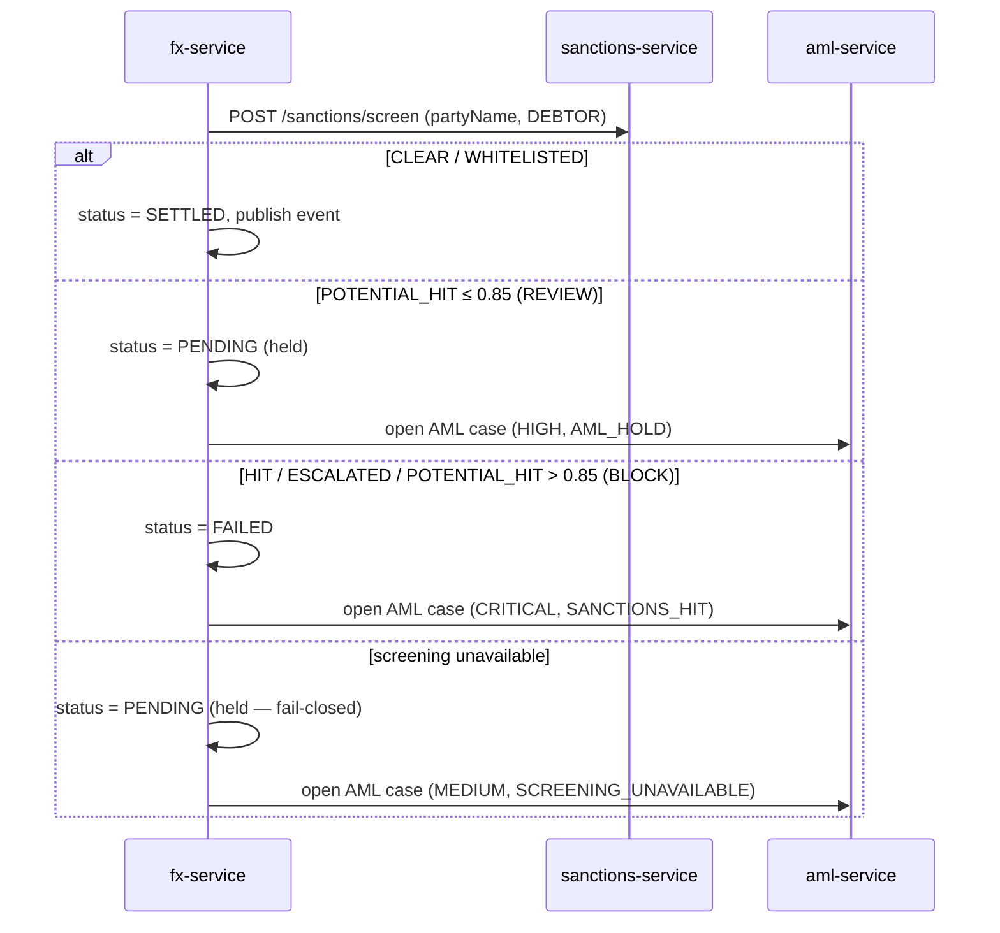

# Compliance

`openbank-fx-service` is a **money-path** service (`rules.yaml: money_path_services`): rate integrity directly determines monetary outcomes, and every conversion passes a synchronous sanctions gate. A threat model exists at [`docs/threat-models/openbank-fx-service.md`](../../../../docs/threat-models/openbank-fx-service.md) (ADR-0030); changes require 2 approvals + threat-model review.

## Regulatory framework

| Regulation | Relation to this service | Implementation |
|---|---|---|
| **AMLD** (Anti-Money Laundering Directive) | Every conversion screened against sanctions lists; hits/uncertain held & escalated | synchronous screen via `sanctions-service` (ADR-0032); AML case opened in `aml-service` (CRITICAL/HIGH/MEDIUM) |
| **EU/UN/OFAC sanctions** | Converting party must not be a sanctioned entity | `ScreeningPolicy` (BLOCK on HIT/ESCALATED/potential>0.85); fail-closed on screening outage |
| **GDPR** | `partyName` is PII (screened in-flight, not stored); `party_id`/`account_id` pseudonymous | name not persisted in fx tables; identifiers are UUIDs; logs avoid raw PII |
| **PSD2** | FX may sit behind a payment flow | fx-service serves rate/conversion to internal payment services; no direct TPP surface |
| **DORA** (Reg. (EU) 2022/2554) | Operational resilience of a money-path service | health probes, fault-tolerant outbox, OTEL tracing, SLO, runbooks, T0 always-on |
| **NIS2** | Network & info security | mTLS in-cluster, security response headers, deny-by-default roles |
| **ČNB / CNB rates** | Official central-bank fixing ingested daily | ADR-0046 ČNB fixing ingestion (`source=CNB`, `INDICATIVE`, CZK) |

## ADR-0032 — synchronous sanctions/AML screening gate

The defining compliance control. On `POST /convert` the converting party's name is screened **before** the conversion may settle:

Key invariants:
- **Fail-closed** — a conversion is **never** settled without a CLEAR screening result. An unreachable sanctions service holds it in PENDING.
- **No drift** — `POTENTIAL_HIT_BLOCK_THRESHOLD = 0.85` mirrors the sanctions service's own `isHighRisk`.
- **Best-effort escalation** — opening the AML case must not change the verdict (a case-store outage is logged, not propagated).

## GDPR mapping

### Lawful basis (Art. 6)

- **Contract** (Art. 6(1)(b)) — executing a currency conversion the customer requested.
- **Legal obligation** (Art. 6(1)(c)) — AML/sanctions screening and record-keeping.

### Data subject rights

| Right | Application |
|---|---|
| Access (Art. 15) | `GET /api/v1/fx/conversions/{id}`; conversions filterable by `party_id` |
| Rectification (Art. 16) | rate/conversion records are immutable financial facts; corrections via reversal/new record |
| Erasure (Art. 17) | **Not applicable to conversion records** — AML record-keeping overrides during the retention window |
| Restriction (Art. 18) | a flagged party's conversions hold in PENDING (AML case) |
| Portability (Art. 20) | conversion history exportable on request |
| Object (Art. 21) | N/A (no marketing processing) |

### PII minimisation

The converting party's **name (`partyName`) is not stored** in `fx_conversions` — it is sent to `sanctions-service` for screening in-flight and persisted only by `aml-service` when a case is opened. The fx tables hold only pseudonymous `party_id`/`account_id` UUIDs and financial facts.

### Data flows out

- → **sanctions-service** (sync REST): `partyName` for screening — same controller, intra-OpenBank.
- → **aml-service** (sync REST, best-effort): party/conversion details + matched entity when a case is opened — same controller.
- → **Kafka** (`openbank.fx.conversion.completed`): conversion event for downstream (transaction/audit) — same controller.
- → **ČNB** (external, inbound only): the daily fixing feed is read; **no customer data is sent outbound** to ČNB.

No customer data leaves the EU/EEA region.

## DORA mapping (Reg. (EU) 2022/2554)

| Article | Topic | Implementation |
|---|---|---|
| Art. 5/6 | ICT risk management framework | centralized via `openbank-libs`; service in the governance register |
| Art. 9 | Identification | `BuildInfo` (gitCommit, buildTime, version) on `/api/v1/info` |
| Art. 10 | Detection | Micrometer/Prometheus metrics, OTEL tracing, alerting on error rate/latency/outbox lag |
| Art. 11 | Response & recovery | runbooks in [05 — Operations](./05-operations.md); fault-tolerant outbox; T0 always-on |
| Art. 16/17 | Incident management & reporting | conversion events + AML cases form the audit/evidence trail |
| Art. 28 | Third-party risk | only external dependency is the ČNB feed (read-only, public data); no third-party SaaS for customer data |

## Audit trail

Each conversion is a financial record (`fx_conversions`) pinning `rate_id`/`applied_rate`. Settled conversions emit `FxConversionExecuted` via the transactional outbox; screening verdicts that are not CLEAR open an auditable AML case (`aml-service`) carrying the alert code (`SANCTIONS_HIT` / `AML_HOLD` / `SCREENING_UNAVAILABLE`), risk level, detail and matched entity.

## Security controls

- ✅ AuthN: Keycloak OIDC (disabled only in `%dev`/`%test`).
- ✅ AuthZ: Quarkus `@RolesAllowed` per endpoint, deny-by-default (distinct convert vs read roles; publish/ingest = OPERATOR/ADMIN).
- ✅ Sanctions gate: synchronous, fail-closed on every conversion (ADR-0032).
- ✅ Idempotency: mandatory `Idempotency-Key` on convert, DB-unique guard.
- ✅ Rate pinning: `rate_id` + `applied_rate` recorded for dispute/audit defence.
- ✅ Resilience: outbox dispatcher with bulkhead/circuit-breaker/retry/timeout.
- ✅ Transport hardening: HSTS, CSP, X-Frame-Options DENY, nosniff, Referrer-Policy, Permissions-Policy (set in `application.yaml`); mTLS in-cluster.
- ✅ Secrets: dev placeholders must be overridden in prod via Vault (ADR 0017).
- ⚠️ Rate-source integrity is the dominant residual risk (threat model §5): a manipulated/stale rate is a silent financial-loss vector — mitigated by rate provenance/timestamp, validity (`isValid`) checks, and `rate_id` pinning; bounds/sanity limits tracked as a follow-up.
- ⚠️ Domain-event Kafka publisher (`KafkaFxEventPublisher`) is currently a stub; the live event path is the outbox dispatcher — wiring is a tracked follow-up.
