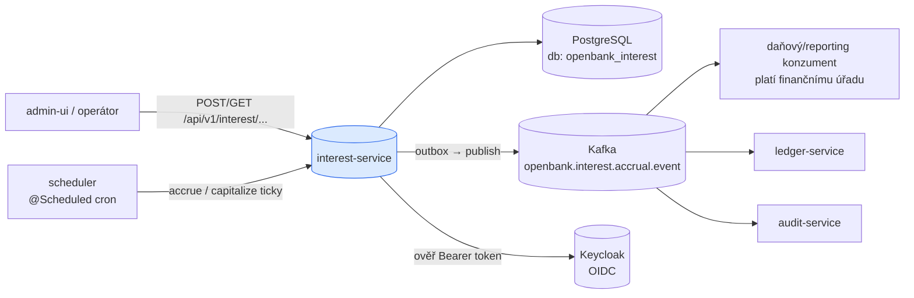
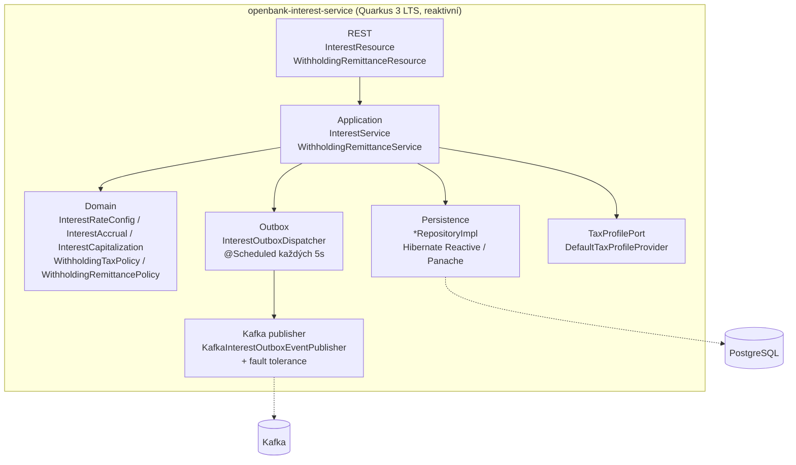
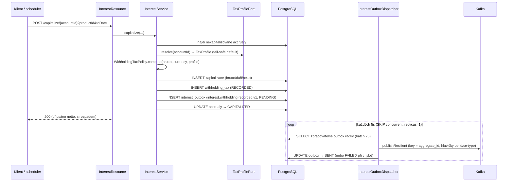
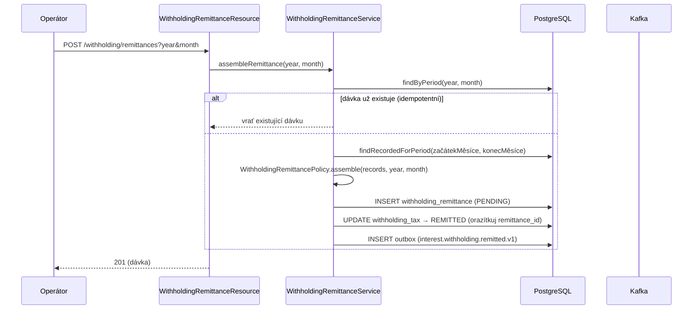

# Architektura

## C4 — Kontext systému



## C4 — Kontejner (vnitřní struktura)



## Hexagonální vrstvy

Struktura balíčků odráží **ports-and-adapters** (ADR-0002):

```
com.openbank.interest/
├── domain/                          ◄── jádro — NULOVÉ frameworkové importy
│   ├── model/                       InterestRateConfig, InterestAccrual, InterestCapitalization,
│   │                                AccrualRequest, AccrualSummary + enumy
│   └── tax/                         WithholdingTaxPolicy / WithholdingRemittancePolicy (čisté §36/§38d ZDP),
│                                    TaxProfile, WithholdingTax, WithholdingRemittance
│
├── application/                     ◄── orchestrace use-casů
│   ├── port/in/                     AccrueInterestUseCase, CapitalizeInterestUseCase,
│   │                                GetAccrualsUseCase, ManageRateConfigUseCase, RemitWithholdingUseCase
│   ├── port/out/                    *Repository, TaxProfilePort, InterestEventOutbox
│   └── usecase/                     InterestService, WithholdingRemittanceService
│
└── infrastructure/                  ◄── adaptéry
    ├── rest/                        JAX-RS resources + mapování DTO
    ├── persistence/                 *Entity (Panache), *RepositoryImpl, InterestMapper
    ├── outbox/                      InterestOutboxDispatcher (@Scheduled)
    ├── kafka/                       KafkaInterestOutboxEventPublisher
    └── tax/                         DefaultTaxProfileProvider
```

**Pravidlo závislostí:** `domain` ← `application` ← `infrastructure`. Obě daňové policy (`WithholdingTaxPolicy`, `WithholdingRemittancePolicy`) jsou čisté objekty bez frameworkových importů, takže zákonná pravidla a jejich zaokrouhlování žijí na jednom testovaném místě a nemohou driftovat mezi místy volání.

## Tok kapitalizace + srážky



## Tok měsíčního odvodu



**Proč outbox (ADR-0050):** transakční konzistence mezi DB zápisem a publikací do Kafky. Dispatcher běží na Vert.x event loop, používá `concurrentExecution = SKIP` a Deployment je připnut na `replicas: 1` — přesně jeden writer si nárokuje řádek, čímž zachová pořadí v rámci agregátu (partition key = `aggregate_id`). Doručení at-least-once; hlavičky `ce-id` / `idempotency-key` umožní konzumentům deduplikaci.

## Komponenty z `openbank-libs`

| Modul | Využití zde |
|---|---|
| `libs.web.ServiceInfoResource` | `/api/v1/info` (build metadata, verze API + služby) |
| `libs.docs.DocsResource` | **tato dokumentace** (`/q/openbank/docs`) |
| `libs.util.BuildInfo` | runtime snímek tech stacku |
| `libs` security infrastruktura | integrace OIDC, kontrola bootstrap tajemství |

## Principy

1. **Čistá daňová policy** — `WithholdingTaxPolicy` a `WithholdingRemittancePolicy` jsou bez frameworku; pravidla §36/§38d ZDP a zákonné zaokrouhlování žijí na jednom testovaném místě.
2. **Fail-safe srážka** — implementace `TaxProfilePort` nesmí nikdy propagovat selhání, které by srážku přeskočilo; resolvují na fiskálně konzervativní výchozí profil CZ rezidenta fyzické osoby.
3. **Netto kredit, zaznamenaná povinnost** — kapitalizace připisuje netto a zaznamenává rozhodnutí o srážce (i nulové zdanění) pro audit.
4. **Žádná vzdálená volání v zápisové TX** — událost přistává spolu se změnou agregátu přes outbox; downstream propagace je asynchronní přes Kafku.
5. **Idempotentní odvod** — jedna dávka na `(year, month)`; opakované spuštění vrátí sestavenou dávku a nic znovu neoznačí.
