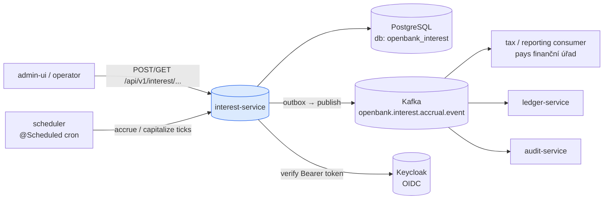
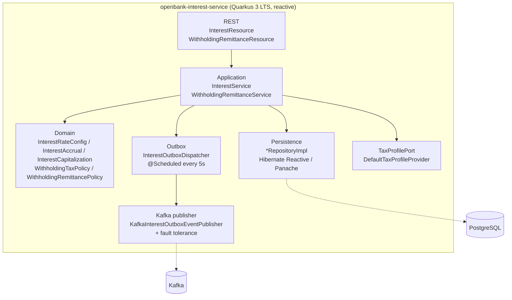
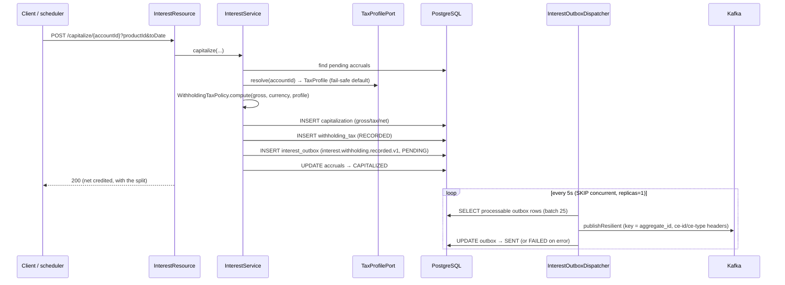
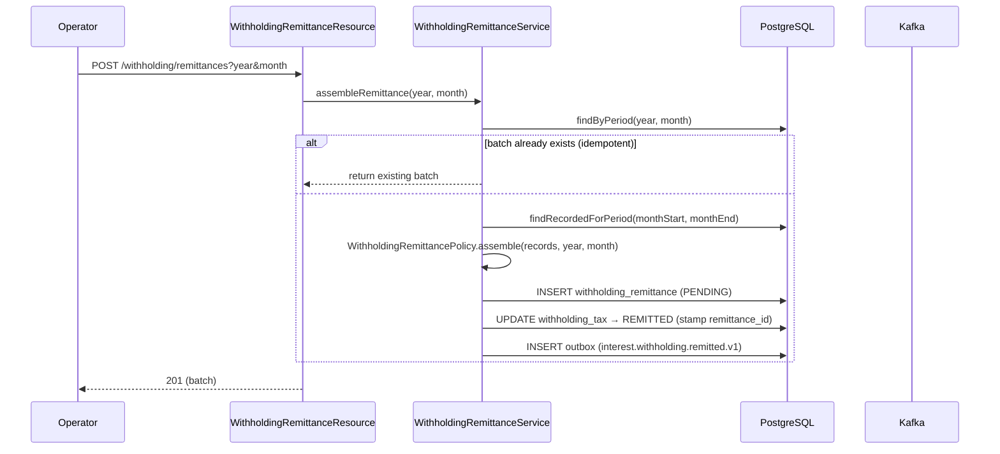

# Architecture

## C4 — System Context



## C4 — Container (internal structure)



## Hexagonal layers

The package structure reflects **ports-and-adapters** (ADR-0002):

```
com.openbank.interest/
├── domain/                          ◄── core — ZERO framework imports
│   ├── model/                       InterestRateConfig, InterestAccrual, InterestCapitalization,
│   │                                AccrualRequest, AccrualSummary + enums
│   └── tax/                         WithholdingTaxPolicy / WithholdingRemittancePolicy (pure §36/§38d ZDP),
│                                    TaxProfile, WithholdingTax, WithholdingRemittance
│
├── application/                     ◄── use-case orchestration
│   ├── port/in/                     AccrueInterestUseCase, CapitalizeInterestUseCase,
│   │                                GetAccrualsUseCase, ManageRateConfigUseCase, RemitWithholdingUseCase
│   ├── port/out/                    *Repository, TaxProfilePort, InterestEventOutbox
│   └── usecase/                     InterestService, WithholdingRemittanceService
│
└── infrastructure/                  ◄── adapters
    ├── rest/                        JAX-RS resources + DTO mapping
    ├── persistence/                 *Entity (Panache), *RepositoryImpl, InterestMapper
    ├── outbox/                      InterestOutboxDispatcher (@Scheduled)
    ├── kafka/                       KafkaInterestOutboxEventPublisher
    └── tax/                         DefaultTaxProfileProvider
```

**Dependency rule:** `domain` ← `application` ← `infrastructure`. The two tax policies (`WithholdingTaxPolicy`, `WithholdingRemittancePolicy`) are pure objects with no infrastructure imports, so the statutory rules and their rounding live in one tested place and cannot drift across call sites.

## Capitalization + withholding flow



## Monthly remittance flow



**Why outbox (ADR-0050):** transactional consistency between the DB write and the Kafka publish. The dispatcher runs on the Vert.x event loop, uses `concurrentExecution = SKIP`, and the Deployment is pinned to `replicas: 1` — exactly one writer claims a row, preserving per-aggregate ordering (partition key = `aggregate_id`). At-least-once delivery; `ce-id` / `idempotency-key` headers let consumers deduplicate.

## Components from `openbank-libs`

| Module | Use here |
|---|---|
| `libs.web.ServiceInfoResource` | `/api/v1/info` (build metadata, API + service version) |
| `libs.docs.DocsResource` | **this documentation** (`/q/openbank/docs`) |
| `libs.util.BuildInfo` | runtime tech-stack snapshot |
| `libs` security plumbing | OIDC integration, secret bootstrap checks |

## Principles

1. **Pure tax policy** — `WithholdingTaxPolicy` and `WithholdingRemittancePolicy` are framework-free; the §36/§38d ZDP rules and statutory rounding live in one tested place.
2. **Fail-safe withholding** — `TaxProfilePort` implementations must never propagate a failure that would skip withholding; they resolve to the fiscally conservative CZ-resident-individual default.
3. **Net credit, recorded liability** — capitalization credits the net amount and records the withholding decision (even zero-tax treatments) for the audit trail.
4. **No remote calls in the write TX** — the event lands with the aggregate change via the outbox; downstream propagation is async via Kafka.
5. **Idempotent remittance** — one batch per `(year, month)`; re-running returns the assembled batch and re-marks nothing.
