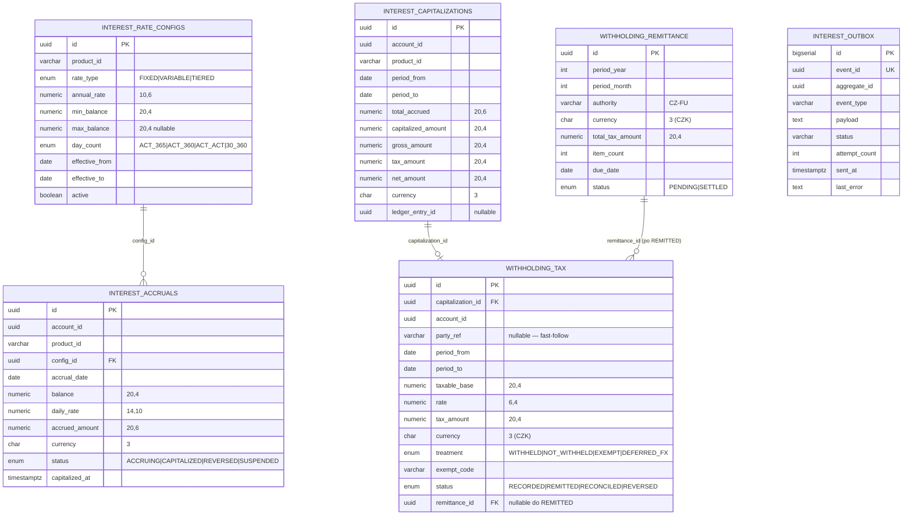

# Data

## Schéma

Služba vlastní dedikovanou PostgreSQL databázi `openbank_interest`. Migrace vytváří tabulky ve výchozím schématu (DDL nemá explicitní prefix schématu).

> Pozn. k pojmenování: per-service governance manifest (`governance.yaml`) deklaruje vlastněné schéma jako `interest_schema` a závislé schéma `accounts_schema` pro účely lineage; skutečné Flyway DDL používá výchozí schéma databáze `openbank_interest`. `governance.yaml` berte jako lineage/katalogovou deklaraci a níže uvedené migrace jako fyzickou pravdu.

## Migrace

Flyway, neměnné historické skripty, forward-only (`migrate-at-start: true`):

| Skript | Co dělá | Poznámka k rollbacku |
|---|---|---|
| `V1__init_interest.sql` | Enumy (`interest_rate_type`, `accrual_status`, `day_count`), tabulky `interest_rate_configs`, `interest_accruals` (unique `(account_id, accrual_date, product_id)`), `interest_capitalizations`, indexy | drop tabulek + enumů |
| `V2__create_interest_outbox.sql` | Tabulka `interest_outbox` + indexy status/aggregate (transakční outbox) | drop tabulky |
| `V3__withholding_tax.sql` | ADR-0033: enumy `withholding_treatment` / `withholding_tax_status`; přidá `gross/tax/net_amount` ke kapitalizacím (backfill net = gross = předchozí částka, tax = 0); tabulka `withholding_tax` | rollback poznámka přímo ve skriptu (drop tabulky, drop sloupců, drop typů) |
| `V4__withholding_remittance.sql` | ADR-0038: enum `withholding_remittance_status`; tabulka `withholding_remittance` (unique `(period_year, period_month, authority)`); přidá `withholding_tax.remittance_id` FK | reverzibilní — drop sloupce / tabulky / typu; stavy lze resetovat `REMITTED → RECORDED` |
| `V5__hibernate_sequences.sql` | Vytvoří `interest_outbox_seq INCREMENT BY 50` (alokace id Hibernate Reactive PanacheEntity; `generation: none`) | `DROP SEQUENCE interest_outbox_seq` |

## Indexy

- `interest_accruals(account_id)`, `(accrual_date)`, `(status)` — dotazy účet/období/stav.
- `interest_capitalizations(account_id)` — historie kapitalizací.
- `interest_rate_configs(product_id)` — vyhledání aktivní sazby.
- `withholding_tax(account_id)`, `(capitalization_id)`, `(status)`, `(remittance_id)` — sestavení odvodu a lineage.
- `interest_outbox(status, created_at ASC)`, `(aggregate_id)` — poll dispatcheru + pořadí.

## Retence

Deklarovaná retenční politika služby: **5 let** (`governance.yaml: retentionPolicy`).

| Tabulka | Retence | Důvod |
|---|---|---|
| `interest_rate_configs` | drženo (logická deaktivace přes `active=false`) | audit, reprodukovatelnost minulých accrualů |
| `interest_accruals` | drženo dle politiky | rekonstrukce připsaného úroku |
| `interest_capitalizations` | drženo dle politiky | důkaz o daňovém základu; vazba na ledger kredit |
| `withholding_tax` | drženo dle politiky | **daňový důkaz** — záznam povinnosti srážky u zdroje |
| `withholding_remittance` | drženo dle politiky | daňový důkaz — měsíční *Vyúčtování daně vybírané srážkou* |
| `interest_outbox` | krátkodobé po SENT | troubleshooting / replay |

> Retence daňových důkazů je ohraničena lhůtami daňové správy (daňový řád); 5letá politika služby je deklarovaný základ. Před go-live ověřte proti firemnímu plánu uchovávání daňových záznamů (TBD — není zakódováno ve službě).

## PII / citlivá pole

`interest-service` neukládá **žádné přímé identifikátory fyzické osoby** (žádné jméno, rodné číslo, IBAN). Nejbližší vazby jsou pseudonymní:

| Pole | Klasifikace | Poznámky |
|---|---|---|
| `account_id` | pseudonymní reference | FK-by-value na account-service; žádný DB FK |
| `withholding_tax.party_ref` | pseudonymní reference (daňový subjekt) | ve v1 nullable, dokud nepřijde resoluce účet→party |
| částky / sazby | finanční data (důvěrná) | nejsou osobní identifikátory, ale obchodně citlivé |

Datová klasifikace: `internal` (`governance.yaml: dataClassification`). Záznamy srážky jsou daňová data o identifikovatelném příjemci, jakmile je `party_ref` vyplněn, takže spadají pod zpracování dle GDPR pro zákonnou daňovou povinnost — viz [06 — Compliance](./06-compliance.md).

## Lineage

- **Upstream (deklarováno):** `accounts_schema` (kontext účet → party; `balance` použitý v accrualu je dodán v požadavku, nečte se z DB FK).
- **Downstream (deklarováno):** `account-service` (relace `api`, „accrues").
- **Lineage událostí:** outbox → Kafka → daňový/reporting konzument, ledger-service, audit-service.
