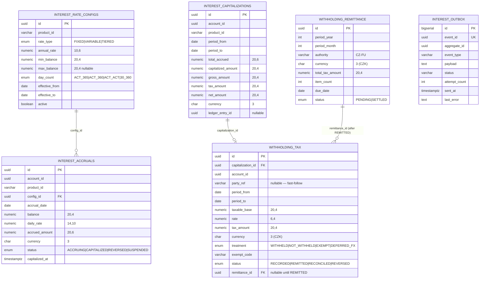

# Data

## Schema

The service owns a dedicated PostgreSQL database `openbank_interest`. Migrations create the tables in the default schema (no explicit schema prefix in the DDL).

> Note on naming: the per-service governance manifest (`governance.yaml`) declares the owned schema as `interest_schema` and a dependent schema `accounts_schema` for lineage purposes; the actual Flyway DDL uses the default schema of the `openbank_interest` database. Treat `governance.yaml` as the lineage/catalog declaration and the migrations below as the physical truth.

## Migrations

Flyway, immutable historical scripts, forward-only (`migrate-at-start: true`):

| Script | What it does | Rollback note |
|---|---|---|
| `V1__init_interest.sql` | Enums (`interest_rate_type`, `accrual_status`, `day_count`), tables `interest_rate_configs`, `interest_accruals` (unique `(account_id, accrual_date, product_id)`), `interest_capitalizations`, indexes | drop tables + enums |
| `V2__create_interest_outbox.sql` | Table `interest_outbox` + status/aggregate indexes (transactional outbox) | drop table |
| `V3__withholding_tax.sql` | ADR-0033: enums `withholding_treatment` / `withholding_tax_status`; adds `gross/tax/net_amount` to capitalizations (backfill net = gross = prior amount, tax = 0); table `withholding_tax` | rollback note embedded in the script (drop table, drop columns, drop types) |
| `V4__withholding_remittance.sql` | ADR-0038: enum `withholding_remittance_status`; table `withholding_remittance` (unique `(period_year, period_month, authority)`); adds `withholding_tax.remittance_id` FK | reversible — drop column / table / type; statuses can be reset `REMITTED → RECORDED` |
| `V5__hibernate_sequences.sql` | Creates `interest_outbox_seq INCREMENT BY 50` (Hibernate Reactive PanacheEntity id allocation; `generation: none`) | `DROP SEQUENCE interest_outbox_seq` |

## Indexes

- `interest_accruals(account_id)`, `(accrual_date)`, `(status)` — account/period/status queries.
- `interest_capitalizations(account_id)` — capitalization history.
- `interest_rate_configs(product_id)` — active-rate lookup.
- `withholding_tax(account_id)`, `(capitalization_id)`, `(status)`, `(remittance_id)` — remittance assembly and lineage.
- `interest_outbox(status, created_at ASC)`, `(aggregate_id)` — dispatcher poll + ordering.

## Retention

Declared service retention policy: **5 years** (`governance.yaml: retentionPolicy`).

| Table | Retention | Reason |
|---|---|---|
| `interest_rate_configs` | retained (logical deactivation via `active=false`) | audit, reproducibility of past accruals |
| `interest_accruals` | retained per policy | reconstruction of credited interest |
| `interest_capitalizations` | retained per policy | tax base evidence; ties to ledger credit |
| `withholding_tax` | retained per policy | **tax evidence** — withheld-at-source liability record |
| `withholding_remittance` | retained per policy | tax evidence — monthly *Vyúčtování daně vybírané srážkou* |
| `interest_outbox` | short-lived after SENT | troubleshooting / replay |

> Tax-evidence retention is bounded by Czech tax-administration time limits (daňový řád); the 5-year service policy is the declared baseline. Confirm against the firm's tax-records retention schedule before go-live (TBD — not encoded in the service).

## PII / sensitive fields

`interest-service` stores **no direct natural-person identifiers** (no name, no birth number, no IBAN). The closest links are pseudonymous:

| Field | Classification | Notes |
|---|---|---|
| `account_id` | pseudonymous reference | FK-by-value to account-service; no DB FK |
| `withholding_tax.party_ref` | pseudonymous reference (tax subject) | nullable in v1 until account→party tax resolution lands |
| amounts / rates | financial data (confidential) | not personal identifiers, but commercially sensitive |

Data classification: `internal` (`governance.yaml: dataClassification`). The withholding records are tax data about an identifiable beneficiary once `party_ref` is populated, so they fall under GDPR processing for the tax legal obligation — see [06 — Compliance](./06-compliance.md).

## Lineage

- **Upstream (declared):** `accounts_schema` (account → party context; the `balance` used in accrual is supplied in the request, not read from a DB FK).
- **Downstream (declared):** `account-service` (relation `api`, "accrues").
- **Event lineage:** outbox → Kafka → tax/reporting consumer, ledger-service, audit-service.
