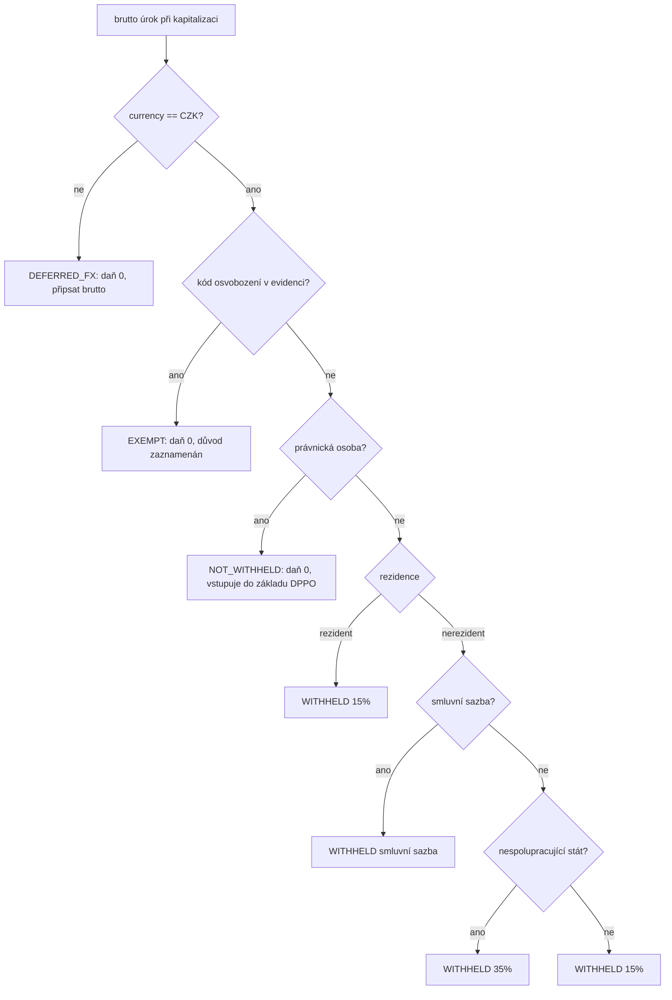
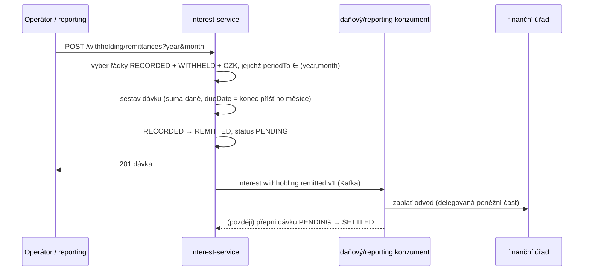

# Compliance

`interest-service` **není** money-path služba (není v `rules.yaml: money_path_services` — nepřesouvá hotovost; peněžní část k finančnímu úřadu je delegována dále). Je však **daňově relevantní**: aplikuje českou srážkovou daň z úrokového výnosu a sestavuje zákonný měsíční odvod.

## Regulatorní rámec

| Regulace | Vztah ke službě | Implementace |
|---|---|---|
| **Zákon č. 586/1992 Sb. (ZDP), §36** | Srážková daň z úrokového výnosu: 15 % rezident fyzická osoba, 35 % nespolupracující/bezsmluvní stát, smluvní sazba; právnické osoby se nesráží | `WithholdingTaxPolicy.compute` (čistá, testovaná); sazby `0.15` / `0.35` / smluvní; zaokrouhlení dolů na celé CZK (daňový řád) — ADR-0033 |
| **ZDP §38d** | Srážka ke dni připsání; odvod do konce měsíce následujícího po měsíci srážky | srážka při kapitalizaci; `WithholdingRemittancePolicy.dueDate` = konec příštího měsíce; `withholding_tax.status RECORDED → REMITTED` — ADR-0038 |
| **Daňový řád** | Zaokrouhlování základu / daně; uchovávání daňových záznamů | zaokrouhlení `RoundingMode.DOWN`, scale 0 (celé CZK); deklarovaná retence 5 let (ověřit proti daňovému plánu) |
| **GDPR** | Záznamy srážky jsou daňová data o identifikovatelném příjemci (jakmile je `party_ref` vyplněn) | právní základ = zákonná povinnost (daň); neukládají se přímé identifikátory (žádné jméno/IBAN/rodné číslo) |
| **DORA** (Reg. (EU) 2022/2554) | Provozní odolnost | health probes, outbox s circuit-breaker/retry/timeout, metriky, audit události, runbooky |
| **NIS2** | Síťová a informační bezpečnost | OIDC auth, bezpečnostní hlavičky (CSP/HSTS/X-Frame-Options), in-cluster TLS, audit log |
| **ČNB / účetní předpisy** | Accrual a kapitalizace úroku do účetnictví | kapitalizace odkazuje ledger kredit (`ledger_entry_id`); ledger-service vede podvojnou knihu |

## Logika srážkové daně (ADR-0033)

**Fail-safe:** pokud daňový profil nelze resolvovat, policy použije fiskálně konzervativní výchozí profil CZ rezidenta fyzické osoby (15 %) — nikdy nesrazí méně. Rozhodnutí se zaznamenává pro každou kapitalizaci, včetně nulového zdanění, pro audit.

## Měsíční odvod (ADR-0038)

`interest-service` nikdy nepřesouvá hotovost (ADR-0030 off-gate). Prázdné období dá zdokumentovanou nulovou dávku (nulová částka, nula položek) — nulové vyúčtování je stále vyúčtování.

## GDPR mapování

### Právní základ (čl. 6)

- **Zákonná povinnost** (čl. 6(1)(c)) — primární: srážka a odvod daně dle ZDP §36/§38d.
- **Smlouva** (čl. 6(1)(b)) — sekundární: výpočet a připsání smluvního úroku.

### Jaká osobní data se zpracovávají

`interest-service` neukládá **žádné přímé identifikátory fyzické osoby** (žádné jméno, rodné číslo, IBAN). Drží pseudonymní reference:

- `account_id` — pseudonymní reference účtu (FK-by-value na account-service).
- `withholding_tax.party_ref` — pseudonymní reference daňového subjektu (ve v1 nullable; vyplní se po resoluci účet→party).

### Práva subjektu údajů

| Právo | Aplikace |
|---|---|
| Přístup (čl. 15) | accrualy / kapitalizace / srážka dotazovatelné dle `accountId` |
| Oprava (čl. 16) | opravy konfigurace sazby přes admin (deaktivovat + znovu vytvořit) |
| Výmaz (čl. 17) | **Neaplikuje se** na daňové záznamy — zákonná daňová povinnost přebíjí výmaz po dobu zákonné retence |
| Omezení (čl. 18) | konfigurace sazby `active=false`; accrualy pozastaveny (`SUSPENDED`) |
| Přenositelnost (čl. 20) | N/A (zde nejsou osobní data poskytnutá spotřebitelem) |
| Námitka (čl. 21) | N/A (žádné marketingové zpracování) |

### Toky dat ven

- → **daňový / reporting konzument** (Kafka): `interest.withholding.recorded.v1` a `interest.withholding.remitted.v1` — pseudonymní (`accountId`, částky, treatment); stejný správce, intra-OpenBank.
- → **audit-service** (Kafka): plný payload události pro tamper-evident audit; stejný správce.
- → **ledger-service** (Kafka): reference netto kreditu; stejný správce.

Žádná data neopouští region EU/EHP.

### Retence (čl. 5(1)(e))

| Data | Retence | Základ |
|---|---|---|
| Záznamy srážky (`withholding_tax`) | dle plánu daňových záznamů (deklarovaný základ 5 let) | daňový řád / důkaz dle ZDP |
| Dávky odvodu (`withholding_remittance`) | dle plánu daňových záznamů | důkaz daňového podání |
| Accrualy / kapitalizace | dle politiky služby (deklarováno 5 let) | reprodukovatelnost připsaného úroku |

> Přesná zákonná retence daňových záznamů je **TBD** — před go-live ověřte proti firemnímu plánu uchovávání daňových záznamů; hodnota 5 let je deklarovaná politika služby (`governance.yaml`).

## DORA mapování (Reg. (EU) 2022/2554)

| Článek | Téma | Implementace |
|---|---|---|
| čl. 5/6 | Rámec řízení ICT rizik | centrální registr operací; závislost na `openbank-libs` |
| čl. 9 | Identifikace | `BuildInfo` (gitCommit, buildTime, version) v `/api/v1/info` |
| čl. 10 | Detekce | metriky Micrometer/Prometheus, OpenTelemetry tracing, alerting na error rate |
| čl. 11 | Reakce & obnova | outbox s circuit-breaker/retry/timeout (ADR-0050); runbooky v [05 — Provoz](./05-operations.md) |
| čl. 16/17 | Incidenty & reporting | doménové události do audit-service jako důkaz |
| čl. 28 | Riziko třetích stran | žádný third-party SaaS — vše self-hosted |

## Audit trail

Každá kapitalizace zaznamená rozhodnutí brutto/daň/netto a emituje `interest.withholding.recorded.v1`; každý odvod emituje `interest.withholding.remitted.v1`. Obě nesou `schemaVersion` a `audit-service` je perzistuje s tamper-evident řetězcem. Události jsou append-only; opravy jsou kompenzační události, nikdy přepis.

## Bezpečnostní kontroly

- ✅ AuthN: Keycloak OIDC, RS256 JWT (vypnuto jen v `%dev` / `%test`).
- ✅ AuthZ: Quarkus `@RolesAllowed` na endpoint (čtení vs. mutace).
- ✅ Bezpečnostní hlavičky: CSP `default-src 'self'`, HSTS, `X-Frame-Options: DENY`, `X-Content-Type-Options: nosniff`, Referrer-Policy, Permissions-Policy.
- ✅ CORS: omezené originy, povolené hlavičky `Content-Type,Authorization,Idempotency-Key`.
- ✅ Resilientní publikace: Bulkhead + CircuitBreaker + Retry + Timeout na Kafka publisheru.
- ✅ Jeden writer outboxu: `concurrentExecution = SKIP` + `replicas: 1` (ADR-0050).
- ✅ Tajemství: dev placeholdery musí být v prod přepsány přes Vault (ADR-0017).
- ✅ Daňové zaokrouhlení & sazby zafixované v jedné testované policy (žádný drift mezi místy volání).
- ⚠️ Idempotency-Key na mutacích: ve v1 neimplementováno (odvod je idempotentní dle `(year, month)`; accrualy dle DB unique klíče) — sledováno jako položka zralosti.
- ⚠️ Resoluce daňových atributů party: v1 používá fail-safe default; cesty právnická osoba / smlouva / osvobození čekají na fast-follow resoluce účet→party.
