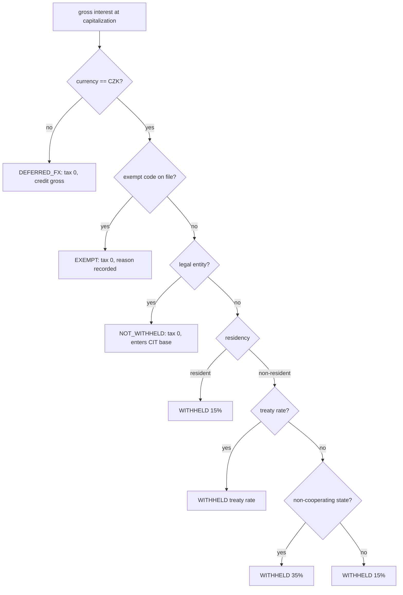
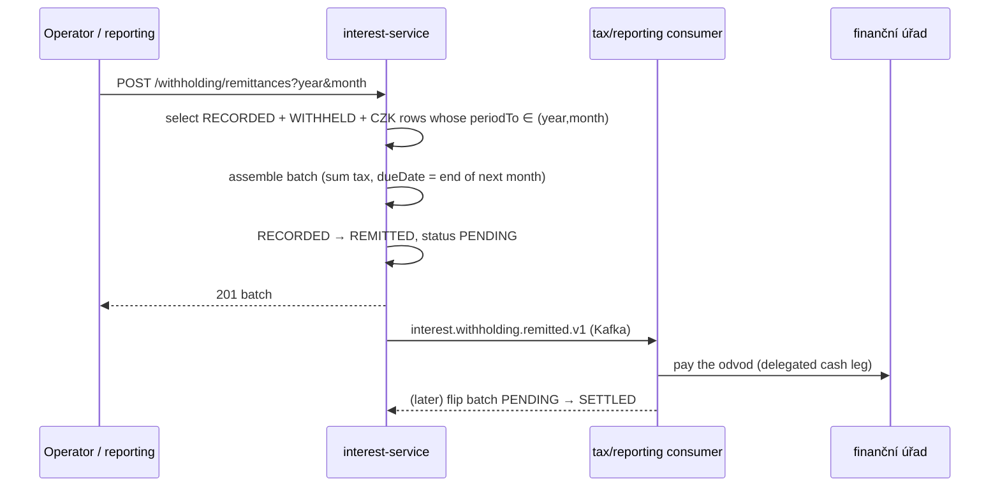

# Compliance

`interest-service` is **not** a money-path service (it is not in `rules.yaml: money_path_services` — it moves no cash; the cash leg to the tax authority is delegated downstream). It is, however, a **tax-relevant** service: it applies Czech final withholding on credit interest and assembles the statutory monthly remittance.

## Regulatory framework

| Regulation | Relation to this service | Implementation |
|---|---|---|
| **Zákon č. 586/1992 Sb. (ZDP), §36** | Final withholding (srážková daň) on credit interest: 15 % resident individual, 35 % non-cooperating/no-treaty state, treaty rate; legal entities not withheld | `WithholdingTaxPolicy.compute` (pure, tested); rates `0.15` / `0.35` / treaty; whole-CZK rounding down (daňový řád) — ADR-0033 |
| **ZDP §38d** | Withholding on the credit date; remit by end of the month following the withholding month | withholding at capitalization; `WithholdingRemittancePolicy.dueDate` = end of next month; `withholding_tax.status RECORDED → REMITTED` — ADR-0038 |
| **Daňový řád** | Tax base / tax amount rounding; tax-records retention | rounding `RoundingMode.DOWN`, scale 0 (whole CZK); 5-year declared retention (confirm against tax schedule) |
| **GDPR** | Withholding records are tax data about an identifiable beneficiary (once `party_ref` is populated) | lawful basis = legal obligation (tax); no direct identifiers stored (no name/IBAN/birth number) |
| **DORA** (Reg. (EU) 2022/2554) | Operational resilience | health probes, outbox with circuit-breaker/retry/timeout, metrics, audit events, runbooks |
| **NIS2** | Network & info security | OIDC auth, security headers (CSP/HSTS/X-Frame-Options), in-cluster TLS, audit log |
| **CNB / účetní předpisy** | Interest accrual & capitalization feeding the books | capitalization references the ledger credit (`ledger_entry_id`); ledger-service keeps the double-entry book |

## Withholding-tax logic (ADR-0033)

**Fail-safe:** if the tax profile cannot be resolved, the policy uses the fiscally conservative CZ-resident-individual default (15 %) — it never under-withholds. The decision is recorded for every capitalization, including zero-tax treatments, for the audit trail.

## Monthly remittance (ADR-0038)

`interest-service` never moves the cash (ADR-0030 off-gate). An empty period yields a documented nil batch (zero amount, zero items) — a nil return is still a return.

## GDPR mapping

### Lawful basis (Art. 6)

- **Legal obligation** (Art. 6(1)(c)) — primary: withholding and remitting tax under ZDP §36/§38d.
- **Contract** (Art. 6(1)(b)) — secondary: computing and crediting contractual interest.

### What personal data is processed

`interest-service` stores **no direct natural-person identifiers** (no name, no birth number, no IBAN). It holds pseudonymous references:

- `account_id` — pseudonymous account reference (FK-by-value to account-service).
- `withholding_tax.party_ref` — pseudonymous tax-subject reference (nullable in v1; populated once account→party tax resolution lands).

### Data subject rights

| Right | Application |
|---|---|
| Access (Art. 15) | accruals / capitalizations / withholding queryable by `accountId` |
| Rectification (Art. 16) | rate-config corrections via admin (deactivate + recreate) |
| Erasure (Art. 17) | **Not applicable** to tax records — the tax legal obligation overrides erasure for the statutory retention period |
| Restriction (Art. 18) | rate config `active=false`; accruals suspended (`SUSPENDED`) |
| Portability (Art. 20) | N/A (no consumer-provided personal data here) |
| Object (Art. 21) | N/A (no marketing processing) |

### Data flows out

- → **tax / reporting consumer** (Kafka): `interest.withholding.recorded.v1` and `interest.withholding.remitted.v1` — pseudonymous (`accountId`, amounts, treatment); same controller, intra-OpenBank.
- → **audit-service** (Kafka): full event payload for the tamper-evident audit trail; same controller.
- → **ledger-service** (Kafka): the net credit reference; same controller.

No data leaves the EU/EEA region.

### Retention (Art. 5(1)(e))

| Data | Retention | Basis |
|---|---|---|
| Withholding records (`withholding_tax`) | per tax-records schedule (5-year declared baseline) | daňový řád / ZDP evidence |
| Remittance batches (`withholding_remittance`) | per tax-records schedule | tax filing evidence |
| Accruals / capitalizations | per service policy (5 years declared) | reproducibility of credited interest |

> The exact statutory tax-records retention is **TBD** — confirm against the firm's tax-records retention schedule before go-live; the 5-year value is the service's declared policy (`governance.yaml`).

## DORA mapping (Reg. (EU) 2022/2554)

| Article | Topic | Implementation |
|---|---|---|
| Art. 5/6 | ICT risk management framework | central register operations; dependency on `openbank-libs` |
| Art. 9 | Identification | `BuildInfo` (gitCommit, buildTime, version) in `/api/v1/info` |
| Art. 10 | Detection | Micrometer/Prometheus metrics, OpenTelemetry tracing, error-rate alerting |
| Art. 11 | Response & recovery | outbox with circuit-breaker/retry/timeout (ADR-0050); runbooks in [05 — Operations](./05-operations.md) |
| Art. 16/17 | Incident & reporting | domain events to audit-service for evidence |
| Art. 28 | Third-party risk | no third-party SaaS — all self-hosted |

## Audit trail

Every capitalization records the gross/tax/net decision and emits `interest.withholding.recorded.v1`; every remittance emits `interest.withholding.remitted.v1`. Both carry `schemaVersion` and are persisted by `audit-service` with a tamper-evident chain. Events are append-only; corrections are compensating events, never rewrites.

## Security controls

- ✅ AuthN: Keycloak OIDC, RS256 JWT (disabled only in `%dev` / `%test`).
- ✅ AuthZ: Quarkus `@RolesAllowed` per endpoint (reads vs. mutations).
- ✅ Security headers: CSP `default-src 'self'`, HSTS, `X-Frame-Options: DENY`, `X-Content-Type-Options: nosniff`, Referrer-Policy, Permissions-Policy.
- ✅ CORS: restricted origins, allowed headers `Content-Type,Authorization,Idempotency-Key`.
- ✅ Resilient publish: Bulkhead + CircuitBreaker + Retry + Timeout on the Kafka publisher.
- ✅ Single-writer outbox: `concurrentExecution = SKIP` + `replicas: 1` (ADR-0050).
- ✅ Secrets: dev placeholders must be overridden via Vault in prod (ADR-0017).
- ✅ Tax rounding & rates pinned in one tested policy (no drift across call sites).
- ⚠️ Idempotency-Key on mutations: not implemented in v1 (remittance is idempotent by `(year, month)`; accruals by the DB unique key) — tracked as a maturity item.
- ⚠️ Party tax-attribute resolution: v1 uses the fail-safe default; legal-entity / treaty / exempt paths await the account→party resolution fast-follow.
