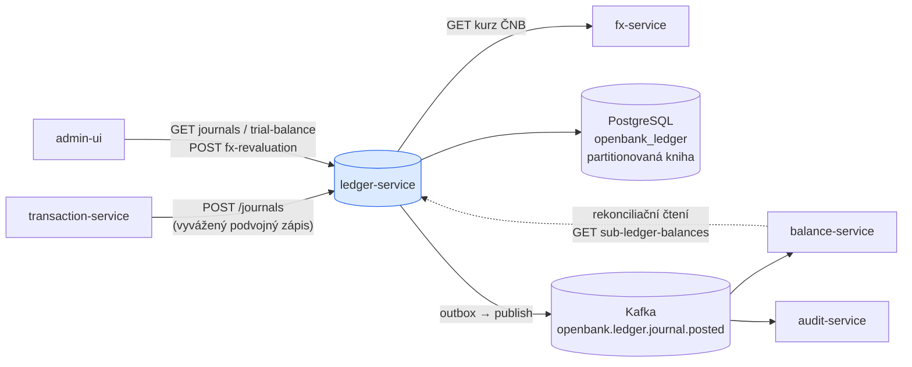
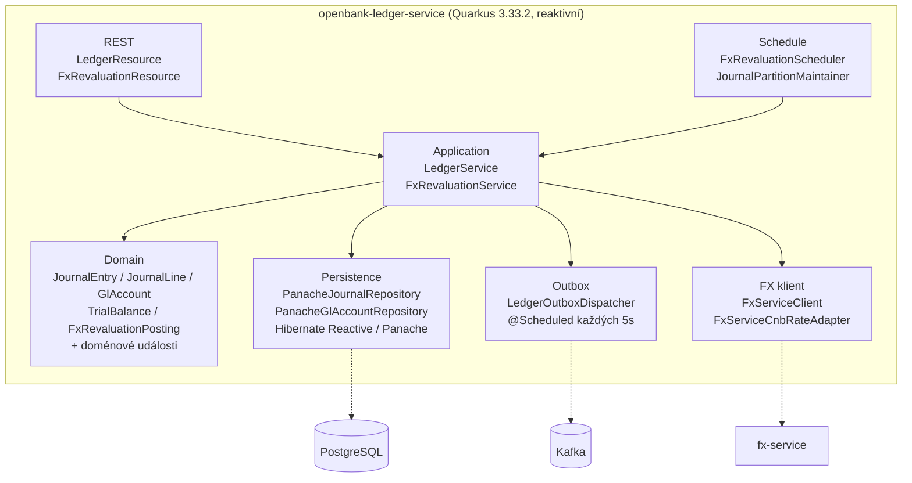
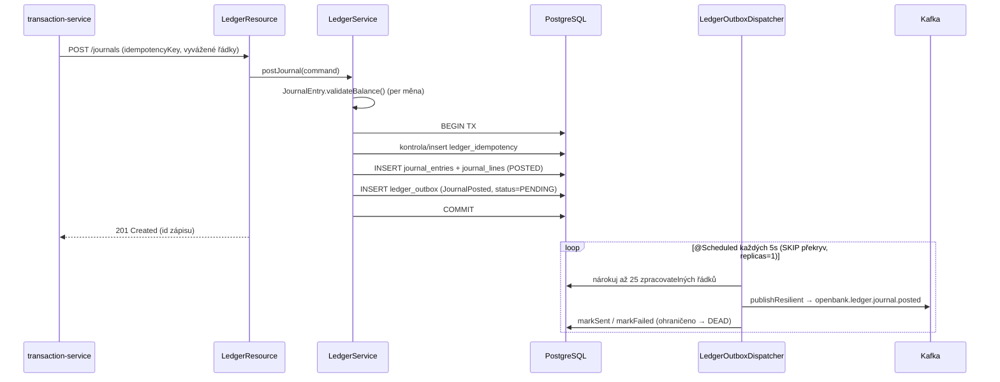

# Architektura

## C4 — Kontext systému



## C4 — Kontejner (vnitřní struktura)



## Hexagonální vrstvy

Struktura adresářů odráží **ports-and-adapters** (ADR-0002):

```
com.openbank.ledger/
├── domain/                    ◄── jádro — bez frameworkových závislostí
│   ├── model/                 JournalEntry, JournalLine, GlAccount, TrialBalance,
│   │                          FxConversionPosting, FxRevaluationPosting
│   └── event/                 JournalPosted, JournalReversed, FxRevalued
│
├── application/               ◄── orchestrace use-casů
│   ├── port/in/               LedgerPorts (LedgerUseCase), FxRevaluationPorts
│   ├── port/out/              GlAccountRepository, JournalRepository,
│   │                          LedgerOutboxPort, CnbRateProvider
│   └── usecase/               LedgerService, FxRevaluationService
│
└── infrastructure/            ◄── adaptéry
    ├── rest/                  LedgerResource, FxRevaluationResource, ExceptionMappers
    ├── persistence/           Panache*Repository, JournalEntities, LedgerOutboxEntity
    ├── outbox/                LedgerOutboxDispatcher (plánovaný drain)
    ├── messaging/             KafkaLedgerOutboxEventPublisher
    ├── client/                FxServiceClient, FxServiceCnbRateAdapter
    ├── partition/             JournalPartitionMaintainer, HibernatePartitionExecutor
    └── schedule/              FxRevaluationScheduler
```

**Pravidlo závislostí:** `domain` ← `application` ← `infrastructure`. Doménový kód nikdy nevidí Hibernate, Kafku ani REST DTO. Invariant podvojnosti žije celý v `JournalEntry` (`validateBalance()` běží v `init` agregátu).

## Klíčové porty

| Port (směr) | Adaptér | Účel |
|---|---|---|
| `LedgerUseCase` (in) | `LedgerService` | účtuj/stornuj/dotazuj zápisy, předvaha a analytika |
| `FxRevaluationUseCase` (in) | `FxRevaluationService` | denní mark-to-ČNB revalvace |
| `JournalRepository` (out) | `PanacheJournalRepository` | perzistence/čtení zápisů + řádků |
| `GlAccountRepository` (out) | `PanacheGlAccountRepository` | vyhledávání v účtové osnově dle kódu/id |
| `LedgerOutboxPort` (out) | `LedgerOutboxRepositoryImpl` | zařazení + nárokování outbox řádků |
| `CnbRateProvider` (out) | `FxServiceCnbRateAdapter` (→ `FxServiceClient`) | zákonný kurz ČNB |

## Outbox tok



**Proč outbox (ADR-0050):** zápis do DB a publikace do Kafky musí být atomické. Doručení na money-path je regulatorní: jediný in-JVM zapisovatel (`concurrentExecution = SKIP`) plus `replicas: 1` garantují, že řádek nárokuje právě jeden dispatcher; selhání jednotlivých řádků jsou izolovaná a ohraničená přechodem do DEAD. Dispatcher běží plně na Vert.x event loopu (reaktivní Panache), aby se předešlo chybám session na worker vlákně.

## Životní cyklus partitionů

`journal_entries` je RANGE-partitionováno podle `entry_date` (jeden partition na kalendářní rok + DEFAULT catch-all). `JournalPartitionMaintainer` posouvá horizont vpřed (`future-years: 2`) a v režimu DETACH-only/dry-run (výchozí) spravuje retenci (`retention-years: 10`). Každá akce životního cyklu se zapisuje do neměnné tabulky `partition_lifecycle_audit`. DROP je destruktivní a je za vědomým, archivovaným přepnutím operátorského flagu.

## Komponenty z `openbank-libs`

| Modul | Použití zde |
|---|---|
| `libs.domain.money.Money` + `CurrencyCode` | částky řádků a bázové částky, měnově bezpečná aritmetika |
| `libs.domain.event.DomainEvent` | základ pro JournalPosted / JournalReversed / FxRevalued |
| `libs.api.pagination.CursorPage` | cursor stránkování seznamu zápisů |
| `libs.security.Roles` | typované role konstanty pro `@RolesAllowed` |
| `libs.web.ServiceInfoResource` | `/api/v1/info` build metadata |
| `libs.docs.DocsResource` | **tato dokumentace** (`/q/openbank/docs`) |

## Principy

1. **Hranice agregátu = JournalEntry** — zaúčtování je atomické a vyvažuje se v rámci každé měny, než vůbec může existovat (invariant v `init`).
2. **Neměnnost + oprava pouze stornem** — POSTED zápis se nikdy nemění; chyba se opravuje vyváženým stornem provázaným přes `reversal_of`.
3. **Per-měnové vyvažování (ADR-0025)** — cross-currency události se vyvažují směrováním přes per-měnové FX position účty; nikdy ne křížovým součtem v bázové měně.
4. **Kniha je zlatá, zůstatek je projekce (ADR-0039)** — kniha vlastní pravdu; `balance-service` se vůči ní rekonciliuje.
5. **Žádná vzdálená volání uvnitř zapisovací TX** — publikace do Kafky je asynchronní přes outbox; načtení kurzu ČNB probíhá v use-casu revalvace, ne na cestě zápisu.
