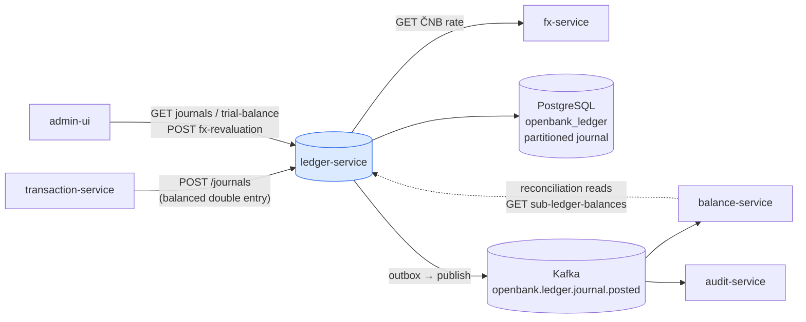
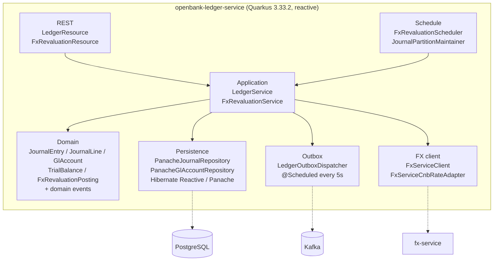
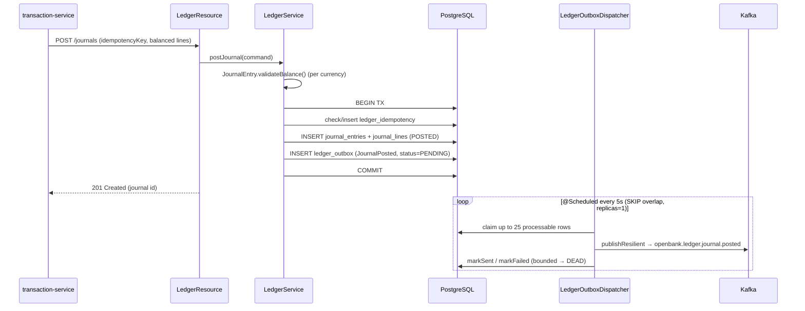

# Architecture

## C4 — System Context



## C4 — Container (internal structure)



## Hexagonal layers

The directory structure reflects **ports-and-adapters** (ADR-0002):

```
com.openbank.ledger/
├── domain/                    ◄── core — no framework dependencies
│   ├── model/                 JournalEntry, JournalLine, GlAccount, TrialBalance,
│   │                          FxConversionPosting, FxRevaluationPosting
│   └── event/                 JournalPosted, JournalReversed, FxRevalued
│
├── application/               ◄── use-case orchestration
│   ├── port/in/               LedgerPorts (LedgerUseCase), FxRevaluationPorts
│   ├── port/out/              GlAccountRepository, JournalRepository,
│   │                          LedgerOutboxPort, CnbRateProvider
│   └── usecase/               LedgerService, FxRevaluationService
│
└── infrastructure/            ◄── adapters
    ├── rest/                  LedgerResource, FxRevaluationResource, ExceptionMappers
    ├── persistence/           Panache*Repository, JournalEntities, LedgerOutboxEntity
    ├── outbox/                LedgerOutboxDispatcher (scheduled drain)
    ├── messaging/             KafkaLedgerOutboxEventPublisher
    ├── client/                FxServiceClient, FxServiceCnbRateAdapter
    ├── partition/             JournalPartitionMaintainer, HibernatePartitionExecutor
    └── schedule/              FxRevaluationScheduler
```

**Dependency rule:** `domain` ← `application` ← `infrastructure`. Domain code never sees Hibernate, Kafka, or REST DTOs. The double-entry invariant lives entirely in `JournalEntry` (`validateBalance()` runs in the aggregate `init`).

## Key ports

| Port (direction) | Adapter | Purpose |
|---|---|---|
| `LedgerUseCase` (in) | `LedgerService` | post/reverse/query journals, trial & sub-ledger balances |
| `FxRevaluationUseCase` (in) | `FxRevaluationService` | daily mark-to-ČNB revaluation |
| `JournalRepository` (out) | `PanacheJournalRepository` | persist/read journal entries + lines |
| `GlAccountRepository` (out) | `PanacheGlAccountRepository` | chart-of-accounts lookups by code/id |
| `LedgerOutboxPort` (out) | `LedgerOutboxRepositoryImpl` | enqueue + claim outbox rows |
| `CnbRateProvider` (out) | `FxServiceCnbRateAdapter` (→ `FxServiceClient`) | statutory ČNB FX fixing |

## Outbox flow



**Why outbox (ADR-0050):** the DB write and the Kafka publish must be atomic-ish. Money-path delivery is regulatory-grade: a single in-JVM writer (`concurrentExecution = SKIP`) plus `replicas: 1` guarantee exactly one dispatcher claims a row; per-row failures are isolated and bounded by a DEAD transition. The dispatcher runs fully on the Vert.x event loop (reactive Panache) to avoid worker-thread session errors.

## Partition lifecycle

`journal_entries` is RANGE-partitioned by `entry_date` (one partition per calendar year + a DEFAULT catch-all). The `JournalPartitionMaintainer` rolls the horizon forward (`future-years: 2`) and, in DETACH-only/dry-run mode by default, manages retention (`retention-years: 10`). Every lifecycle action is written to the immutable `partition_lifecycle_audit` table. DROP is destructive and gated behind a deliberate, archived operator flag flip.

## Components from `openbank-libs`

| Module | Use here |
|---|---|
| `libs.domain.money.Money` + `CurrencyCode` | per-line and base amounts, currency-safe arithmetic |
| `libs.domain.event.DomainEvent` | base for JournalPosted / JournalReversed / FxRevalued |
| `libs.api.pagination.CursorPage` | cursor-paginated journal listing |
| `libs.security.Roles` | typed role constants for `@RolesAllowed` |
| `libs.web.ServiceInfoResource` | `/api/v1/info` build metadata |
| `libs.docs.DocsResource` | **this documentation** (`/q/openbank/docs`) |

## Principles

1. **Aggregate boundary = JournalEntry** — a posting is atomic and balances within each currency before it can exist (`init` invariant).
2. **Immutability + reversal-only correction** — a POSTED entry is never mutated; a mistake is fixed by a balanced reversal that links back via `reversal_of`.
3. **Per-currency balancing (ADR-0025)** — cross-currency events self-balance by routing through per-currency FX position accounts; never a base-currency cross-sum.
4. **Ledger is golden, balance is projection (ADR-0039)** — the ledger owns truth; `balance-service` reconciles against it.
5. **No remote calls inside the write TX** — Kafka publish is async via outbox; ČNB rate fetch happens in the revaluation use case, not in the journal write path.
