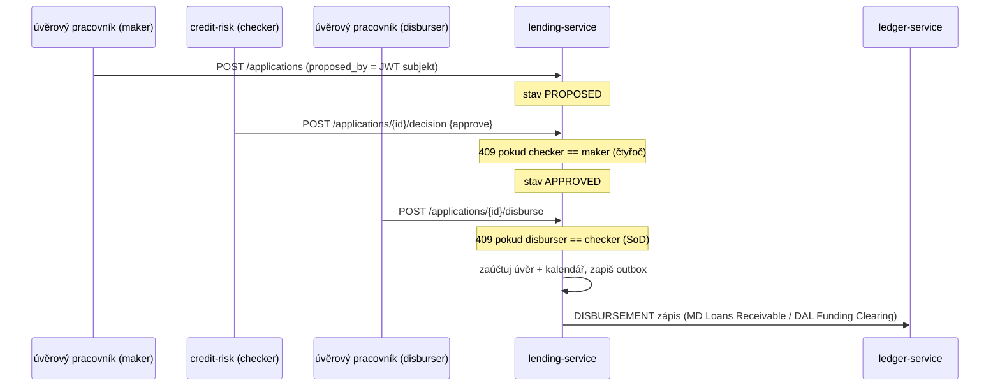

# Compliance

Toto je **money-path služba** (`rules.yaml: money_path_services`): každá změna vyžaduje 2 schválení + threat model (`docs/threat-models/openbank-lending-service.md`, ADR-0030).

## Regulatorní rámec

| Regulace | Vztah ke službě | Implementace |
|---|---|---|
| **IFRS 9** (Finanční nástroje) | Opravné položky úvěru — stage + očekávané úvěrové ztráty | `GET /loans/{id}/provisioning`; čistá `libs.lending.Ifrs9` ECL; `RiskParameterSource` (PD/LGD); Stage 3 → odpis a derecognition |
| **EBA/GL/2020/06** (Poskytování a monitorování úvěrů) | Čtyřoč úvěrové rozhodnutí + segregace odpovědností | maker/checker/disburser vynucené na serveru z JWT subjektu; `409` při porušení |
| **IAS 1 / akruální účetnictví** | Úrok uznán při vydělání, ne při inkasu | naplánovaný akruální průchod (`INTEREST_ACCRUAL`), idempotenční příznak `interest_accrued` |
| **AnaCredit (Reg. (EU) 2016/867)** | Granulární reporting úvěrů a zajištění | kategorie ochrany `collateral_type`; atributy úvěr/party/expozice uchovány |
| **AMLD** (Boj proti praní špinavých peněz) | Podezřelá úvěrová aktivita, auditovatelnost odpisů | každá peněžní událost + rozhodnutí emituje doménovou událost do audit pipeline; AML hold může prodloužit retenci |
| **GDPR** | `party_id` je pseudonymní reference; identity operátorů jsou osobní údaj | žádné jméno klienta/IBAN/rodné číslo neukládáno; 7letá retence záznamů překrývá výmaz |
| **DORA** (Reg. (EU) 2022/2554) | Provozní odolnost | health probes, fault-tolerant volání ledgeru, audit události, SLO, runbooky. `BootstrapVerifier` byl uveden zde a neexistuje (#8426) — secrets drží injektáž přes ESO/OpenBao `secretKeyRef` (ADR-0007) |
| **NIS2** | Bezpečnost sítí a informací | mTLS in-cluster, bezpečnostní hlavičky, JSON audit logging |
| **ČNB uchovávání úvěrových záznamů** | Retence úvěrové smlouvy | 7letá retenční politika (`governance.yaml`) |

## GDPR mapování

### Právní základ (čl. 6)

- **Smlouva** (čl. 6(1)(b)) — primární: správa úvěru je nezbytná pro plnění úvěrové smlouvy.
- **Právní povinnost** (čl. 6(1)(c)) — sekundární: IFRS 9 opravné položky, AnaCredit reporting, AML, účetní/daňové uchovávání záznamů.

### Práva subjektu údajů

| Právo | Aplikace |
|---|---|
| Přístup (čl. 15) | `GET /loans?partyId=…` a `GET /applications?partyId=…` vrací data subjektu |
| Oprava (čl. 16) | opravy přes admin UI (audit logováno) |
| Výmaz (čl. 17) | **Neaplikovatelné u aktivního/uzavřeného úvěru** — uchovávání záznamů (7 let) a AMLD má přednost |
| Omezení (čl. 18) | přechody stavu žádosti/úvěru (např. `REJECTED`); žádné další zpracování |
| Přenositelnost (čl. 20) | export dat dle `party_id` (CSV/JSON) — TBD jako formální endpoint |
| Námitka (čl. 21) | N/A (zde žádné marketingové zpracování) |

### Minimalizace dat

Tato služba ukládá pouze pseudonymní `party_id` plus ekonomiku úvěru a identity operátorů, kteří učinili jednotlivá rozhodnutí. Žádné jméno klienta, kontakt, IBAN ani rodné číslo se nedrží — ty žijí v `party-service`.

### Toky dat ven

- → **ledger-service** (REST `POST /api/v1/journals`): GL účty, částka, měna, system-actor — účetní zápisy, stejný správce, intra-OpenBank.
- → **Kafka `openbank.lending.events`** (audit / analytika): payload události s `loanId`, `partyId`, částkami — stejný správce.
- Žádná data neopouštějí region EU/EHP.

### Retence (čl. 5(1)(e))

| Stav úvěru | Retence |
|---|---|
| `ACTIVE` | průběžně |
| `CLOSED` | 7 let po uzavření (úvěrová smlouva / účetní uchovávání) |
| `WRITTEN_OFF` | 7 let; déle při AML případu |

## DORA mapování (Reg. (EU) 2022/2554)

| Článek | Téma | Implementace |
|---|---|---|
| čl. 5 | Řízení ICT rizik | money-path, T0 vždy zapnuté (ADR-0057) |
| čl. 6 | Rámec řízení rizik | závislost = openbank-libs (centralizováno) |
| čl. 9 | Identifikace | `BuildInfo` (gitCommit, buildTime, version) v `/api/v1/info` |
| čl. 10 | Detekce | Micrometer/Prometheus metriky, OpenTelemetry trasy, alerting |
| čl. 11 | Reakce a obnova | runbooky v `05-operations.md`, RTO 15 min / RPO 5 min |
| čl. 16 | Řízení incidentů | doménové události do audit-service pro evidenci |
| čl. 28 | Riziko třetích stran | žádná třetí strana SaaS — ledger/Keycloak/Kafka vše self-hosted |

## Čtyřoč princip & segregace odpovědností (EBA/GL/2020/06, ADR-0028 D5)



Všechny tři identity jsou ověřený JWT subjekt zachycený na serveru — nikdy z klienta — takže oddělení nelze zfalšovat.

## IFRS 9 opravné položky

`GET /loans/{id}/provisioning?asOf=` vrací bodový snímek: zbývající zůstatek, dny po splatnosti, bucket delikvence, IFRS 9 stage, ECL horizont a očekávanou úvěrovou ztrátu. ECL matematika je čistá primitiva `libs.lending.Ifrs9` živená `RiskParameterSource` (dnes konzervativní no-op výchozí: PD12m 0.03, PD-lifetime 0.20, LGD 0.45 — reálný PD model je otázka zapojení). Stage 3 nevymahatelné úvěry končí přes `POST /loans/{id}/writeoff` → zápis `WRITE_OFF` (MD Loan Loss Expense / DAL Loans Receivable) a derecognition.

### Stage bucketing (ADR-0028 Fáze 3)

`Ifrs9.stage(daysPastDue, …)` třídí čistě podle dnů po splatnosti (praktická náhrada, kterou toto ADR používá místo plného modelu "významného nárůstu úvěrového rizika", jenž vyžaduje data, která tento repozitář zatím nemá):

- **Stage 1** (splácející se, 12měsíční ECL) — DPD ≤ 30.
- **Stage 2** (SICR, celoživotní ECL) — 30 < DPD ≤ 90.
- **Stage 3** (znehodnocený / default, celoživotní ECL) — DPD > 90, odpovídá prahu definice defaultu dle CRR čl. 178 / EBA (`Delinquency.isDefaulted`).

DPD se odvozuje z existujícího splátkového kalendáře (`installment.due_date` / `paid`) — pro samotné stage bucketing nebyl potřeba žádný nový sloupec.

### Naplánovaný cyklus provisioningu a účetní zápis (ADR-0028 Fáze 3)

`ProvisioningCycleScheduler` měsíčně přehodnotí stage/ECL každého ACTIVE úvěru (`lending.provisioning.cycle.every`) a zaúčtuje pouze **deltu** ECL oproti předchozímu období úvěru — nikdy celé ECL znovu — jako zápis `PROVISIONING` (MD Loan Loss Expense / DAL Loan Loss Allowance při nárůstu; obráceně při poklesu/rozpuštění). Historie se ukládá do `loan_provisioning` (jeden řádek na úvěr a období `yyyy-MM`), což slouží jako základ pro deltu i jako idempotenční pojistka proti opakování už provisionovaného období.

### ⚠️ Explicitní omezení — zjednodušené, neprodukční PD/LGD/EAD

**Parametry PD a LGD použité v tomto přírůstku jsou zjednodušené zástupné hodnoty, nikoli regulatorně kvalitní rizikové parametry:**

- **EAD** = zbývající jistina (bez diskontování na efektivní úrokovou sazbu — primitivum `Ifrs9` to ponechává na volajícím a zde se neaplikuje).
- **PD** = plochá sazba podle IFRS 9 stage (`RiskParameterSource.DEFAULT_PD_12M = 0.03`, `DEFAULT_PD_LIFETIME = 0.20`), identická pro každý úvěr bez ohledu na dlužníka, produkt, vintage nebo makroekonomické podmínky. **Tímto přírůstkem beze změny.**
- **LGD** = plochých `0.45` pro každý úvěr, **snížených o registrované zajištění** (viz níže), jinak bez ohledu na senioritu nebo historii návratnosti.

### LGD upravené o zajištění (ADR-0028 fáze 3, přírůstek 2)

Registrace zajištění (`POST /api/v1/lending/loans/{id}/collateral`) byla dodána dříve jako data pro
AnaCredit kategorie ochrany; **tento přírůstek je první, který ji skutečně zohledňuje ve výpočtu ECL.**
`Ifrs9.collateralAdjustedLgd` (`openbank-libs-domain`) sníží plochý LGD výše o zajištění úvěru
upravené o srážku (haircut) v poměru k expozici při selhání:

```
efektivníLGD = max(0, LGD - (Σ zajištění.tržníHodnota × (1 - zajištění.srážka)) / expoziceČiPriSelhani)
```

- Každá položka zajištění registrovaná k úvěru přispívá `tržníHodnota × (1 - srážka)`; položky se
  sečtou **před** aplikací snížení (více položek zajištění k jednomu úvěru se sečte korektně).
- Výsledek je **omezen na rozsah `[0, LGD]`**: nadměrné zajištění srazí ztrátu při selhání na (téměř)
  nulu, nikdy do záporu — záporné LGD nemá ekonomický smysl. Úvěr bez registrovaného zajištění zůstává
  beze změny (bit-identické s výpočtem před tímto přírůstkem).
- PD tímto přírůstkem **není** dotčeno.

**Explicitní omezení tohoto prvního přírůstku (datové modelování, nikoli kalibrovaný rizikový model):**
- **Žádné přeceňování v reálném čase / mark-to-market.** Snížení používá tržní hodnotu/srážku naposledy
  deklarovanou nebo externě přeceněnou při registraci (`CollateralValuationPort`, stále no-op výchozí
  hodnota) — zastaralé ocenění přímo podhodnocuje vykázané ECL bez jakéhokoli varování o stáří.
- **Žádné ověření právního zajištění (perfection of security interest).** Registrace zajištění
  zaznamenává datový nárok k úvěru; nezakládá, neověřuje ani nepotvrzuje vymahatelnou právní přednost
  banky k podkladovému aktivu.
- **Procenta srážek (haircut) jsou zástupná tabulka prvního přiblížení**, nikoli aktuársky nebo
  regulatorně kalibrované hodnoty — např. nemovitosti 20 %, vozidla 40 %, hotovostní vklad 0 %, cenné
  papíry 30 % jsou rozumné výchozí předpoklady použité v testech této služby, dodávané volajícím při
  každé registraci (`CollateralRequest.haircut`), nikoli platformou vynucovaná nebo model-governance
  tabulka.
- **Kontrola čtyř očí při registraci (issue #621):** zaregistrovaná položka zajištění je ve stavu
  `PENDING` a je vyloučena ze snížení LGD výše, dokud ji neschválí JINÝ princip prostřednictvím
  `POST /api/v1/lending/collateral/{id}/decision` — zrcadlí maker-checker vzor vzniku úvěru/vyplacení.
  Viz threat model §3/§7.

**Neexistuje žádný behaviorální/statistický PD model, žádný makroekonomický overlay ani forward-looking scénářové vážení.** Tyto parametry **musí být před jakýmkoli produkčním použitím kalibrovány aktuárským/risk týmem podle reálné historie ztrát portfolia** — jde o strukturální první přírůstek (funkční pipeline stage-bucketing → ECL → účetní zápis s prvním přiblížením zohlednění zajištění), nikoli o regulatorně kvalitní implementaci IFRS 9. Výměna konzervativních konstant za reálný adaptér rizikových parametrů, nebo zástupné tabulky srážek za kalibrovanou, je otázka zapojení (`RiskParameterSource`, ADR-0028 D4), ne doménová změna.

## Auditní stopa

Každá stavotvorná operace (disburse, accrue, write-off) emituje doménovou událost do `lending_outbox` → Kafka `openbank.lending.events`, persistovanou `audit-service`. Metadata rozhodnutí (`proposed_by`, `decided_by`, `decision_reason`, `decided_at`) zůstávají na řádku žádosti.

## Bezpečnostní kontroly

- AuthN: Keycloak OIDC, RS256 JWT; service-to-ledger přes OIDC-client (client-credentials).
- AuthZ: Quarkus `@RolesAllowed` (žádné `@PermitAll`); jednající principal = JWT subjekt, nezfalšovatelný.
- Čtyřoč + segregace odpovědností vynucené v aplikační službě.
- Validace vstupu (kladná částka, term ≥ 1, sazba ≥ 0, haircut `[0,1]`).
- Idempotentní účetní zápisy (reference = idempotency key ledgeru) a idempotentní akruální průchod.
- Bezpečnostní hlavičky (HSTS, CSP, X-Frame-Options, nosniff); TLS terminace na bráně, mTLS in-cluster.
- ⬜ Tajemství: **`BootstrapVerifier` neexistuje** — na dev placeholder v prod profilu nespadne start ničemu. Credentials přicházejí přes `secretKeyRef` z ESO/OpenBao v `lending-service.yaml` (ADR-0007); je to vlastnost konfigurace, ne kontrola v aplikaci (#8426).
- Odolnost: fault-tolerant volání ledgeru (`LedgerCallGuard`), ohraničené REST timeouty.
- ⚠️ `RiskParameterSource` / `CreditBureauPort` aktuálně používají konzervativní no-op výchozí hodnoty — reálný PD model a integrace registru jsou sledované roadmapové položky, ne regrese kontroly.
