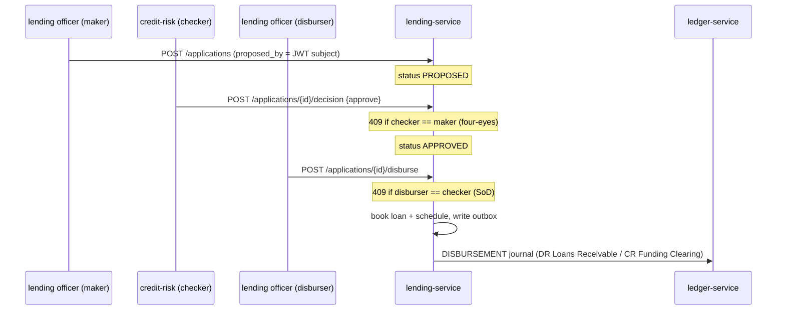

# Compliance

This is a **money-path service** (`rules.yaml: money_path_services`): every change needs 2 approvals + a threat model (`docs/threat-models/openbank-lending-service.md`, ADR-0030).

## Regulatory framework

| Regulation | Relation to this service | Implementation |
|---|---|---|
| **IFRS 9** (Financial Instruments) | Loan loss provisioning — staging + Expected Credit Loss | `GET /loans/{id}/provisioning`; pure `libs.lending.Ifrs9` ECL; `RiskParameterSource` (PD/LGD); Stage 3 → write-off derecognition |
| **EBA/GL/2020/06** (Loan origination & monitoring) | Four-eyes credit decision + segregation of duties | maker/checker/disburser enforced server-side from the JWT subject; `409` on violation |
| **IAS 1 / accrual accounting** | Interest recognized when earned, not when collected | scheduled accrual pass (`INTEREST_ACCRUAL`), `interest_accrued` idempotency flag |
| **AnaCredit (Reg. (EU) 2016/867)** | Granular credit & collateral reporting | `collateral_type` protection categories; loan/party/exposure attributes retained |
| **AMLD** (Anti-Money Laundering) | Suspicious lending activity, write-off auditability | every cash event + decision emits a domain event to the audit pipeline; AML holds may extend retention |
| **GDPR** | `party_id` is a pseudonymous reference; operator identities are personal data | no customer name/IBAN/national ID stored; 7-year record retention overrides erasure |
| **DORA** (Reg. (EU) 2022/2554) | Operational resilience | health probes, BootstrapVerifier, fault-tolerant ledger calls, audit events, SLO, runbooks |
| **NIS2** | Network & information security | mTLS in-cluster, security headers, JSON audit logging |
| **CNB credit record-keeping** | Credit-agreement retention | 7-year retention policy (`governance.yaml`) |

## GDPR mapping

### Lawful basis (Art. 6)

- **Contract** (Art. 6(1)(b)) — primary: servicing a loan is necessary to perform the credit agreement.
- **Legal obligation** (Art. 6(1)(c)) — secondary: IFRS 9 provisioning, AnaCredit reporting, AML, accounting/tax record-keeping.

### Data subject rights

| Right | Application |
|---|---|
| Access (Art. 15) | `GET /loans?partyId=…` and `GET /applications?partyId=…` return the subject's data |
| Rectification (Art. 16) | corrections via admin UI (audit logged) |
| Erasure (Art. 17) | **Not applicable for active/closed credit** — record-keeping (7 years) and AMLD override |
| Restriction (Art. 18) | application/loan status transitions (e.g. `REJECTED`); no further processing |
| Portability (Art. 20) | data export by `party_id` (CSV/JSON) — TBD as a formal endpoint |
| Object (Art. 21) | N/A (no marketing processing here) |

### Data minimisation

This service stores only the pseudonymous `party_id` plus loan economics and the operator identities that made each decision. No customer name, contact, IBAN or national ID is held — those live in `party-service`.

### Data flows out

- → **ledger-service** (REST `POST /api/v1/journals`): GL accounts, amount, currency, system-actor — accounting postings, same controller, intra-OpenBank.
- → **Kafka `openbank.lending.events`** (audit / analytics): event payload with `loanId`, `partyId`, amounts — same controller.
- No data leaves the EU/EEA region.

### Retention (Art. 5(1)(e))

| Loan status | Retention |
|---|---|
| `ACTIVE` | ongoing |
| `CLOSED` | 7 years after closure (credit-agreement / accounting record-keeping) |
| `WRITTEN_OFF` | 7 years; longer if under an AML case |

## DORA mapping (Reg. (EU) 2022/2554)

| Article | Topic | Implementation |
|---|---|---|
| Art. 5 | ICT risk management | money-path, T0 always-on (ADR-0057) |
| Art. 6 | Risk framework | dependency = openbank-libs (centralized) |
| Art. 9 | Identification | `BuildInfo` (gitCommit, buildTime, version) in `/api/v1/info` |
| Art. 10 | Detection | Micrometer/Prometheus metrics, OpenTelemetry traces, alerting |
| Art. 11 | Response & recovery | runbooks in `05-operations.md`, RTO 15 min / RPO 5 min |
| Art. 16 | Incident management | domain events to audit-service for evidence |
| Art. 28 | Third-party risk | no third-party SaaS — ledger/Keycloak/Kafka all self-hosted |

## Four-eyes & segregation of duties (EBA/GL/2020/06, ADR-0028 D5)

All three identities are the authenticated JWT subject captured server-side — never client-supplied — so the separation cannot be spoofed.

## IFRS 9 provisioning

`GET /loans/{id}/provisioning?asOf=` returns a point-in-time snapshot: outstanding balance, days-past-due, delinquency bucket, IFRS 9 stage, ECL horizon and Expected Credit Loss. The ECL math is the pure `libs.lending.Ifrs9` primitive fed by `RiskParameterSource` (conservative no-op defaults today: PD12m 0.03, PD-lifetime 0.20, LGD 0.45 — a real PD model is a wiring change). Stage 3 uncollectible loans terminate via `POST /loans/{id}/writeoff` → `WRITE_OFF` posting (DR Loan Loss Expense / CR Loans Receivable) and derecognition.

## Audit trail

Every state-changing operation (disburse, accrue, write-off) emits a domain event to `lending_outbox` → Kafka `openbank.lending.events`, persisted by `audit-service`. Decision metadata (`proposed_by`, `decided_by`, `decision_reason`, `decided_at`) is retained on the application row.

## Security controls

- AuthN: Keycloak OIDC, RS256 JWT; service-to-ledger via OIDC-client (client-credentials).
- AuthZ: Quarkus `@RolesAllowed` (no `@PermitAll`); acting principal = JWT subject, unspoofable.
- Four-eyes + segregation of duties enforced in the application service.
- Input validation (positive amount, term ≥ 1, rate ≥ 0, haircut `[0,1]`).
- Idempotent ledger postings (reference = ledger idempotency key) and idempotent accrual pass.
- Security headers (HSTS, CSP, X-Frame-Options, nosniff); TLS termination at gateway, mTLS in-cluster.
- Secrets: BootstrapVerifier blocks dev placeholders in prod.
- Resilience: fault-tolerant ledger calls (`LedgerCallGuard`), bounded REST timeouts.
- ⚠️ `RiskParameterSource` / `CreditBureauPort` currently use conservative no-op defaults — a real PD model and bureau integration are tracked roadmap items, not a control regression.
