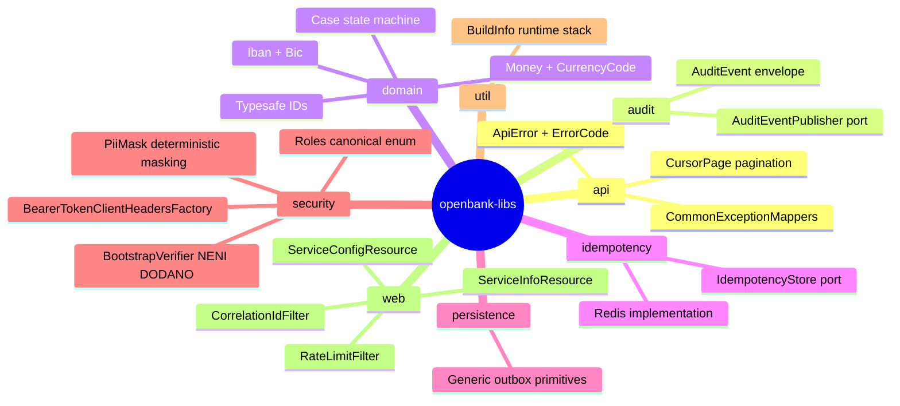

# 01 — Overview (business)

## Proč openbank-libs existuje

Před květnovým auditem 2026 byl OpenBank monorepo s ~28 Quarkus mikroslužbami, kde každá služba měla **vlastní implementaci** stejných cross-cutting věcí:

- 14× kopie `InfoResource.kt` (identický kód byte za byte)
- 9× kopie `RedisIdempotencyStore.kt`
- ~20× kopie outbox dispatcher logiky
- 13× různé `ExceptionMapper` třídy (každá vrací jiný formát chyby)
- 31 souborů s vlastním `BigDecimal amount + String currency` místo sjednoceného `Money`
- 0 sdílených bezpečnostních primitiv (PII masking, audit envelope, role konstanty, S2S auth)

Audit napočítal **~4 500 řádků duplikovaného Kotlinu** a několik regulatorních děr (K1-K7), kde stejný bug existoval ve více službách najednou.

**openbank-libs centralizuje vše, co MÁ být stejné napříč službami**, a nutí, aby fix landoval jednou pro celou flotilu — ne 28×.

## Hodnota pro projekt

| Bez libs | S libs |
|---|---|
| 14 různých `/api/v1/info` endpointů, postupně driftují | 1 `ServiceInfoResource` auto-discovered ve všech službách |
| GDPR PII masking řešen ad-hoc, pokud vůbec | `PiiMask.email/iban/pan/phone/name/nationalId` — 1 audit-grade implementace |
| Per-service `BigDecimal + String` páry pro peníze | `Money` value object s `CurrencyCode` (ISO 4217), `add/subtract/multiply` operacemi |
| Žádný unifikovaný audit log | `AuditEvent` envelope s GDPR Art. 30 poli + `AuditEventPublisher` port |
| Service-to-service volání bez `Authorization` header | `BearerTokenClientHeadersFactory` automatická injekce + correlation ID propagace |
| Hardcoded `CHANGE_ME_LOCAL_DEV_ONLY` v prod profilu (K1) | ⬜ **Není dodáno.** `BootstrapVerifier` v libs neexistuje (`git grep BootstrapVerifier -- '*.kt'` vrací 0) — uvádí to i delivery note ADR-0017. K1 dnes drží injektáž secrets přes ESO/OpenBao (ADR-0007): nasazené manifesty berou credentials přes `secretKeyRef` a žádný dev placeholder v nich není, ale žádný startup guard to nekontroluje (#8426) |
| Žádný runtime přehled o tech stacku | `BuildInfo` singleton → `/api/v1/info` ukazuje Kotlin/Quarkus/JDK verze, LTS flag, support date |

## Klíčové schopnosti (per balíček)

## Use cases pro typickou službu

Když vznikne nový OpenBank service `openbank-foo-service`:

1. `implementation(project(":openbank-libs"))` v `build.gradle.kts` — to je vše
2. Auto-dostane: `/api/v1/info` s tech stackem, rate limiting, correlation ID, security headers, common exception mappers, ApiError jednotný formát
3. Když potřebuje peníze → `import com.openbank.libs.domain.money.Money`
4. Když potřebuje audit → `AuditEventPublisher` inject + emit event
5. Když chce volat jiný service → `@RegisterClientHeaders(BearerTokenClientHeadersFactory::class)` + dostane Bearer token + correlation ID propagaci

## Co openbank-libs **NENÍ**

- **Není to ORM framework** — Panache + Hibernate Reactive zůstávají Quarkus extensions; libs jen poskytuje sdílenou outbox `@MappedSuperclass`
- **Není to API gateway** — Kong / Istio gateway sedí mimo
- **Není to Quarkus extension** — kód běží v každém service classloader jako normální JAR (Jandex index zajistí discovery)
- **Není to runtime sidecar** — žádný separátní pod, žádný HTTP overhead
- **Není to placeholder pro domain logic** — žádná business pravidla, jen value objects a primitives

## Roadmapa (z ADR 0014)

| Fáze | Stav | Co to přidává |
|---|---|---|
| F1 — house cleaning | ✅ done | Unified dep declaration, Jandex plugin, smazaný InfoResource/Redis duplicates |
| F2 — domain primitives | ✅ done | Outbox, typesafe IDs, common exception mappers |
| F3 — security foundation | ⚠️ partial | PiiMask, Roles, AuditEvent, S2S auth. `BootstrapVerifier` byl do F3 naplánován a nikdy nedodán (#8426) |
| F4 — convention plugin | planned | `build-logic/openbank.quarkus-service` Gradle convention plugin |
| F5 — Quarkus platform extension | planned | Baseline `application.yaml` jako Quarkus extension |

## Související

- [02 — Architecture](./02-architecture.md) — jak je libs vnitřně strukturován
- [06 — Compliance](./06-compliance.md) — proč regulátor potřebuje, aby tohle bylo sdílené
