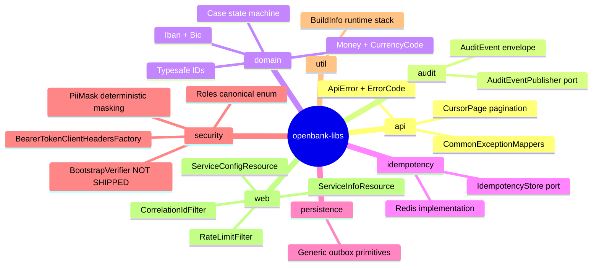

# 01 — Overview (business)

## Why openbank-libs exists

Before the May 2026 audit, OpenBank was a monorepo of ~28 Quarkus microservices where every service shipped its **own implementation** of the same cross-cutting concerns:

- 14× copies of `InfoResource.kt` (byte-identical code)
- 9× copies of `RedisIdempotencyStore.kt`
- ~20× copies of outbox dispatcher logic
- 13× distinct `ExceptionMapper` classes (each returning a different error shape)
- 31 files using their own `BigDecimal amount + String currency` instead of a unified `Money`
- 0 shared security primitives (PII masking, audit envelope, role constants, S2S auth)

The audit counted **~4 500 lines of duplicated Kotlin** and several regulatory gaps (K1-K7) where the same bug existed across multiple services simultaneously.

**openbank-libs centralises everything that SHOULD be the same across services** and forces a fix to land once for the whole fleet — not 28 times.

## Value to the project

| Without libs | With libs |
|---|---|
| 14 different `/api/v1/info` endpoints, gradually drifting | 1 `ServiceInfoResource` auto-discovered in every service |
| GDPR PII masking handled ad hoc — if at all | `PiiMask.email/iban/pan/phone/name/nationalId` — 1 audit-grade implementation |
| Per-service `BigDecimal + String` pairs for money | `Money` value object with `CurrencyCode` (ISO 4217) and `add/subtract/multiply` operations |
| No unified audit log | `AuditEvent` envelope with GDPR Art. 30 fields + `AuditEventPublisher` port |
| Service-to-service calls with no `Authorization` header | `BearerTokenClientHeadersFactory` automatic injection + correlation ID propagation |
| Hardcoded `CHANGE_ME_LOCAL_DEV_ONLY` in the prod profile (K1) | ⬜ **Not shipped.** No `BootstrapVerifier` exists in libs (`git grep BootstrapVerifier -- '*.kt'` returns 0), as ADR-0017's own delivery note records. K1 is held today by ESO/OpenBao secret injection (ADR-0007): deployed manifests take credentials through `secretKeyRef` and carry no dev placeholder, but no startup guard checks that (#8426) |
| No runtime view of the tech stack | `BuildInfo` singleton → `/api/v1/info` shows Kotlin/Quarkus/JDK versions, LTS flag, support date |

## Key capabilities (per package)

## Use cases for a typical service

When a new OpenBank service `openbank-foo-service` is created:

1. Add `implementation(project(":openbank-libs"))` to `build.gradle.kts` — that's it
2. It auto-gets: `/api/v1/info` with tech stack, rate limiting, correlation ID, security headers, common exception mappers, a unified `ApiError` shape
3. When it needs money → `import com.openbank.libs.domain.money.Money`
4. When it needs audit → inject `AuditEventPublisher` + emit an event
5. When it calls another service → `@RegisterClientHeaders(BearerTokenClientHeadersFactory::class)` + automatic Bearer token + correlation propagation

## What openbank-libs is **NOT**

- **Not an ORM framework** — Panache + Hibernate Reactive remain Quarkus extensions; libs only provides a shared outbox `@MappedSuperclass`
- **Not an API gateway** — Kong / Istio gateway sits outside
- **Not a Quarkus extension** — the code runs in each service's classloader as a regular JAR (the Jandex index ensures discovery)
- **Not a runtime sidecar** — no separate pod, no HTTP overhead
- **Not a placeholder for domain logic** — no business rules, only value objects and primitives

## Roadmap (from ADR 0014)

| Phase | Status | What it adds |
|---|---|---|
| F1 — house cleaning | ✅ done | Unified dep declaration, Jandex plugin, deleted InfoResource/Redis duplicates |
| F2 — domain primitives | ✅ done | Outbox, typesafe IDs, common exception mappers |
| F3 — security foundation | ⚠️ partial | PiiMask, Roles, AuditEvent, S2S auth. `BootstrapVerifier` was scoped into F3 and never shipped (#8426) |
| F4 — convention plugin | planned | `build-logic/openbank.quarkus-service` Gradle convention plugin |
| F5 — Quarkus platform extension | planned | Baseline `application.yaml` as a Quarkus extension |

## Related

- [02 — Architecture](./02-architecture.md) — how libs is internally structured
- [06 — Compliance](./06-compliance.md) — why the regulator wants this to be shared
