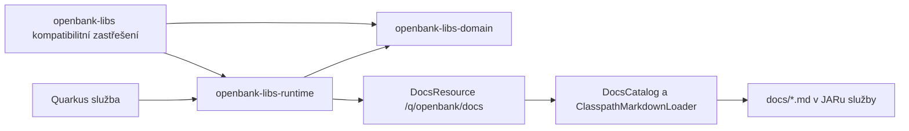

# 02 — Architektura

## Současná hranice modulů

`openbank-libs-domain` obsahuje sdílené doménové primitivy a porty. Jeho build definuje hranici bez frameworku; modul nesmí importovat Quarkus ani CDI. `openbank-libs-runtime` obsahuje frameworkové adaptéry, HTTP resource a CDI zapojení. Konzumentům exportuje doménové typy. Kořenový `openbank-libs` zůstává kompatibilitním zastřešením starších závislostí; zdrojové kódy knihovny již nevlastní.

Služba vlastní dokumenty v `src/main/resources/docs/`. Společná Gradle konvence při `processResources` vytvoří `00-build.md` a zabalí jej vedle ručně psaných Markdown souborů. `ClasspathMarkdownLoader` čte tyto zdroje z classpath, `DocsCatalog` vybírá jazykové varianty a počítá otisky, `DocsResource` publikuje index, metadata a dokumenty z běžícího buildu. Admin UI čte běžící endpoint přes Kubernetes discovery. Zobrazená dokumentace služby tak odpovídá nasazenému image.

Samotný `openbank-libs` nemá běžící endpoint. Jeho kořenová složka `docs/` je snímkem zabaleným do image Admin UI. Pro aktuální chování za běhu čtěte zdrojové moduly a `/q/openbank/docs` příslušné služby.

## Build a kompatibilita

Kořenový build používá Gradle subprojekty. Služby zpravidla deklarují `implementation(project(":openbank-libs-runtime"))`, starší konzumenti mohou používat zastřešující modul. Autoritativní verze závislostí jsou v `openbank-libs/gradle/libs.versions.toml`; Gradle konvence v `build-logic/src/main/kotlin/`. Release verze každé služby je v jejím `version.txt`.
