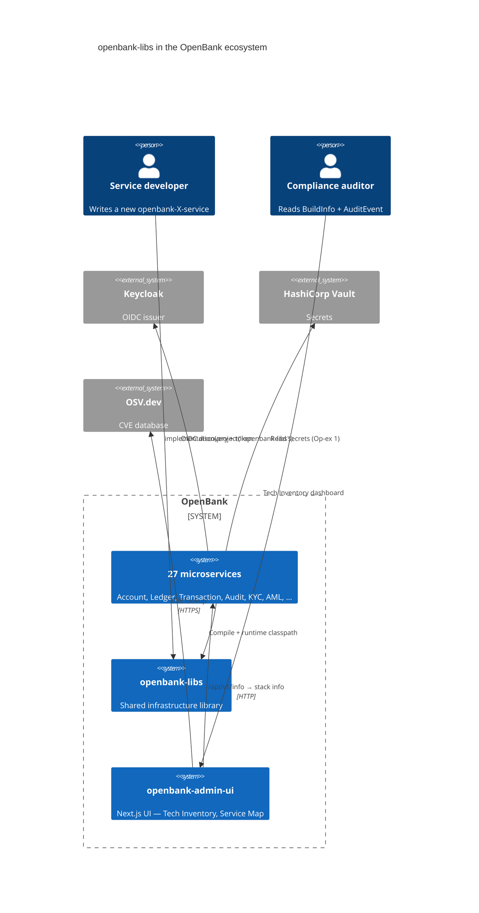
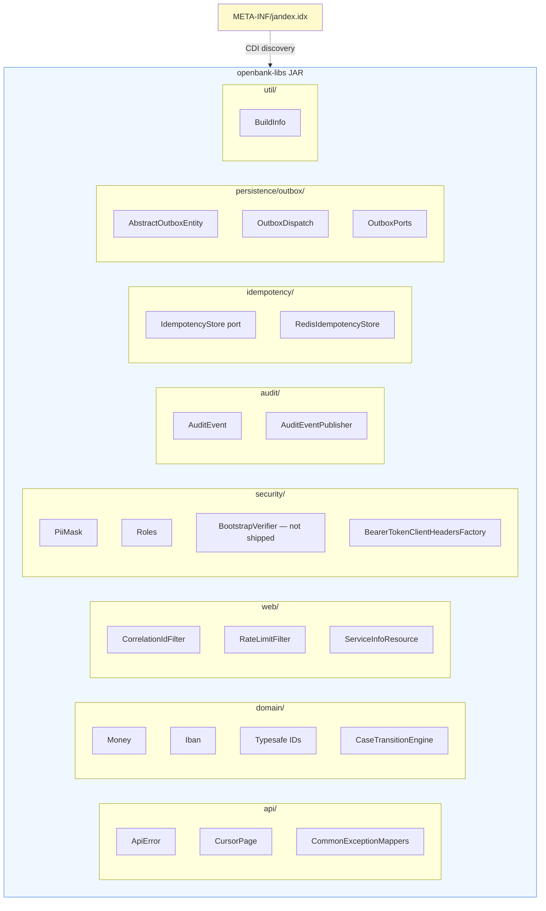
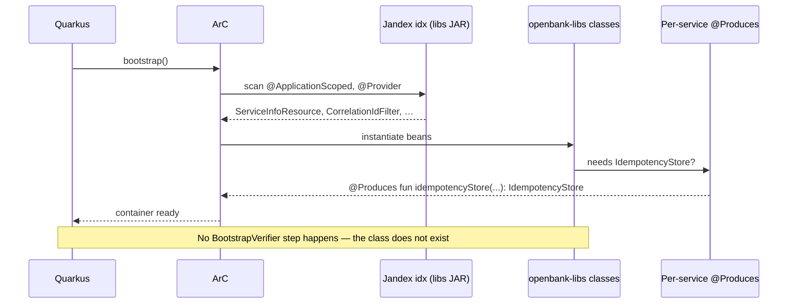

# 02 — Architecture

## C4 — Context

Where libs sits in the OpenBank ecosystem:



## C4 — Container (libs zoom-in)



## Architectural principles

### 1. Hexagonal architecture — libs is "shared adapters"

In the hexagonal model (ADR 0002) each service has its own `domain/`, `application/`, `infrastructure/`. **libs fills in the recurring chunks of `infrastructure/`** — REST filters, persistence helpers, security adapters. The domain layer in libs only contains **value objects that cannot be domain-specific** (money, IBAN, IDs, Case state machine).

### 2. CDI discovery via Jandex

Quarkus ArC by default **does NOT scan classes from external JARs**. libs solves this with the Jandex Gradle plugin (commit `78c2d93`), which generates `META-INF/jandex.idx` inside the libs JAR at build time. ArC then automatically finds:

- `@ApplicationScoped` beans
- `@Provider` JAX-RS filters and exception mappers
- `@Path` REST resources (e.g. `ServiceInfoResource`)

Without Jandex each service would have to add `quarkus.index-dependency.openbank-libs.group-id` to its `application.yaml`.

### 3. compileOnly Quarkus dependencies

libs `build.gradle.kts` declares Quarkus runtime classes as `compileOnly`:

```kotlin
dependencies {
    api(libs.kotlin.stdlib)
    api(libs.jackson.module.kotlin)

    compileOnly("jakarta.ws.rs:jakarta.ws.rs-api:3.1.0")
    compileOnly("jakarta.enterprise:jakarta.enterprise.cdi-api:4.0.1")
    compileOnly("io.quarkus:quarkus-redis-client:3.33.2")
    compileOnly("jakarta.persistence:jakarta.persistence-api:3.1.0")
    // ... other compileOnly
}
```

**Why:** the libs JAR must not become the source of specific Quarkus runtime versions. Each service declares its own Quarkus extensions via `quarkus-bom`. libs only needs the types to compile, not to run.

### 4. Per-service @Produces instead of `@Default` in libs

Classes like `RedisIdempotencyStore` are not `@ApplicationScoped` directly in libs. Instead:

```kotlin
// In openbank-libs:
class RedisIdempotencyStore(private val redis: ReactiveRedisDataSource) : IdempotencyStore { ... }

// In the service that uses Redis (account, aml, consent, …):
@ApplicationScoped
class IdempotencyConfig {
    @Produces @ApplicationScoped
    fun idempotencyStore(redis: ReactiveRedisDataSource): IdempotencyStore =
        RedisIdempotencyStore(redis)
}
```

**Why:** if `RedisIdempotencyStore` were `@ApplicationScoped @Default` in libs, ArC would try to instantiate it in services without Redis (ledger, audit, kyc) and crash with `UnsatisfiedResolutionException` (commit `115728f`).

### 5. Build-time stamping for BuildInfo

The `BuildInfo` singleton in `util/` returns a snapshot of the tech stack (Kotlin, Quarkus, JDK versions). Values are stamped **at build time** from `libs.versions.toml` into `openbank-build-info.properties` via Gradle `processResources`:

```kotlin
tasks.processResources {
    filesMatching("openbank-build-info.properties") {
        filter(ReplaceTokens::class, "tokens" to mapOf(
            "kotlinVersion" to libsVersionsToml["kotlin"],
            "quarkusVersion" to libsVersionsToml["quarkus"],
            "buildTime" to Instant.now().toString(),
            // …
        ))
    }
}
```

`BuildInfo` loads properties at class init + augments with runtime data (`Runtime.version()`, vendor, CPU count, heap). **Zero per-request overhead** — `toStack()` returns a cached `LinkedHashMap`.

## Package map

### `api/`
REST-side primitives, not domain.

| File | Purpose |
|---|---|
| `ApiError.kt` | Unified error response (`traceId`, `status`, `code`, `message`, `details`) — RFC 7807-inspired |
| `CommonExceptionMappers.kt` | 5 auto-registered `@Provider`s: IllegalArgumentException, IllegalStateException, NoSuchElementException, WebApplicationException, generic Exception |
| `pagination/CursorPage.kt` | Generic cursor-based pagination DTO + helper |

### `audit/`
Audit envelope for GDPR Art. 30 + DORA Art. 17.

| File | Purpose |
|---|---|
| `AuditEvent.kt` | Data class with actorId/Type, operation, resourceType, ipAddress, timestamp, payload, traceId |
| `AuditEventPublisher.kt` | Port; default `LoggingAuditEventPublisher` as a safe fallback. Services can add a Kafka publisher as `@Alternative @Priority(100)` |

### `domain/`
Value objects, not domain entities.

| Subpackage | Purpose |
|---|---|
| `money/` | `Money` (BigDecimal + CurrencyCode) with `add/subtract/multiply/abs/isZero` operations, scale-aware |
| `account/` | `Iban` (ISO 13616) with validation and formatting |
| `case/` | `CaseTransitionEngine` — generic state machine for KYC, AML, dispute workflows |
| `event/` | `DomainEvent` base — eventId, occurredAt, payload Map |
| `identifiers/` | 9× typesafe IDs (`AccountId`, `TransactionId`, `PartyId`, …) + per-ID JPA `AttributeConverter` + Jackson `@JsonValue` |

### `idempotency/`
| File | Purpose |
|---|---|
| `IdempotencyStore.kt` | Port — `suspend fun get(key) / save(key, response)` |
| `impl/RedisIdempotencyStore.kt` | Redis impl, NOT `@ApplicationScoped` — services wrap it via `@Produces` |

### `persistence/outbox/`
Generic transactional outbox primitives — see [ADR 0013](../../docs/adr/0013-shared-outbox-in-openbank-libs.md).

| File | Purpose |
|---|---|
| `OutboxStatus.kt` | enum: `PENDING`, `SENT`, `FAILED` |
| `OutboxMessage.kt`, `OutboxEntry.kt` | DTOs |
| `OutboxPorts.kt` | `OutboxRepository` interface |
| `AbstractOutboxEntity.kt` | `@MappedSuperclass` — common schema (event_id, aggregate_id, payload, status, attempt_count, sent_at, last_error, created_at, updated_at) |
| `OutboxDispatch.kt` | `dispatchOnce(repository, batchSize, publish)` — shared dispatcher loop, services call it from their own `@Scheduled` |

### `security/`
Audit-grade security primitives — see [ADR 0017](../../docs/adr/0017-secrets-via-vault.md), [ADR 0018](../../docs/adr/0018-opa-for-fine-grained-authz.md).

| File | Purpose |
|---|---|
| `PiiMasking.kt` | `PiiMask.email/iban/pan/phone/name/nationalId/full` — applied explicitly at the render/log site (there is no masking annotation; see #4011) |
| `Roles.kt` | Canonical role string constants (`ROLE_ADMIN`, `OPERATOR`, `VIEWER`, `COMPLIANCE`, `AUDITOR`, `SUPERVISOR`, `KYC`, `PAYMENTS`, `SERVICE`) |
| `SecurityContextExtensions.kt` | Kotlin extensions: `securityContext.currentUserId`, `actorName`, `actorType`, `requireAnyRole(...)` |
| `ServiceTokenProvider.kt` | Port for S2S Bearer tokens; recommended prod impl: `quarkus-oidc-client-reactive-filter` |
| `BearerTokenClientHeadersFactory.kt` | `@RegisterClientHeaders(…)` — automatic Bearer + correlation injection into REST clients |
| `BootstrapVerifier.kt` — ⬜ **the file does not exist** | **Nothing.** The startup fail-fast guard against dev placeholders that ADR-0017 prescribes was never written (`git grep BootstrapVerifier -- '*.kt'` returns 0), as that ADR's own delivery note records. Secrets are held today by ESO/OpenBao `secretKeyRef` injection (ADR-0007), with no boot-time check at all (#8426) |

### `util/`
| File | Purpose |
|---|---|
| `BuildInfo.kt` | Singleton — Kotlin/Quarkus/Gradle/JDK versions + runtime info (vendor, CPU, heap). Loaded once at class init. |

### `web/`
JAX-RS filters + resources auto-registered through Jandex.

| File | Purpose |
|---|---|
| `CorrelationIdFilter.kt` | Request: reads `X-Correlation-ID` / `X-Request-ID`, fallback UUID, into MDC. Response: re-emits headers. |
| `RateLimitFilter.kt` | Semaphore-based per-pod rate limit (configurable `openbank.rate-limit.max-concurrent-requests`) |
| `ApiVersionResponseFilter.kt` | Response headers: `X-API-Version`, `X-Service-Name`, `Deprecation` (when the path is deprecated) |
| `ServiceInfoResource.kt` | `GET /api/v1/info` — service name, version, status, **BuildInfo.toStack()** |
| `ServiceConfigResource.kt` | `GET /api/v1/config` — rate limit + circuit breaker + retry + timeout config (read via MicroProfile Config) |

## Cross-cutting: how libs interacts with ArC



This diagram used to show `BootstrapVerifier.onStart(StartupEvent)` as the last startup step. That step
never happened: there is no `BootstrapVerifier` in `openbank-libs` and there never was. Startup ends when
the container is ready — nothing in libs checks whether the prod-profile config contains dev placeholders.
That property is held today by ESO/OpenBao `secretKeyRef` injection outside this library (ADR-0007, #8426).
