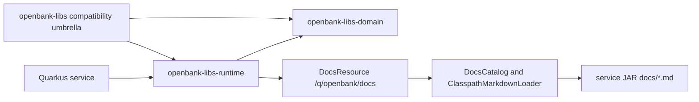

# 02 — Architecture

## Current module boundary

```mermaid
flowchart LR
  Service[Quarkus service] --> Runtime[openbank-libs-runtime]
  Runtime --> Domain[openbank-libs-domain]
  Legacy[openbank-libs compatibility umbrella] --> Runtime
  Legacy --> Domain
  Runtime --> DocsResource[DocsResource /q/openbank/docs]
  DocsResource --> DocsCatalog[DocsCatalog and ClasspathMarkdownLoader]
  DocsCatalog --> ServiceDocs[service JAR docs/*.md]
```

`openbank-libs-domain` contains shared domain primitives and ports. Its build file documents the framework boundary; it must not import Quarkus or CDI. `openbank-libs-runtime` contains framework adapters, HTTP resources and CDI wiring. It exports domain types to consumers. The root `openbank-libs` module remains a compatibility umbrella for existing dependencies; it no longer owns the library source.

The service owns its documentation files at `src/main/resources/docs/`. The common Gradle convention generates `00-build.md` during `processResources` and packages it beside authored Markdown. `ClasspathMarkdownLoader` reads those classpath resources, `DocsCatalog` selects language variants and hashes content, and `DocsResource` publishes the index, metadata and documents from the running build. The Admin UI fetches the running endpoint through Kubernetes discovery. This keeps the displayed service documentation tied to the deployed image.

`openbank-libs` itself has no running endpoint. Its top-level `docs/` tree is bundled with the Admin UI image as a snapshot. Refer to the source modules and the service's own `/q/openbank/docs` for current runtime behavior.

## Build and compatibility

The root build uses Gradle subprojects. Service modules generally declare `implementation(project(":openbank-libs-runtime"))`, while older consumers can use the umbrella. The authoritative dependency versions are in `openbank-libs/gradle/libs.versions.toml`; Gradle conventions are in `build-logic/src/main/kotlin/`. Each service's release version is its own `version.txt`.

## Four-eyes: approval summaries

`AuthorizeInterceptor` (`openbank-libs-runtime`, ADR-0155) parks an operation OPA flags `four_eyes_required`, answers 202 with an `approvalId`, and binds the approval to a fingerprint of the exact request (endpoint + arguments, #11675). It also stores a human-readable `summary` for the checker.

- **Default:** a service without a renderer gets the generic summary — action, endpoint, resource and the arguments with credential-like fields (`password`, `token`, `pin`, …) redacted, control characters flattened, capped at 1024 characters.
- **`ApprovalSummaryRenderer` (optional):** a service may supply a CDI bean with `suspend fun render(action, resourceId, arguments): String?`. The interceptor passes it the same business arguments the request fingerprint covers, and its output (flattened and capped the same way) replaces the generic summary. It runs whenever a request is bound (a retry with `X-Approval-Id` included) but is stored only when the approval is created, so the checker reads the summary of what was bound, never a re-derived one. Returning `null` keeps the generic summary for actions the renderer does not cover.
- **Failure:** a renderer exception refuses the call (503, `PolicyDecisionException`): no approval is issued with a missing summary or with the generic argument dump the renderer exists to replace.
- **Informational only:** the fingerprint alone decides whether a retry matches, never the summary text.
- **PII:** operators read the summary, so include only what the checker needs to recognise the target. Mask accounts and IBANs (e.g. last 4 characters), never print key material (a short SHA-256 prefix is enough), no secrets, and shape-check caller-supplied values rather than echoing them. Worked example: `ScaApprovalSummaryRenderer` in sca-service.

## Policy-rate topic ownership

`openbank-libs-domain` maps `openbank.fx.cnb-policy-rate.published` to `fx-service` in `TopicProducers`. This records the producing service for shared analytics and governance checks; it does not publish or consume the event. The producer is the FX ingestion pipeline, while risk-engine and audit-service consume its facts and audit trail. Keep the mapping in step with a topic rename or ownership change.
