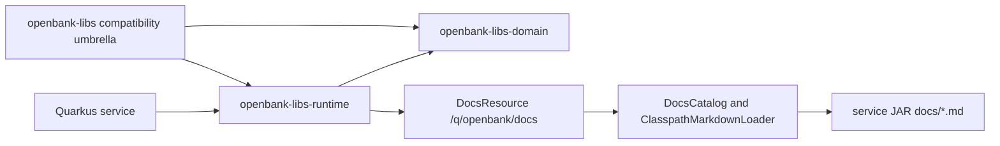

# 02 — Architecture

## Current module boundary

```mermaid
flowchart LR
  Service[Quarkus service] --> Runtime[openbank-libs-runtime]
  Runtime --> Domain[openbank-libs-domain]
  Legacy[openbank-libs compatibility umbrella] --> Runtime
  Legacy --> Domain
  Runtime --> DocsResource[DocsResource /q/openbank/docs]
  DocsResource --> DocsCatalog[DocsCatalog and ClasspathMarkdownLoader]
  DocsCatalog --> ServiceDocs[service JAR docs/*.md]
```

`openbank-libs-domain` contains shared domain primitives and ports. Its build file documents the framework boundary; it must not import Quarkus or CDI. `openbank-libs-runtime` contains framework adapters, HTTP resources and CDI wiring. It exports domain types to consumers. The root `openbank-libs` module remains a compatibility umbrella for existing dependencies; it no longer owns the library source.

The service owns its documentation files at `src/main/resources/docs/`. The common Gradle convention generates `00-build.md` during `processResources` and packages it beside authored Markdown. `ClasspathMarkdownLoader` reads those classpath resources, `DocsCatalog` selects language variants and hashes content, and `DocsResource` publishes the index, metadata and documents from the running build. The Admin UI fetches the running endpoint through Kubernetes discovery. This keeps the displayed service documentation tied to the deployed image.

`openbank-libs` itself has no running endpoint. Its top-level `docs/` tree is bundled with the Admin UI image as a snapshot. Refer to the source modules and the service's own `/q/openbank/docs` for current runtime behavior.

## Build and compatibility

The root build uses Gradle subprojects. Service modules generally declare `implementation(project(":openbank-libs-runtime"))`, while older consumers can use the umbrella. The authoritative dependency versions are in `openbank-libs/gradle/libs.versions.toml`; Gradle conventions are in `build-logic/src/main/kotlin/`. Each service's release version is its own `version.txt`.
