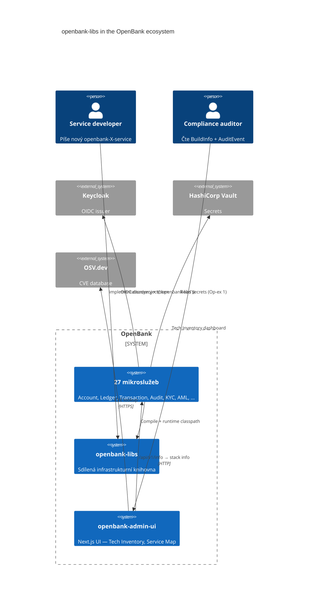
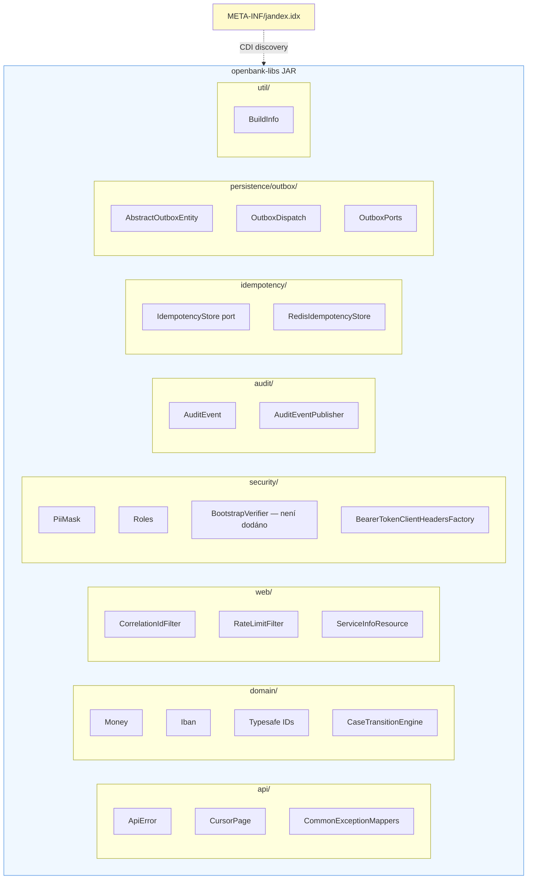
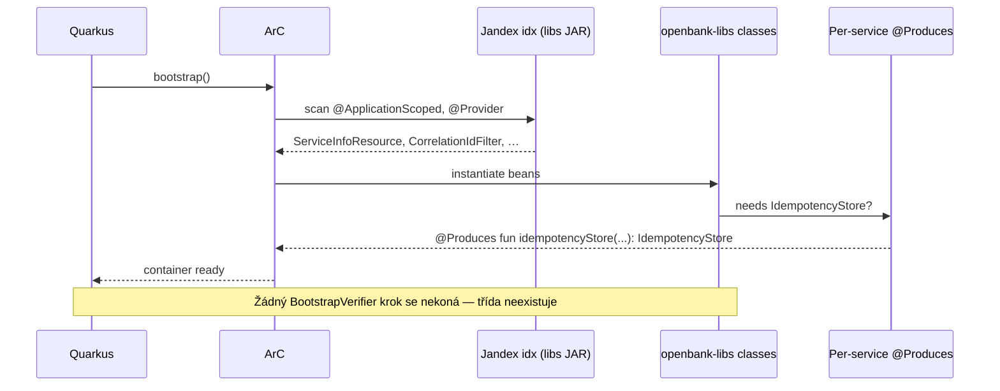

# 02 — Architecture

## C4 — Context

Kde libs sedí v ekosystému OpenBank:



## C4 — Container (libs zoom-in)



## Architekturní principy

### 1. Hexagonal architecture — libs je „shared adapters"

V hexagonal modelu (ADR 0002) každá služba má `domain/`, `application/`, `infrastructure/`. **libs vyplňuje opakující se kusy z `infrastructure/`** — REST filtry, persistence helpers, security adapters. Domain layer v libs je pouze pro **value objects, které nemohou být doménově specifické** (peníze, IBAN, ID, Case state machine).

### 2. CDI discovery přes Jandex

Quarkus ArC defaultně **NEnaskenuje classes z externích JAR-ů**. libs řeší přes Jandex Gradle plugin (commit `78c2d93`), který při buildu generuje `META-INF/jandex.idx` v libs JAR. ArC tak automaticky najde:

- `@ApplicationScoped` beans
- `@Provider` JAX-RS filtry a exception mappery
- `@Path` REST resources (např. `ServiceInfoResource`)

Bez Jandex by každá služba musela přidat `quarkus.index-dependency.openbank-libs.group-id` do `application.yaml`.

### 3. compileOnly Quarkus dependencies

libs `build.gradle.kts` deklaruje Quarkus runtime třídy jako `compileOnly`:

```kotlin
dependencies {
    api(libs.kotlin.stdlib)
    api(libs.jackson.module.kotlin)

    compileOnly("jakarta.ws.rs:jakarta.ws.rs-api:3.1.0")
    compileOnly("jakarta.enterprise:jakarta.enterprise.cdi-api:4.0.1")
    compileOnly("io.quarkus:quarkus-redis-client:3.33.2")
    compileOnly("jakarta.persistence:jakarta.persistence-api:3.1.0")
    // ... další compileOnly
}
```

**Proč:** libs JAR se nemá stát zdrojem konkrétních verzí Quarkus runtime. Každá služba si Quarkus extensions deklaruje samostatně přes `quarkus-bom`. libs pouze potřebuje typy ke kompilaci, ne ke spuštění.

### 4. Per-service @Produces místo `@Default` v libs

Třídy jako `RedisIdempotencyStore` nejsou `@ApplicationScoped` přímo v libs. Místo toho:

```kotlin
// V openbank-libs:
class RedisIdempotencyStore(private val redis: ReactiveRedisDataSource) : IdempotencyStore { ... }

// V služby co Redis používá (account, aml, consent, …):
@ApplicationScoped
class IdempotencyConfig {
    @Produces @ApplicationScoped
    fun idempotencyStore(redis: ReactiveRedisDataSource): IdempotencyStore =
        RedisIdempotencyStore(redis)
}
```

**Proč:** Pokud by `RedisIdempotencyStore` byl `@ApplicationScoped @Default` v libs, ArC by ho zkusil vytvořit i ve službách bez Redis (ledger, audit, kyc) a crashed by na `UnsatisfiedResolutionException` (commit `115728f`).

### 5. Build-time stamping pro BuildInfo

`BuildInfo` singleton v `util/` vrací snapshot tech stacku (Kotlin, Quarkus, JDK verze). Hodnoty se stampují **při buildu** z `libs.versions.toml` do `openbank-build-info.properties` přes Gradle `processResources`:

```kotlin
tasks.processResources {
    filesMatching("openbank-build-info.properties") {
        filter(ReplaceTokens::class, "tokens" to mapOf(
            "kotlinVersion" to libsVersionsToml["kotlin"],
            "quarkusVersion" to libsVersionsToml["quarkus"],
            "buildTime" to Instant.now().toString(),
            // …
        ))
    }
}
```

`BuildInfo` při class init loadne properties + augmentuje runtime daty (`Runtime.version()`, vendor, CPU count, heap). **Nulový per-request overhead** — `toStack()` vrací cached `LinkedHashMap`.

## Mapa balíčků

### `api/`
REST-side primitives, nejsou doménové.

| Soubor | Účel |
|---|---|
| `ApiError.kt` | Sjednocený error response (`traceId`, `status`, `code`, `message`, `details`) — RFC 7807-inspired |
| `CommonExceptionMappers.kt` | 5× auto-registered `@Provider`: IllegalArgumentException, IllegalStateException, NoSuchElementException, WebApplicationException, generic Exception |
| `pagination/CursorPage.kt` | Generic cursor-based pagination DTO + helper |

### `audit/`
Audit envelope pro GDPR Art. 30 + DORA Art. 17.

| Soubor | Účel |
|---|---|
| `AuditEvent.kt` | Data class s actorId/Type, operation, resourceType, ipAddress, timestamp, payload, traceId |
| `AuditEventPublisher.kt` | Port; default `LoggingAuditEventPublisher` jako safe fallback. Služby mohou přidat Kafka publisher jako `@Alternative @Priority(100)` |

### `domain/`
Value objects, ne doménové entity.

| Subpackage | Účel |
|---|---|
| `money/` | `Money` (BigDecimal + CurrencyCode) s `add/subtract/multiply/abs/isZero` operacemi, scale-aware |
| `account/` | `Iban` (ISO 13616) s validací a formátováním |
| `case/` | `CaseTransitionEngine` — generic state machine pro KYC, AML, dispute workflows |
| `event/` | `DomainEvent` base — eventId, occurredAt, payload Map |
| `identifiers/` | 9× typesafe ID (`AccountId`, `TransactionId`, `PartyId`, …) + JPA `AttributeConverter` per ID + Jackson `@JsonValue` |

### `idempotency/`
| Soubor | Účel |
|---|---|
| `IdempotencyStore.kt` | Port — `suspend fun get(key) / save(key, response)` |
| `impl/RedisIdempotencyStore.kt` | Redis impl, NE `@ApplicationScoped` — služby ji wrappnou přes `@Produces` |

### `persistence/outbox/`
Generic transactional outbox primitives — viz [ADR 0013](../../docs/adr/0013-shared-outbox-in-openbank-libs.md).

| Soubor | Účel |
|---|---|
| `OutboxStatus.kt` | enum: `PENDING`, `SENT`, `FAILED` |
| `OutboxMessage.kt`, `OutboxEntry.kt` | DTOs |
| `OutboxPorts.kt` | `OutboxRepository` interface |
| `AbstractOutboxEntity.kt` | `@MappedSuperclass` — společná schema (event_id, aggregate_id, payload, status, attempt_count, sent_at, last_error, created_at, updated_at) |
| `OutboxDispatch.kt` | `dispatchOnce(repository, batchSize, publish)` — shared dispatcher loop, služba ho volá ze svého `@Scheduled` |

### `security/`
Audit-grade security primitives — viz [ADR 0017](../../docs/adr/0017-secrets-via-vault.md), [ADR 0018](../../docs/adr/0018-opa-for-fine-grained-authz.md).

| Soubor | Účel |
|---|---|
| `PiiMasking.kt` | `PiiMask.email/iban/pan/phone/name/nationalId/full` — applied explicitly at the render/log site (there is no masking annotation; see #4011) |
| `Roles.kt` | Canonical role string constants (`ROLE_ADMIN`, `OPERATOR`, `VIEWER`, `COMPLIANCE`, `AUDITOR`, `SUPERVISOR`, `KYC`, `PAYMENTS`, `SERVICE`) |
| `SecurityContextExtensions.kt` | Kotlin extensions: `securityContext.currentUserId`, `actorName`, `actorType`, `requireAnyRole(...)` |
| `ServiceTokenProvider.kt` | Port pro S2S Bearer tokens; doporučená prod impl: `quarkus-oidc-client-reactive-filter` |
| `BearerTokenClientHeadersFactory.kt` | `@RegisterClientHeaders(…)` — automatická Bearer + correlation injection do REST clients |
| `BootstrapVerifier.kt` — ⬜ **soubor neexistuje** | **Nic.** Startup fail-fast guard proti dev placeholderům, který předepisuje ADR-0017, nebyl nikdy napsán (`git grep BootstrapVerifier -- '*.kt'` vrací 0) — uvádí to i delivery note téže ADR. Secrets dnes drží ESO/OpenBao `secretKeyRef` injektáž (ADR-0007), bez jakékoli boot-time kontroly (#8426) |

### `util/`
| Soubor | Účel |
|---|---|
| `BuildInfo.kt` | Singleton — Kotlin/Quarkus/Gradle/JDK verze + runtime info (vendor, CPU, heap). Loaded once at class init. |

### `web/`
JAX-RS filtry + resources auto-registered přes Jandex.

| Soubor | Účel |
|---|---|
| `CorrelationIdFilter.kt` | Request: čte `X-Correlation-ID` / `X-Request-ID`, fallback UUID, do MDC. Response: re-emits headers. |
| `RateLimitFilter.kt` | Semaphore-based per-pod rate limit (configurable `openbank.rate-limit.max-concurrent-requests`) |
| `ApiVersionResponseFilter.kt` | Response headers: `X-API-Version`, `X-Service-Name`, `Deprecation` (pokud path = deprecated) |
| `ServiceInfoResource.kt` | `GET /api/v1/info` — service name, version, status, **BuildInfo.toStack()** |
| `ServiceConfigResource.kt` | `GET /api/v1/config` — rate limit + circuit breaker + retry + timeout config (čtené přes MicroProfile Config) |

## Cross-cutting: jak libs interaguje s ArC



Diagram dříve uváděl `BootstrapVerifier.onStart(StartupEvent)` jako poslední krok startupu. Ten krok se
nikdy nekonal: v `openbank-libs` žádný `BootstrapVerifier` není a nikdy nebyl. Startup končí tím, že je
kontejner připraven — nic v libs nekontroluje, zda config v prod profilu obsahuje dev placeholdery.
Tu vlastnost dnes drží ESO/OpenBao `secretKeyRef` injektáž mimo tuto knihovnu (ADR-0007, #8426).
