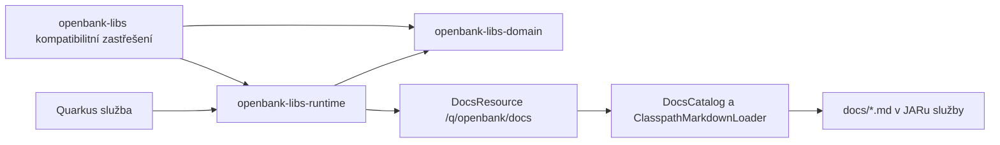

# 02 — Architektura

## Současná hranice modulů

```mermaid
flowchart LR
  Service[Quarkus služba] --> Runtime[openbank-libs-runtime]
  Runtime --> Domain[openbank-libs-domain]
  Legacy[openbank-libs kompatibilitní zastřešení] --> Runtime
  Legacy --> Domain
  Runtime --> DocsResource[DocsResource /q/openbank/docs]
  DocsResource --> DocsCatalog[DocsCatalog a ClasspathMarkdownLoader]
  DocsCatalog --> ServiceDocs[docs/*.md v JARu služby]
```

`openbank-libs-domain` obsahuje sdílené doménové primitivy a porty. Jeho build definuje hranici bez frameworku; modul nesmí importovat Quarkus ani CDI. `openbank-libs-runtime` obsahuje frameworkové adaptéry, HTTP resource a CDI zapojení. Konzumentům exportuje doménové typy. Kořenový `openbank-libs` zůstává kompatibilitním zastřešením starších závislostí; zdrojové kódy knihovny již nevlastní.

Služba vlastní dokumenty v `src/main/resources/docs/`. Společná Gradle konvence při `processResources` vytvoří `00-build.md` a zabalí jej vedle ručně psaných Markdown souborů. `ClasspathMarkdownLoader` čte tyto zdroje z classpath, `DocsCatalog` vybírá jazykové varianty a počítá otisky, `DocsResource` publikuje index, metadata a dokumenty z běžícího buildu. Admin UI čte běžící endpoint přes Kubernetes discovery. Zobrazená dokumentace služby tak odpovídá nasazenému image.

Samotný `openbank-libs` nemá běžící endpoint. Jeho kořenová složka `docs/` je snímkem zabaleným do image Admin UI. Pro aktuální chování za běhu čtěte zdrojové moduly a `/q/openbank/docs` příslušné služby.

## Build a kompatibilita

Kořenový build používá Gradle subprojekty. Služby zpravidla deklarují `implementation(project(":openbank-libs-runtime"))`, starší konzumenti mohou používat zastřešující modul. Autoritativní verze závislostí jsou v `openbank-libs/gradle/libs.versions.toml`; Gradle konvence v `build-logic/src/main/kotlin/`. Release verze každé služby je v jejím `version.txt`.

## Čtyři oči: shrnutí schvalované operace

`AuthorizeInterceptor` (`openbank-libs-runtime`, ADR-0155) pozdrží operaci, kterou OPA označí `four_eyes_required`, vrátí 202 s `approvalId` a schválení naváže na otisk přesného požadavku (endpoint + argumenty, #11675). Ke schválení ukládá i čitelné `summary` pro schvalovatele.

- **Výchozí chování:** služba bez vlastního rendereru dostane obecné shrnutí — akci, endpoint, resource a argumenty s redigovanými poli podobnými přihlašovacím údajům (`password`, `token`, `pin` …), s odstraněnými řídicími znaky a zkrácené na 1024 znaků.
- **`ApprovalSummaryRenderer` (volitelné):** služba může dodat CDI bean s `suspend fun render(action, resourceId, arguments): String?`. Interceptor mu předá tytéž obchodní argumenty, které pokrývá otisk požadavku, a jeho výstup (opět zploštěný a zkrácený) nahradí obecné shrnutí. Volá se při každém navázání požadavku (i při opakování s `X-Approval-Id`), uloží se ale jen při vytvoření schválení — schvalovatel tedy čte shrnutí toho, co bylo navázáno, nikdy znovu odvozené. `null` ponechá obecné shrnutí pro akce, které renderer nepokrývá.
- **Selhání:** výjimka z rendereru volání odmítne (503, `PolicyDecisionException`) — schválení se nevydá s chybějícím shrnutím ani s obecným výpisem argumentů, který renderer nahrazuje.
- **Shrnutí je informativní:** o shodě opakovaného požadavku rozhoduje pouze otisk, nikdy text shrnutí.
- **Osobní údaje:** shrnutí vidí operátoři, takže v něm smí být jen to, co schvalovatel potřebuje k rozpoznání cíle. Účty a IBAN maskujte (např. poslední 4 znaky), klíče nikdy nevypisujte (stačí krátký otisk SHA-256), žádná tajemství, hodnoty od volajícího ověřte podle očekávaného tvaru, jinak je nevypisujte. Příklad: `ScaApprovalSummaryRenderer` v sca-service.

## Service-account and interactive caller identity

`ServiceAccountIdentity` in libs-runtime checks a machine token's verified JWT subject, `azp` client id and matching Keycloak `preferred_username`. Service guards compare only the resulting client-bound service-account identity with their endpoint-specific allowlist. Staff-role shortcuts use `isHumanStaff`, which requires a verified user JWT from one of the realm's interactive-only clients and excludes service-account usernames. Neither role nor principal name alone establishes the caller.
