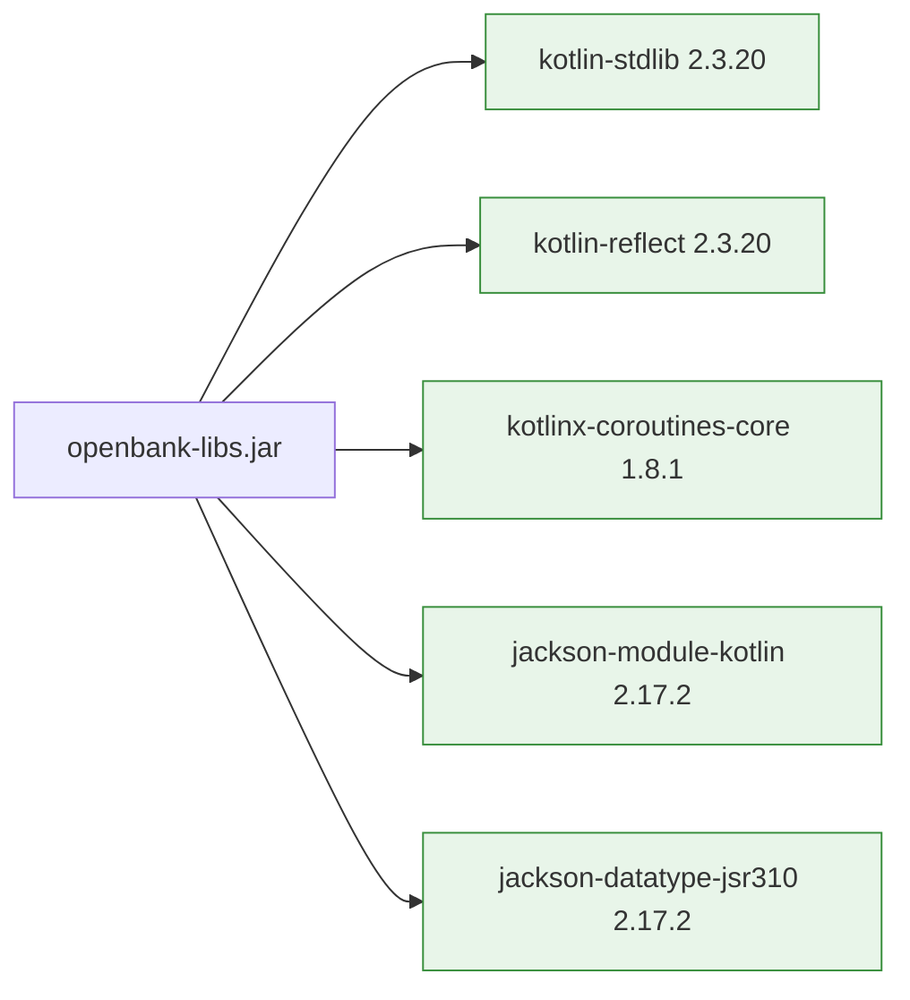

# 05 — Operations

## Build

```bash
# Build the libs JAR (also runs Jandex + CycloneDX SBOM):
./gradlew :openbank-libs:build

# Just compile + Jandex index, skip tests:
./gradlew :openbank-libs:jandex :openbank-libs:jar

# Run tests:
./gradlew :openbank-libs:test
```

Build artifacts:

```
openbank-libs/build/
├── libs/
│   └── openbank-libs.jar             ← consumed by services
└── reports/
    └── bom.json                      ← CycloneDX SBOM
```

## Version compatibility matrix

| Component | Version | Notes |
|---|---|---|
| JDK | **25 LTS** (Temurin) | toolchain `kotlin { jvmToolchain(25) }` |
| Kotlin | **2.3.20** | `libs.versions.toml` `[versions] kotlin` |
| Quarkus | **3.33.2 LTS** | platform BOM, support do 2027-03-25 |
| Gradle | **9.5.1** | wrapper version |
| Jandex Gradle plugin | **2.0.0** | `org.kordamp.gradle.jandex` |
| CycloneDX Gradle plugin | **2.3.0** | `org.cyclonedx.bom`; 3.x DSL nestabilní (viz commit `78c2d93`) |
| Foojay toolchain resolver | **1.0.0** | settings.gradle.kts (Gradle 9 compat) |

Verze žijí jednou v `openbank-libs/gradle/libs.versions.toml` a propagují se přes catalog do všech 27 service buildů.

## How to upgrade

| Upgrade | Steps | Risk |
|---|---|---|
| **Kotlin patch** (2.3.20 → 2.3.21) | Edit `kotlin = "2.3.21"`, rebuild | Low |
| **Quarkus patch** (3.33.2 → 3.33.3) | Edit `quarkus = "3.33.3"` + `quarkus-plugin`, rebuild | Low |
| **Kotlin minor** (2.3.x → 2.4.x) | + verify compileOnly + zkontroluj annotation defaults (`-Xannotation-default-target`) | Medium — Quarkus BOM musí Kotlin minor podporovat |
| **Quarkus minor** (3.33 → 3.34) | + projít migration guide | Medium — Hibernate / Mutiny API changes |
| **Quarkus major LTS** (3.33 → 4.x) | Velký refactor — Hibernate ORM 7, Vert.x 5, OIDC API změny | High — viz scénář B v history |
| **JDK** (25 → 26) | Edit toolchain ve všech service builds | High — Kotlin compatibility + ZGC settings re-tune |
| **Gradle major** (9.x → 10.x) | Update wrapper, smaže deprecated APIs | Medium |

## Release

libs **není separátně publikován** do Maven Central nebo internal repo. Verze `0.1.0-SNAPSHOT` se používá lokálně přes Gradle multi-project (`implementation(project(":openbank-libs"))`).

Pokud někdy bude potřeba externí publishing (např. partner banka chce reusovat libs):

1. Definovat semver policy (currently SNAPSHOT → 0.x while audit-grade not yet certified)
2. Bump version v `openbank-libs/build.gradle.kts`
3. `./gradlew :openbank-libs:publishToMavenLocal` pro local test
4. Setup GitHub Packages publishing v `.github/workflows/release.yml` (TODO)

## Observability

libs sám neemituje metrics ani logy nad rámec instrumentace v `CorrelationIdFilter` (jen MDC fill/clear). Ale ovlivňuje observability flotily:

- **`/api/v1/info`** v každé službě → admin UI Tech Inventory čte `stack` block z `BuildInfo`
- **`/api/v1/config`** v každé službě → System Health „Configuration" tab čte rate-limit/CB/retry/timeout
- **`X-Correlation-ID`** propagace přes `BearerTokenClientHeadersFactory` → distributed tracing
- **`AuditEvent`** přes `AuditEventPublisher` → audit-service ho persistuje

## Dependencies

Runtime classpath libs JAR-u:



Vše ostatní (Quarkus types, jakarta APIs, Redis client, Persistence API, MicroProfile) je `compileOnly` — služby ji bring přes `quarkus-bom`.

## CI

- **`.github/workflows/ci.yml`** — `:openbank-libs:test` běží na každém PR
- **`.github/workflows/security.yml`** — `sbomAll` (per-service CycloneDX SBOM) běží na main + weekly, libs SBOM je součástí
- **CodeQL** — language `java-kotlin`, scope `openbank-libs/src/**`
- **Trivy** — filesystem scan zahrnuje libs (jako součást celého repa)

## Troubleshooting

| Symptom | Příčina | Fix |
|---|---|---|
| `Unresolved reference 'Uni'` při buildu služby | Chybí explicit import `io.smallrye.mutiny.Uni` v service kódu — libs ho transitive nedává | Přidat import |
| `UnsatisfiedResolutionException: IdempotencyStore` | Služba má v REST resource `@Inject IdempotencyStore` ale nemá `@Produces` factory ani `quarkus-redis-client` extension | Přidat `IdempotencyConfig.kt` factory + `implementation(libs.quarkus.redis.client)` |
| Service `/api/v1/info` vrací `stack: null` | Service běží se starým libs JAR (před SBOM-2) nebo image není rebuiltlý | `docker compose build --no-cache <service>` + `up -d --force-recreate <service>` |
| Build padá s `ClassNotFoundException: jakarta.validation.ConstraintViolationException` | Service nemá `quarkus-hibernate-validator` extension ale libs původně auto-registroval ConstraintViolationExceptionMapper (deleted v `62b312b`) | Pull latest libs |
| `Circular dependency: :classes → :compileJava → :compileKotlin → :quarkusGenerateCode → :jar → :classes` | Per-service `settings.gradle.kts` s `includeBuild("../openbank-libs")` + Quarkus 3.33 + Gradle 9 | Build z root: `./gradlew :openbank-<svc>:quarkusBuild` (commit `62b312b`) |
| `BootstrapVerifier` failuje s "looks like development defaults" — ⬜ **tento symptom nemůže nastat** | `BootstrapVerifier` neexistuje, takže tuto hlášku nikdy nic nevypíše. Řádek popisoval kontrolu, která nebyla nikdy dodána (#8426) | Nic k řešení zde. Dev placeholder se do prod nedostane přes ESO/OpenBao `secretKeyRef` injektáž (ADR-0007) — ne přes boot-time kontrolu, takže selhání startu, které byste čekali, nepřijde |

## Audit & support

- Bug reports / questions → repo issues (label `area/libs`)
- Security issue → SECURITY.md (gpg-encrypted email)
- Compliance question → `docs/strategy/07-compliance-matrix.md` row "openbank-libs"
