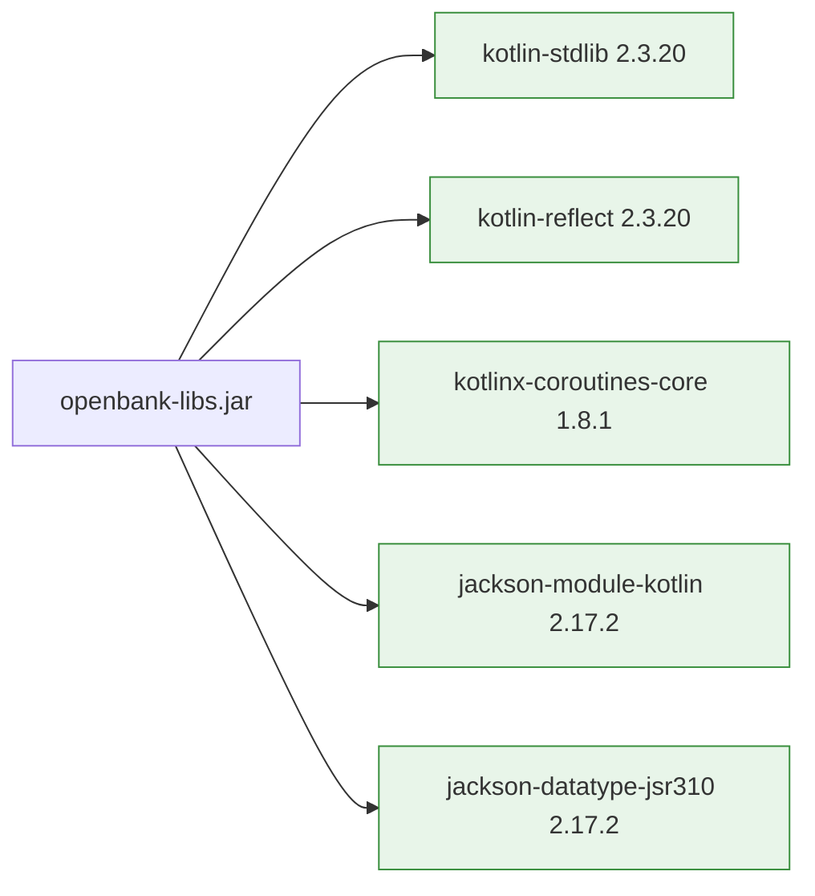

# 05 — Operations

## Build

```bash
# Build the libs JAR (also runs Jandex + CycloneDX SBOM):
./gradlew :openbank-libs:build

# Just compile + Jandex index, skip tests:
./gradlew :openbank-libs:jandex :openbank-libs:jar

# Run tests:
./gradlew :openbank-libs:test
```

Build artifacts:

```
openbank-libs/build/
├── libs/
│   └── openbank-libs.jar             ← consumed by services
└── reports/
    └── bom.json                      ← CycloneDX SBOM
```

## Version compatibility matrix

| Component | Version | Notes |
|---|---|---|
| JDK | **25 LTS** (Temurin) | toolchain `kotlin { jvmToolchain(25) }` |
| Kotlin | **2.3.20** | `libs.versions.toml` `[versions] kotlin` |
| Quarkus | **3.33.2 LTS** | platform BOM, support until 2027-03-25 |
| Gradle | **9.5.1** | wrapper version |
| Jandex Gradle plugin | **2.0.0** | `org.kordamp.gradle.jandex` |
| CycloneDX Gradle plugin | **2.3.0** | `org.cyclonedx.bom`; 3.x DSL unstable (see commit `78c2d93`) |
| Foojay toolchain resolver | **1.0.0** | settings.gradle.kts (Gradle 9 compat) |

Versions live once in `openbank-libs/gradle/libs.versions.toml` and propagate via the catalog to all 27 service builds.

## How to upgrade

| Upgrade | Steps | Risk |
|---|---|---|
| **Kotlin patch** (2.3.20 → 2.3.21) | Edit `kotlin = "2.3.21"`, rebuild | Low |
| **Quarkus patch** (3.33.2 → 3.33.3) | Edit `quarkus = "3.33.3"` + `quarkus-plugin`, rebuild | Low |
| **Kotlin minor** (2.3.x → 2.4.x) | + verify compileOnly + check annotation defaults (`-Xannotation-default-target`) | Medium — Quarkus BOM must support the Kotlin minor |
| **Quarkus minor** (3.33 → 3.34) | + go through the migration guide | Medium — Hibernate / Mutiny API changes |
| **Quarkus major LTS** (3.33 → 4.x) | Big refactor — Hibernate ORM 7, Vert.x 5, OIDC API changes | High — see scenario B in history |
| **JDK** (25 → 26) | Edit toolchain in every service build | High — Kotlin compatibility + ZGC settings re-tune |
| **Gradle major** (9.x → 10.x) | Update wrapper, removes deprecated APIs | Medium |

## Release

libs is **not published separately** to Maven Central or an internal repo. The `0.1.0-SNAPSHOT` version is used locally via Gradle multi-project (`implementation(project(":openbank-libs"))`).

If external publishing is ever needed (e.g. a partner bank wants to reuse libs):

1. Define a semver policy (currently SNAPSHOT → 0.x while audit-grade not yet certified)
2. Bump version in `openbank-libs/build.gradle.kts`
3. `./gradlew :openbank-libs:publishToMavenLocal` for local test
4. Set up GitHub Packages publishing in `.github/workflows/release.yml` (TODO)

## Observability

libs itself emits no metrics or logs beyond the instrumentation in `CorrelationIdFilter` (only MDC fill/clear). But it influences fleet observability:

- **`/api/v1/info`** on every service → admin UI Tech Inventory reads the `stack` block from `BuildInfo`
- **`/api/v1/config`** on every service → System Health "Configuration" tab reads rate-limit/CB/retry/timeout
- **`X-Correlation-ID`** propagation via `BearerTokenClientHeadersFactory` → distributed tracing
- **`AuditEvent`** via `AuditEventPublisher` → audit-service persists it

## Dependencies

Runtime classpath of the libs JAR:



Everything else (Quarkus types, jakarta APIs, Redis client, Persistence API, MicroProfile) is `compileOnly` — services bring those through `quarkus-bom`.

## CI

- **`.github/workflows/ci.yml`** — `:openbank-libs:test` runs on every PR
- **`.github/workflows/security.yml`** — `sbomAll` (per-service CycloneDX SBOM) runs on main + weekly; the libs SBOM is included
- **CodeQL** — language `java-kotlin`, scope `openbank-libs/src/**`
- **Trivy** — filesystem scan covers libs (as part of the whole repo)

## Troubleshooting

| Symptom | Cause | Fix |
|---|---|---|
| `Unresolved reference 'Uni'` during a service build | Missing explicit `import io.smallrye.mutiny.Uni` in service code — libs does not transitively expose it | Add the import |
| `UnsatisfiedResolutionException: IdempotencyStore` | Service has `@Inject IdempotencyStore` in a REST resource but no `@Produces` factory and no `quarkus-redis-client` extension | Add an `IdempotencyConfig.kt` factory + `implementation(libs.quarkus.redis.client)` |
| Service `/api/v1/info` returns `stack: null` | Service runs an old libs JAR (pre-SBOM-2) or the image was not rebuilt | `docker compose build --no-cache <service>` + `up -d --force-recreate <service>` |
| Build fails with `ClassNotFoundException: jakarta.validation.ConstraintViolationException` | Service lacks `quarkus-hibernate-validator` extension but libs used to auto-register ConstraintViolationExceptionMapper (deleted in `62b312b`) | Pull latest libs |
| `Circular dependency: :classes → :compileJava → :compileKotlin → :quarkusGenerateCode → :jar → :classes` | Per-service `settings.gradle.kts` using `includeBuild("../openbank-libs")` + Quarkus 3.33 + Gradle 9 | Build from root: `./gradlew :openbank-<svc>:quarkusBuild` (commit `62b312b`) |
| `BootstrapVerifier` fails with "looks like development defaults" — ⬜ **this symptom cannot occur** | There is no `BootstrapVerifier`, so nothing ever emits that message. The row described a check that was never shipped (#8426) | Nothing to fix here. A dev placeholder is kept out of prod by ESO/OpenBao `secretKeyRef` injection (ADR-0007) — not by a boot-time check, so the startup failure you would expect never arrives |

## Audit & support

- Bug reports / questions → repo issues (label `area/libs`)
- Security issue → SECURITY.md (gpg-encrypted email)
- Compliance question → `docs/strategy/07-compliance-matrix.md` row "openbank-libs"
