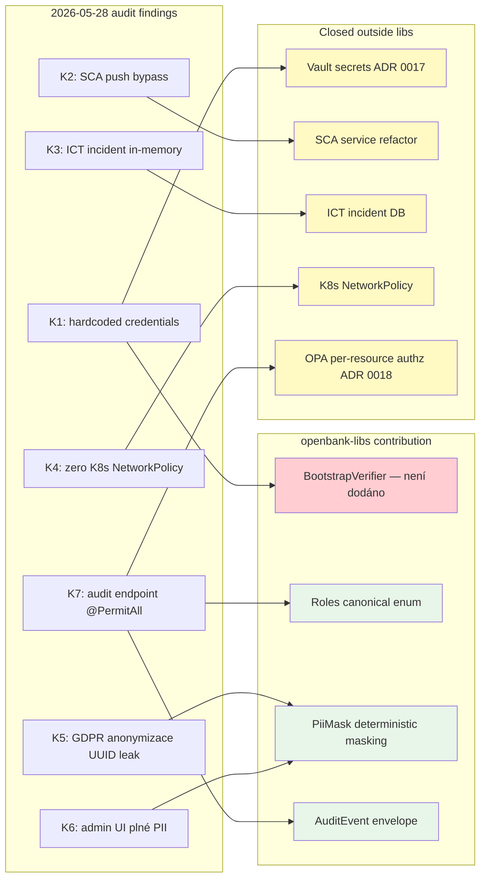

# 06 — Compliance

openbank-libs **není compliance hraniční kontrolou**, ale **kanálem pro implementaci kontrol**. Sjednocením krížových (cross-cutting) primitiv napříč 27 službami se compliance audit z "review 27 různých implementací PII maskování" mění na "review 1 implementace v libs".

## Regulatorní mapping per komponenta

| libs komponenta | Reguluje | Konkrétní článek | Co ji uzavírá |
|---|---|---|---|
| `BuildInfo` + `ServiceInfoResource` | DORA | Art. 8 (asset register) | Per-service runtime tech stack (Kotlin/Quarkus/JDK verze) je machine-readable přes `/api/v1/info` |
| `BuildInfo` + per-service SBOM | DORA | Art. 28 (ICT third-party register) | CycloneDX SBOM per service v `build/reports/bom.json`, CI artefakty + admin UI download |
| `BootstrapVerifier` — ⬜ **není dodáno** | DORA, NIS2 | DORA Art. 9 (ICT security controls), NIS2 čl. 21 | **Nic — třída neexistuje.** V `openbank-libs` není žádný `BootstrapVerifier` (`git grep BootstrapVerifier -- '*.kt'` vrací 0); fail-fast guard proti dev placeholderům, který předepisuje ADR-0017, nebyl nikdy zapojen — uvádí to i delivery note téže ADR. K1 je místo toho mitigováno ESO/OpenBao env-var indirekcí (ADR-0007): nasazené manifesty berou credentials přes `secretKeyRef`, takže dev placeholder se dnes do prod nedostává — ale žádný boot-time guard to nekontroluje (#8426) |
| `PiiMasking` (`PiiMask`) | GDPR | Art. 25 (privacy by design), Art. 32 (security of processing) | Single audit-grade implementation, PCI-DSS compliant card masking (first 4 + last 4). Maskování aplikuje **explicitně** volající — deklarativní anotace neexistuje a neexistuje ani serializační filtr, který by ji ctil (#4011) |
| `AuditEvent` + `AuditEventPublisher` | GDPR, DORA | GDPR Art. 30 (Records of Processing), DORA Art. 17 (incident reconstruction 24h) | Canonical envelope (actor, op, resource, ts, ip, result, traceId), pluggable publisher |
| `Roles` (canonical constants) | PSD2, CNB | PSD2 RTS § technický standard, CNB vyhláška 163/2014 § přístupová oprávnění | Eliminuje string-typo bezpečnostní díry, audit ví, jaké role existují |
| `BearerTokenClientHeadersFactory` | NIS2, DORA | NIS2 čl. 21 (cryptographic auth), DORA Art. 9 | Service-to-service mTLS-equivalent přes JWT Bearer, automatická correlation propagace |
| `IdempotencyStore` | PSD2 | PSD2 RTS čl. 22 (transaction idempotency for SCA-protected operations) | Single Redis-backed store, TTL 24h default |
| `AbstractOutboxEntity` + `OutboxDispatch` | DORA | Art. 25 (operational resilience pro ICT services) | Sdílená dispatch logika s resilience anotacemi, exit-safe boundary mezi service state a downstream konzumenty |
| `Iban` (ISO 13616 validace) | CNB, EBA | EBA/RTS PSD2 § IBAN validation | Není doménově specifické, jednou validováno správně |
| `Money` (BigDecimal + ISO 4217) | CNB, IFRS | IAS 21 (foreign currency), CNB účetní vyhláška | Type-safe operace, scale-aware (decimal places dle currency code), cross-currency add throws |

## Compliance impact map per audit nález

ADR 0014 a 2026-05-28 audit identifikovaly 7 kritických nálezů (K1-K7). libs je v různé míře nástroj k jejich uzavření:

Legenda: zelená = dodáno v libs · žlutá = uzavřeno mimo libs · červená = **předepsáno, ale nikdy nedodáno**.
`BootstrapVerifier` je jediný červený uzel. K1 dnes drží pouze injektáž secrets přes ESO/OpenBao — žádný
boot-time guard za tím není, takže hrana `K1 --> BV` zaznamenává záměr, ne kontrolu (#8426).

## Skóre regulací před / po libs

Audit 2026-05-28 hodnotí compliance posture takto:

| Regulace | Před libs | Po F1-F3 libs | Co ještě chybí |
|---|---|---|---|
| **EBA** (ICT risk + outsourcing GL/2019/04, GL/2019/02) | 35 % | 50 % | Outsourcing register, ICAAP/ILAAP datový model |
| **CNB** (vyhláška 163/2014, regulatorní reporting) | 20 % | 25 % | FINREP/COREP/MIR/AnaCredit XBRL výstupy |
| **GDPR** | 45 % | 70 % | Per-service DSR endpointy (data export, deletion), DPIA records |
| **DORA** | 40 % | 60 % | Incident reporting workflow, vendor registry (DORA Art. 28) |
| **NIS2** | 30 % | 55 % | mTLS prod nasazení (ADR Op-ex 5), Vault prod (ADR 0017) |

(Po dokončení Op-ex 1, 4 a 5 — Vault, OPA, Istio — se skóre dále zvýší.)

## Auditní stopa pro compliance officer

Když auditor zeptá *"jak víš, že každá služba maskuje email stejně?"* odpověď je:

1. Otevři [`02-architecture.md § 5. PiiMasking`](./02-architecture.md)
2. Klikni odkaz na zdrojový kód `openbank-libs-domain/src/main/kotlin/com/openbank/libs/security/PiiMasking.kt`
3. Reviewuj 1 soubor, 80 řádků
4. Ověř testy `openbank-libs-domain/src/test/kotlin/com/openbank/libs/security/PiiMaskTest.kt` (15 cases)
5. Ověř že každá z 27 služeb importuje `com.openbank.libs.security.PiiMask` (grep)

Bez libs by stejná otázka znamenala review 27 různých implementací s rizikem, že 3 z nich PII rotin maskují špatně.

## Compliance matrix v centrálních docs

Update `docs/strategy/07-compliance-matrix.md` row "openbank-libs" odkazuje na tento dokument jako evidence pillar. Při auditech CNB / EBA bude inspector dostávat odkaz na `/services/libs/docs/06-compliance.md` (admin UI rendering této sekce).
