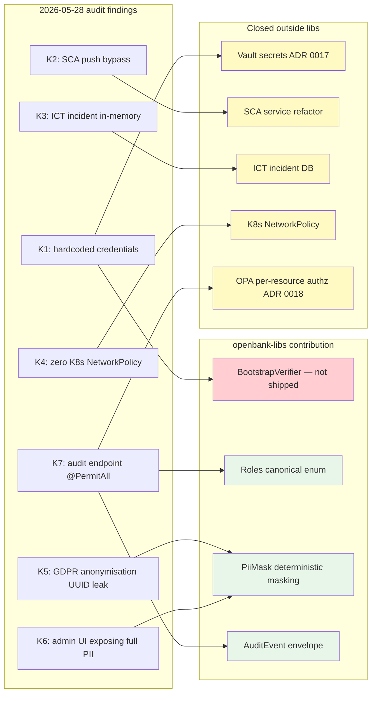

# 06 — Compliance

openbank-libs is **not a compliance boundary control**, but **a channel for implementing controls**. By unifying cross-cutting primitives across 27 services, a compliance audit changes from "review 27 different PII-masking implementations" to "review 1 implementation in libs".

## Regulatory mapping per component

| libs component | Regulates | Specific article | What it closes |
|---|---|---|---|
| `BuildInfo` + `ServiceInfoResource` | DORA | Art. 8 (asset register) | Per-service runtime tech stack (Kotlin/Quarkus/JDK versions) is machine-readable via `/api/v1/info` |
| `BuildInfo` + per-service SBOM | DORA | Art. 28 (ICT third-party register) | CycloneDX SBOM per service in `build/reports/bom.json`, CI artifacts + admin UI download |
| `BootstrapVerifier` — ⬜ **not shipped** | DORA, NIS2 | DORA Art. 9 (ICT security controls), NIS2 Art. 21 | **Nothing — the class does not exist.** There is no `BootstrapVerifier` anywhere in `openbank-libs` (`git grep BootstrapVerifier -- '*.kt'` returns 0); the fail-fast placeholder guard ADR-0017 prescribes was never wired, as that ADR's own delivery note records. K1 is mitigated instead by ESO/OpenBao env-var indirection (ADR-0007): deployed manifests take credentials through `secretKeyRef`, so no dev placeholder reaches prod today — but no boot-time guard checks that (#8426) |
| `PiiMasking` (`PiiMask`) | GDPR | Art. 25 (privacy by design), Art. 32 (security of processing) | Single audit-grade implementation, PCI-DSS compliant card masking (first 4 + last 4). Applied **explicitly** by the caller — there is no declarative masking annotation, and no serialization filter that would honour one (#4011) |
| `AuditEvent` + `AuditEventPublisher` | GDPR, DORA | GDPR Art. 30 (Records of Processing), DORA Art. 17 (incident reconstruction 24 h) | Canonical envelope (actor, op, resource, ts, ip, result, traceId), pluggable publisher |
| `Roles` (canonical constants) | PSD2, CNB | PSD2 RTS § technical standard, CNB decree 163/2014 § access permissions | Eliminates string-typo security holes; audit knows which roles exist |
| `BearerTokenClientHeadersFactory` | NIS2, DORA | NIS2 Art. 21 (cryptographic auth), DORA Art. 9 | Service-to-service mTLS-equivalent via JWT Bearer, automatic correlation propagation |
| `IdempotencyStore` | PSD2 | PSD2 RTS Art. 22 (transaction idempotency for SCA-protected operations) | Single Redis-backed store, default TTL 24 h |
| `AbstractOutboxEntity` + `OutboxDispatch` | DORA | Art. 25 (operational resilience for ICT services) | Shared dispatch logic with resilience annotations, exit-safe boundary between service state and downstream consumers |
| `Iban` (ISO 13616 validation) | CNB, EBA | EBA/RTS PSD2 § IBAN validation | Not domain-specific, validated correctly once |
| `Money` (BigDecimal + ISO 4217) | CNB, IFRS | IAS 21 (foreign currency), CNB accounting decree | Type-safe operations, scale-aware (decimal places per currency code), cross-currency add throws |

## Compliance impact map per audit finding

ADR 0014 and the 2026-05-28 audit identified 7 critical findings (K1-K7). libs is to varying degrees a tool for closing them:

Legend: green = delivered in libs · yellow = closed outside libs · red = **prescribed but never delivered**.
`BootstrapVerifier` is the only red node. K1 is held today by ESO/OpenBao secret injection alone — there is no
boot-time guard behind it, so the `K1 --> BV` edge records an intent, not a control (#8426).

## Regulatory score before / after libs

The 2026-05-28 audit rates the compliance posture as follows:

| Regulation | Before libs | After F1-F3 libs | What is still missing |
|---|---|---|---|
| **EBA** (ICT risk + outsourcing GL/2019/04, GL/2019/02) | 35 % | 50 % | Outsourcing register, ICAAP/ILAAP data model |
| **CNB** (decree 163/2014, regulatory reporting) | 20 % | 25 % | FINREP/COREP/MIR/AnaCredit XBRL outputs |
| **GDPR** | 45 % | 70 % | Per-service DSR endpoints (data export, deletion), DPIA records |
| **DORA** | 40 % | 60 % | Incident reporting workflow, vendor registry (DORA Art. 28) |
| **NIS2** | 30 % | 55 % | mTLS prod deployment (ADR Op-ex 5), Vault prod (ADR 0017) |

(Completing Op-ex 1, 4, and 5 — Vault, OPA, Istio — will raise the score further.)

## Audit trail for the compliance officer

When the auditor asks *"how do you know every service masks email the same way?"* the answer is:

1. Open [`02-architecture.md § 5. PiiMasking`](./02-architecture.md)
2. Click the link to the source `openbank-libs-domain/src/main/kotlin/com/openbank/libs/security/PiiMasking.kt`
3. Review 1 file, 80 lines
4. Verify tests `openbank-libs-domain/src/test/kotlin/com/openbank/libs/security/PiiMaskTest.kt` (15 cases)
5. Verify each of the 27 services imports `com.openbank.libs.security.PiiMask` (grep)

Without libs, the same question would mean reviewing 27 different implementations with the risk that 3 of them mask PII incorrectly.

## Compliance matrix in central docs

`docs/strategy/07-compliance-matrix.md` row "openbank-libs" points to this document as the evidence pillar. During CNB / EBA audits the inspector will receive a link to `/services/libs/docs/06-compliance.md` (admin UI rendering of this section).
