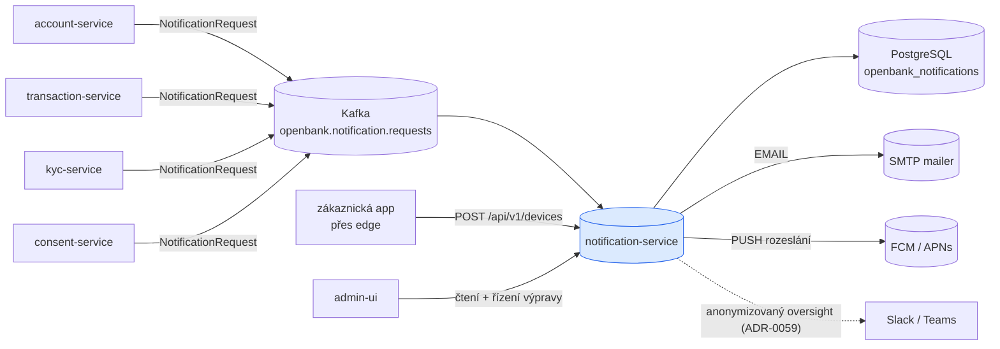
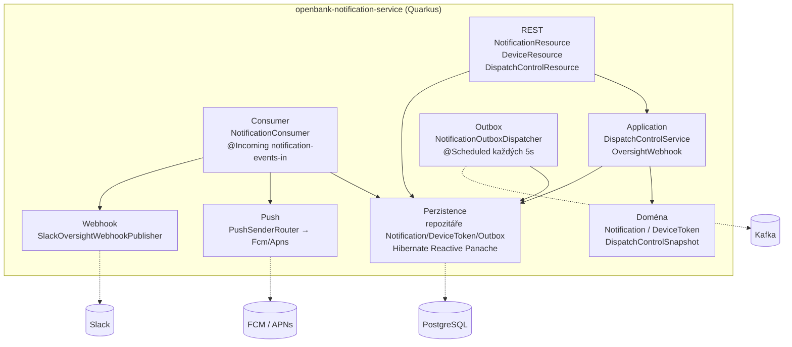
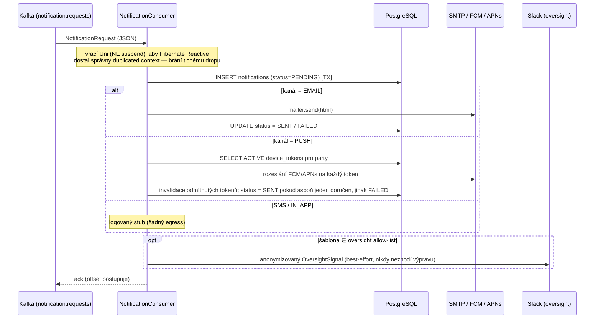
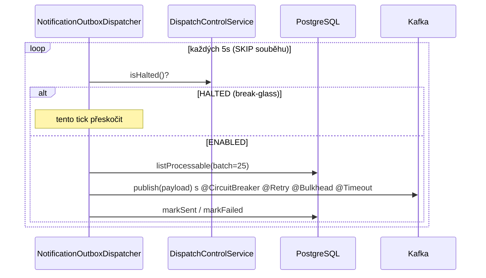

# Architektura

## C4 — Kontext systému



## C4 — Kontejner (vnitřní struktura)



## Hexagonální vrstvy

Rozložení balíčků odráží **ports-and-adapters** (ADR-0002):

```
com.openbank.notification/
├── domain/                    ◄── jádro — bez frameworkových závislostí
│   ├── model/                 Notification, NotificationRequest, DeviceToken, PushResult
│   └── ops/                   DispatchControlSnapshot, DispatchState, ResumeAction
│
├── application/               ◄── orchestrace use-case
│   ├── NotificationConsumer   @Incoming handler: render → uložení → doručení → oversight
│   ├── DispatchControlService break-glass halt + four-eyes resume (ADR-0047)
│   ├── OversightWebhook        anonymizační jádro / allow-list (ADR-0059)
│   └── port/out/              DispatchControlStore, NotificationOutbox*, PushSender,
│                              OversightWebhookPublisher
│
└── infrastructure/            ◄── adaptéry
    ├── rest/                  NotificationResource, DeviceResource, DispatchControlResource
    ├── persistence/           entity/ + repository/ (Hibernate Reactive Panache)
    ├── kafka/                 KafkaNotificationOutboxEventPublisher
    ├── outbox/                NotificationOutboxDispatcher (@Scheduled)
    ├── push/                  PushSenderRouter, FcmPushSender, ApnsPushSender, PushCrypto
    └── webhook/               SlackOversightWebhookPublisher
```

**Pravidlo závislostí:** `domain` ← `application` ← `infrastructure`. Doménový kód nikdy nevidí Kafku, REST DTO ani Hibernate.

## Tok vstupní konzumace



**Sémantika doručení:** at-least-once. Redelivery uloží nový řádek notifikace — přijatelné, protože notifikace nejsou na peněžní cestě. Poison (neparsovatelné) payloady se zalogují a potvrdí (ack), aby jeden vadný záznam nezaklínil partition.

## Tok outboxu (relay)

Služba nese i obecný transakční outbox (`notification_outbox` + `NotificationOutboxDispatcher`):



> **Stav:** odchozí Kafka kanál se v `KafkaNotificationOutboxEventPublisher` jmenuje `notification-events-out`, ale navázání topicu **zatím není deklarováno** v `application.yaml` (`mp.messaging.outgoing.*`). Outbox relay je tedy v kódu přítomný, ale jeho odchozí topic je **TBD**. Primární doručovací cestou dnes je vstupní consumer.

## Break-glass řízení výpravy (ADR-0047)

Governance asymetrie — bezpečný směr je levný, rizikový je gated:

- **`halt`** — break-glass jednoho aktéra; zastavení odchozích notifikací je bezpečné, takže nabývá účinnosti okamžitě a nastavuje povinný příznak `deferredReviewRequired`.
- **`proposeResume` + `approveResume`** — opětovné zapnutí vyžaduje **four-eyes**: schvalovatel se musí lišit od navrhovatele, vynuceno v `openbank-libs` governance (`Proposal` / `MakerCheckerViolation`), ne konvencí.

Stav je append-only, verzovaný log žádaného stavu (`dispatch_control_log`); každá replika čte nejnovější snapshot pro daný `control_key` a konverguje — bez per-pod RPC. Každý přechod emituje `AuditEvent` (DORA čl. 17, GDPR čl. 30).

## Oversight anonymizace (ADR-0059)

`OversightWebhook` je jediné anonymizační jádro. Egress smí jen pevný, bez-PII `OversightSignal` (název enum šablony, kanál, stav, časové razítko), a to jen pro explicitní allow-list rizikových šablon (`TRANSACTION_FAILED`, `KYC_REJECTED`, `ACCOUNT_FROZEN`, `CONSENT_REVOKED`). Defense-in-depth scrubber navíc maskuje tokeny vypadající jako IBAN/PAN/e-mail, takže k úniku musí selhat dva nezávislé kontroly.

## Komponenty z `openbank-libs`

| Modul | Použití zde |
|---|---|
| `libs.audit.AuditEventPublisher` | audit události pro každý přechod řízení výpravy |
| `libs.governance.Proposal` / `MakerCheckerViolation` | four-eyes obnovení výpravy |
| `libs.security.PiiMask` | maskování push tokenů / PII před logováním |
| `libs.web.ServiceInfoResource` | `/api/v1/info` (build metadata) |
| `libs.docs.DocsResource` | **tato dokumentace** (`/q/openbank/docs`) |

## Principy

1. **Reaktivní `Uni`, ne `suspend`** v Kafka consumeru — Hibernate Reactive potřebuje duplicated Vert.x context; `suspend @Incoming` by se zasekl před ackem (tichý drop). Stejná konvence jako statement-service.
2. **Token jen pro zápis** — push tokeny poskytovatele se přijímají, ale nikdy nevrací přes REST ani neloguje v plné podobě.
3. **Egress ve výchozím stavu vypnutý** — push adaptéry a oversight webhook jsou vypnuté, dokud nejsou explicitně zapnuté; vypnutý adaptér je úspěšný no-op.
4. **Soukromí z principu** — oversight egress se staví z pozitivního allow-list schématu plus scrubberu.
5. **Žádná peněžní cesta** — doručení at-least-once, redelivery ukládá znovu; žádná vstupní idempotenční vrstva.
