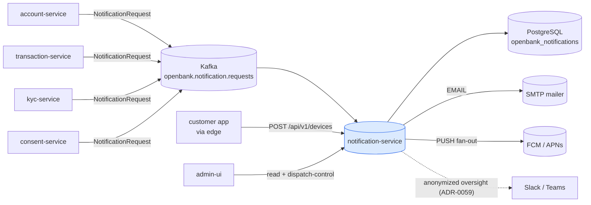
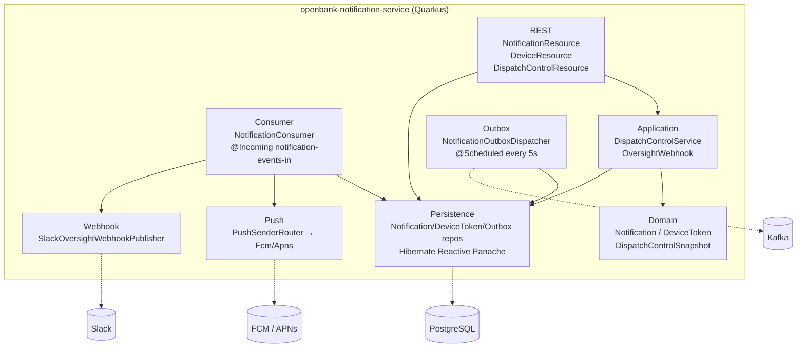
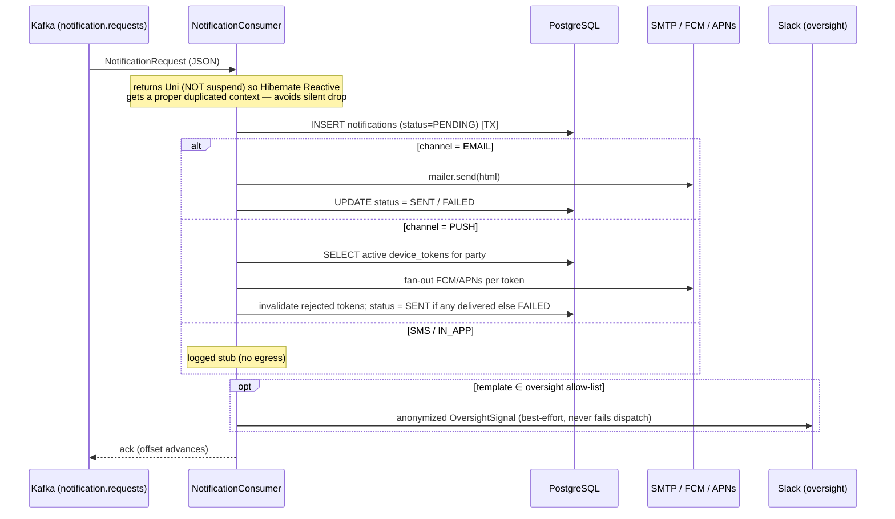
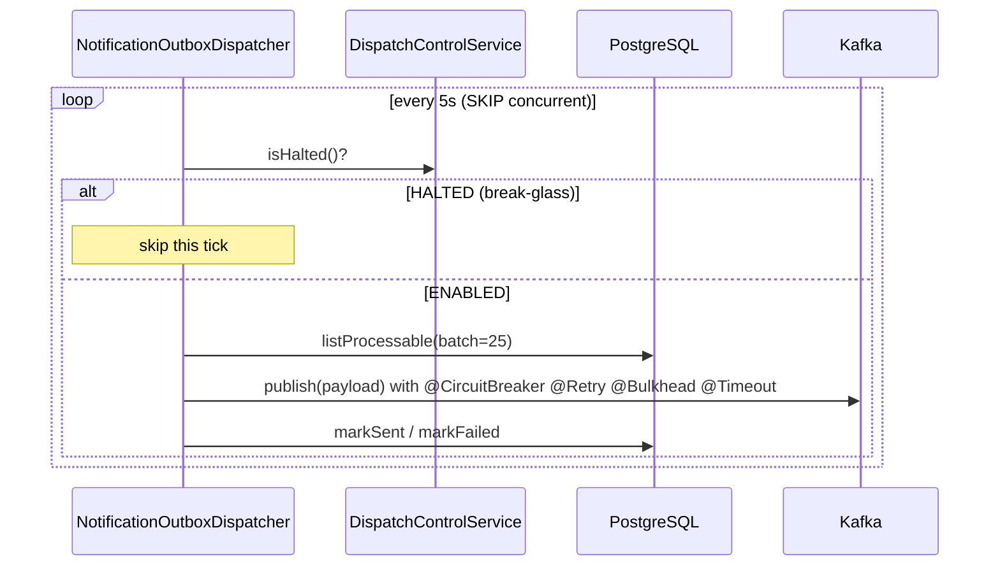

# Architecture

## C4 — System Context



## C4 — Container (internal structure)



## Hexagonal layers

The package layout reflects **ports-and-adapters** (ADR-0002):

```
com.openbank.notification/
├── domain/                    ◄── core — no framework dependencies
│   ├── model/                 Notification, NotificationRequest, DeviceToken, PushResult
│   └── ops/                   DispatchControlSnapshot, DispatchState, ResumeAction
│
├── application/               ◄── use-case orchestration
│   ├── NotificationConsumer   @Incoming handler: render → persist → deliver → oversight
│   ├── DispatchControlService break-glass halt + four-eyes resume (ADR-0047)
│   ├── OversightWebhook        anonymization core / allow-list (ADR-0059)
│   └── port/out/              DispatchControlStore, NotificationOutbox*, PushSender,
│                              OversightWebhookPublisher
│
└── infrastructure/            ◄── adapters
    ├── rest/                  NotificationResource, DeviceResource, DispatchControlResource
    ├── persistence/           entity/ + repository/ (Hibernate Reactive Panache)
    ├── kafka/                 KafkaNotificationOutboxEventPublisher
    ├── outbox/                NotificationOutboxDispatcher (@Scheduled)
    ├── push/                  PushSenderRouter, FcmPushSender, ApnsPushSender, PushCrypto
    └── webhook/               SlackOversightWebhookPublisher
```

**Dependency rule:** `domain` ← `application` ← `infrastructure`. Domain code never sees Kafka, REST DTOs or Hibernate.

## Inbound consume flow



**Delivery semantics:** at-least-once. A redelivery re-persists a fresh notification row — acceptable because notifications are not on the money path. Poison (un-parseable) payloads are logged and acked so one bad record cannot wedge the partition.

## Outbox flow (relay)

The service also carries a generic transactional outbox (`notification_outbox` + `NotificationOutboxDispatcher`):



> **Status:** the outgoing Kafka channel is named `notification-events-out` in `KafkaNotificationOutboxEventPublisher`, but the topic binding is **not yet declared** in `application.yaml` (`mp.messaging.outgoing.*`). The outbox relay is therefore present in code but its egress topic is **TBD**. The primary delivery path today is the inbound consumer.

## Break-glass dispatch control (ADR-0047)

Governance asymmetry — the fail-safe direction is cheap, the risk-increasing one is gated:

- **`halt`** — single-actor break-glass; stopping outbound notifications is safe, so it takes effect immediately and sets a mandatory `deferredReviewRequired` flag.
- **`proposeResume` + `approveResume`** — re-enabling needs **four-eyes**: the approver must differ from the proposer, enforced in `openbank-libs` governance (`Proposal` / `MakerCheckerViolation`), not by convention.

State is an append-only, versioned desired-state log (`dispatch_control_log`); every replica reads the latest snapshot per `control_key` and converges — no per-pod RPC. Every transition emits an `AuditEvent` (DORA Art. 17, GDPR Art. 30).

## Oversight anonymization (ADR-0059)

`OversightWebhook` is the single anonymization core. Only a fixed, PII-free `OversightSignal` (template enum name, channel, status, timestamp) may egress, and only for an explicit allow-list of risk templates (`TRANSACTION_FAILED`, `KYC_REJECTED`, `ACCOUNT_FROZEN`, `CONSENT_REVOKED`). A defense-in-depth scrubber additionally masks IBAN/PAN/email-shaped tokens so two independent controls must fail to leak.

## Components from `openbank-libs`

| Module | Use here |
|---|---|
| `libs.audit.AuditEventPublisher` | audit events for every dispatch-control transition |
| `libs.governance.Proposal` / `MakerCheckerViolation` | four-eyes resume of dispatch |
| `libs.security.PiiMask` | mask push tokens / PII before logging |
| `libs.web.ServiceInfoResource` | `/api/v1/info` (build metadata) |
| `libs.docs.DocsResource` | **this documentation** (`/q/openbank/docs`) |

## Principles

1. **Reactive `Uni`, not `suspend`** in the Kafka consumer — Hibernate Reactive needs a duplicated Vert.x context; a `suspend @Incoming` would stall before acking (silent drop). Same convention as statement-service.
2. **Token is write-only** — provider push tokens are accepted but never returned over REST or logged in full.
3. **Off-by-default egress** — push adapters and the oversight webhook are disabled unless explicitly enabled; a disabled adapter is a successful no-op.
4. **Privacy by construction** — oversight egress is built from a positive allow-list schema plus a scrubber.
5. **No money path** — at-least-once delivery, redelivery re-persists; no inbound idempotency layer.
