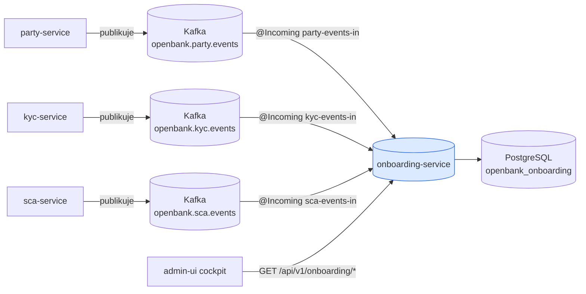
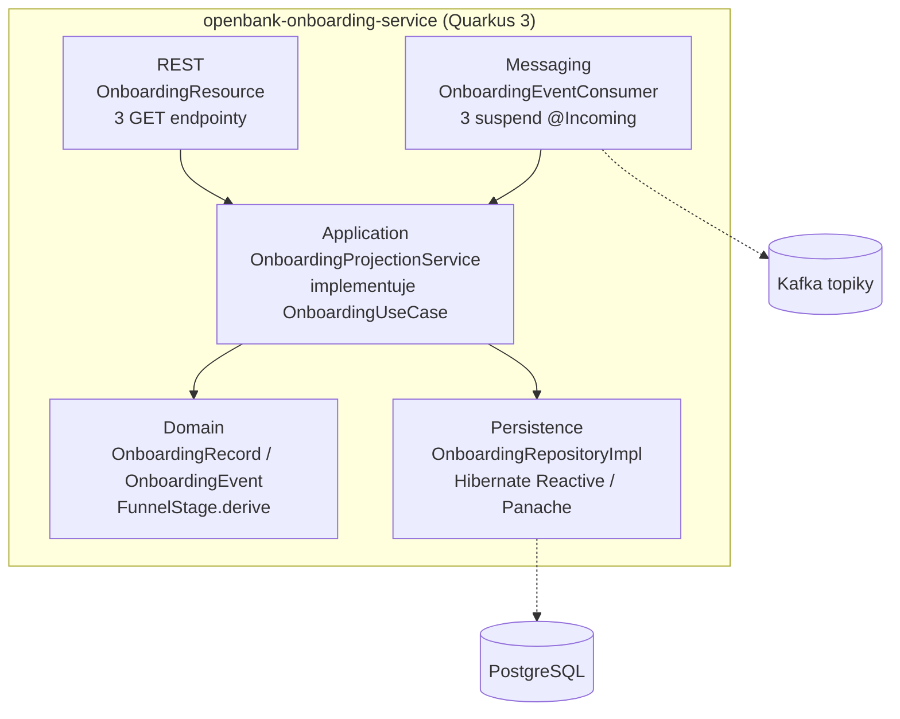
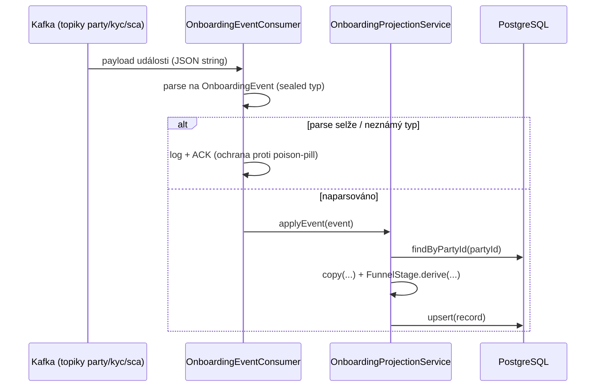

# Architektura

## C4 — Systémový kontext



Pozn.: šipky jsou **jednosměrný příjem**. onboarding-service nikdy nevolá party/kyc/sca a nepublikuje události.

## C4 — Kontejner (vnitřní struktura)



## Hexagonální vrstvy

Struktura balíčků odráží **ports-and-adapters** (ADR-0002):

```
com.openbank.onboarding/
├── domain/                     ◄── jádro — žádné frameworkové závislosti
│   └── model/
│       ├── OnboardingRecord    agregát read-modelu + enumy PartyStage / KycStage
│       ├── FunnelStage         odvozená fáze + čisté derive(party, kyc, scaEnrolled)
│       └── OnboardingEvent     sealed hierarchie příchozích událostí
│
├── application/                ◄── orchestrace use-case
│   ├── port/in/
│   │   └── OnboardingUseCase   příchozí port (čtecí dotazy)
│   ├── port/out/
│   │   └── OnboardingRepository odchozí port (perzistence)
│   └── usecase/
│       └── OnboardingProjectionService  čtecí strana + projekce applyEvent
│
└── infrastructure/             ◄── adaptéry
    ├── rest/                   OnboardingResource (JAX-RS, mapování DTO)
    ├── kafka/                  OnboardingEventConsumer (parse + dispatch)
    └── persistence/
        ├── entity/             OnboardingEntity (Panache)
        └── repository/         OnboardingRepositoryImpl
```

**Pravidlo závislostí:** `domain` ← `application` ← `infrastructure`. Doménová vrstva (zejména `FunnelStage.derive`) nese logiku trychtýře a má nulové frameworkové importy, takže je izolovaně unit-testovatelná.

## Tok projekce událostí

Není zde **žádný outbox** — služba konzumuje události a aktualizuje read-model; nikdy neprodukuje. Tok je konzumace → parse → projekce → upsert.



**Ochrana proti poison-pill:** jakékoli selhání parsování či projekce je zalogováno a zpráva je **acknowledgnuta** (ne re-queue). To je pro read-model správné — jedna vadná událost nesmí zaseknout consumer group a kanonický zdroj pravdy (party/kyc/sca) lze vždy přehrát a projekci znovu sestavit. Konzumenti běží na `suspend @Incoming` handlerech (stejný vzor jako ledger projekce balance-service), s `auto.offset.reset=earliest`, takže čerstvé nasazení se naplní od začátku logu.

## Odvození fáze trychtýře

`FunnelStage.derive(party, kyc, scaEnrolled)` je jedno kanonické mapování (ADR-0068 §2), vyhodnocované při každé projektované události:

| Podmínka | Výsledná fáze |
|---|---|
| party `SUSPENDED` nebo `CLOSED` | `BLOCKED` |
| party `ACTIVE` a `scaEnrolled` | `ACTIVE` |
| party `ACTIVE` a neenrollnuto | `SCA_PENDING` |
| kyc `UNDER_REVIEW` | `KYC_UNDER_REVIEW` |
| kyc `DOCUMENTS_REQUIRED` | `KYC_DOCUMENTS_REQUIRED` | <!-- nedosažitelné: kyc tento stav nikdy nenastaví (#8535) -->
| kyc `OPEN` nebo null | `KYC_OPEN` |
| kyc `REJECTED` nebo `EXPIRED` | `BLOCKED` |
| jinak | `REGISTERED` |

## Komponenty z `openbank-libs`

| Modul | Využití zde |
|---|---|
| `libs.web.ServiceInfoResource` | `/api/v1/info` (build metadata) |
| `libs.web.ApiVersionResponseFilter` | hlavičky `X-API-Version` / `X-Service-Version` |
| `libs.docs.DocsResource` | **tato dokumentace** (`/q/openbank/docs`) |
| build metadata (`BUILD_TIME`, `GIT_COMMIT`) | runtime identifikace (DORA Art. 9) |

## Principy

1. **Projekce, nikdy autorita** — služba pozoruje; party/kyc/sca vlastní každý přechod stavu.
2. **Čistá, otestovaná funkce fáze** — `FunnelStage.derive` žije v doméně a je vyčerpávajícně unit-testovaná.
3. **Idempotence z konstrukce** — projekce je upsert podle `party_id`; přehrání události je bezpečné.
4. **Odolný příjem** — poison-pill události jsou acknowledgnuty a zalogovány, nikdy neblokují consumer group.
5. **Znovusestavitelnost** — read-model lze zahodit a znovu naplnit ze zdrojového logu událostí.
