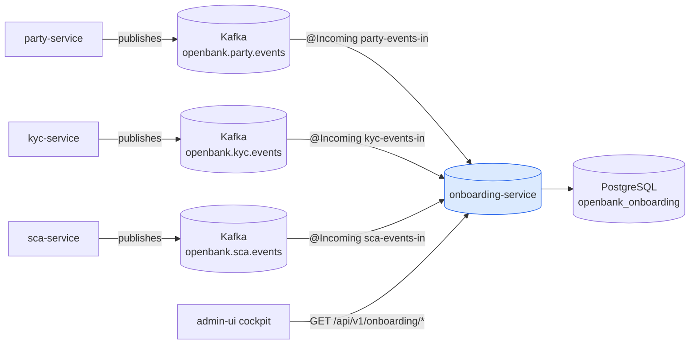
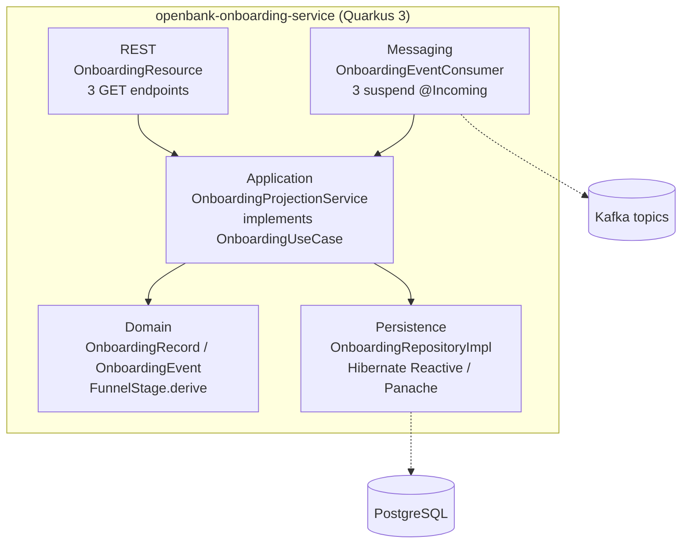
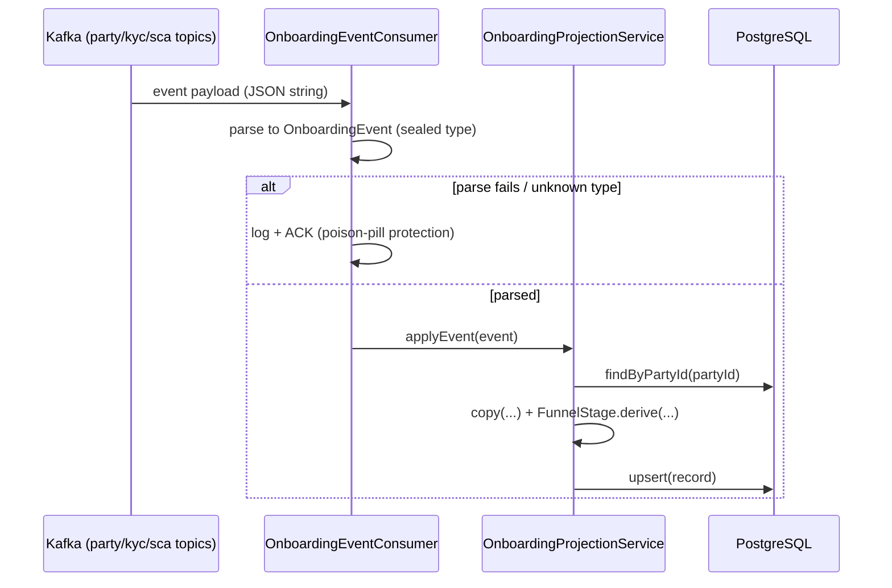

# Architecture

## C4 — System Context



Note: the arrows are **one-way ingestion**. onboarding-service never calls party/kyc/sca and never publishes events.

## C4 — Container (internal structure)



## Hexagonal layers

The package structure reflects **ports-and-adapters** (ADR-0002):

```
com.openbank.onboarding/
├── domain/                     ◄── core — no framework dependencies
│   └── model/
│       ├── OnboardingRecord    read-model aggregate + PartyStage / KycStage enums
│       ├── FunnelStage         derived stage + pure derive(party, kyc, scaEnrolled)
│       └── OnboardingEvent     sealed inbound-event hierarchy
│
├── application/                ◄── use-case orchestration
│   ├── port/in/
│   │   └── OnboardingUseCase   inbound port (read queries)
│   ├── port/out/
│   │   └── OnboardingRepository outbound port (persistence)
│   └── usecase/
│       └── OnboardingProjectionService  query side + applyEvent projection
│
└── infrastructure/             ◄── adapters
    ├── rest/                   OnboardingResource (JAX-RS, DTO mapping)
    ├── kafka/                  OnboardingEventConsumer (parse + dispatch)
    └── persistence/
        ├── entity/             OnboardingEntity (Panache)
        └── repository/         OnboardingRepositoryImpl
```

**Dependency rule:** `domain` ← `application` ← `infrastructure`. The domain layer (notably `FunnelStage.derive`) carries the funnel logic and has zero framework imports, so it is unit-testable in isolation.

## Event-projection flow

There is **no outbox** here — the service consumes events and updates the read-model; it never produces. The flow is consume → parse → project → upsert.



**Poison-pill protection:** any parse or projection failure is logged and the message is **acked** (not re-queued). This is correct for a read-model — a single bad event must not wedge the consumer group, and the canonical source of truth (party/kyc/sca) can always be replayed to rebuild the projection. Consumers run on `suspend @Incoming` handlers (same pattern as balance-service's ledger projection consumer), with `auto.offset.reset=earliest` so a fresh deployment seeds from the start of the log.

## Funnel-stage derivation

`FunnelStage.derive(party, kyc, scaEnrolled)` is the one canonical mapping (ADR-0068 §2), evaluated on every projected event:

| Condition | Resulting stage |
|---|---|
| party `SUSPENDED` or `CLOSED` | `BLOCKED` |
| party `ACTIVE` and `scaEnrolled` | `ACTIVE` |
| party `ACTIVE` and not enrolled | `SCA_PENDING` |
| kyc `UNDER_REVIEW` | `KYC_UNDER_REVIEW` |
| kyc `DOCUMENTS_REQUIRED` | `KYC_DOCUMENTS_REQUIRED` | <!-- unreachable: kyc never sets this status (#8535) -->
| kyc `OPEN` or null | `KYC_OPEN` |
| kyc `REJECTED` or `EXPIRED` | `BLOCKED` |
| otherwise | `REGISTERED` |

## Components from `openbank-libs`

| Module | Use here |
|---|---|
| `libs.web.ServiceInfoResource` | `/api/v1/info` (build metadata) |
| `libs.web.ApiVersionResponseFilter` | `X-API-Version` / `X-Service-Version` headers |
| `libs.docs.DocsResource` | **this documentation** (`/q/openbank/docs`) |
| build metadata (`BUILD_TIME`, `GIT_COMMIT`) | runtime identification (DORA Art. 9) |

## Principles

1. **Projection, never authority** — the service observes; party/kyc/sca own every state transition.
2. **Pure, tested stage function** — `FunnelStage.derive` lives in the domain and is exhaustively unit-tested.
3. **Idempotent by construction** — projection is upsert-by-`party_id`; replaying an event is safe.
4. **Resilient ingestion** — poison-pill events are acked and logged, never block the consumer group.
5. **Rebuildable** — the read-model can be dropped and re-seeded from the source event log.
