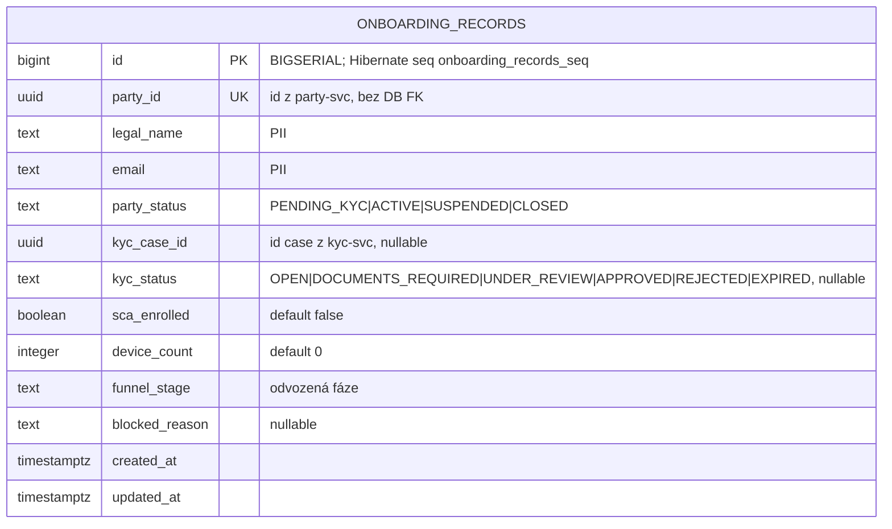

# Data

## Schéma

Služba používá PostgreSQL databázi `openbank_onboarding` s jedinou tabulkou read-modelu, `onboarding_records`. (Manifest `governance.yaml` pojmenovává logické schéma `onboarding_schema`; běžící konfigurace se připojuje k databázi `openbank_onboarding` — obojí odkazuje na izolované úložiště této služby.)

Jde o **plochou jednotabulkovou projekci** — jeden řádek na party, žádné child tabulky, žádná outbox tabulka (služba nic nepublikuje).

## Migrace

Flyway, `migrate-at-start: true`, forward-only:

| Skript | Co dělá | Poznámka k rollbacku |
|---|---|---|
| `V1__create_onboarding_records.sql` | Vytvoří `onboarding_records` s unikátním `party_id`, plus indexy na `funnel_stage` a `updated_at DESC` | `DROP TABLE onboarding_records;` |
| `V2__onboarding_records_seq.sql` | Vytvoří sekvenci `onboarding_records_seq` (start 1, increment 50, pooled), kterou očekává id alokátor Hibernate `PanacheEntity` | `DROP SEQUENCE onboarding_records_seq;` |

> **Pozadí V2:** V1 vytvořila `id` jako `BIGSERIAL`, jehož implicitní sekvence je `onboarding_records_id_seq`, ale Hibernate ORM 6 (PanacheEntity) alokuje id ze sekvence `onboarding_records_seq`. Bez V2 inserty selhávaly s `relation "onboarding_records_seq" does not exist` a read-model se nikdy neukládal. V2 vytváří sekvenci, kterou Hibernate očekává. Dle pravidla projektu pro Flyway nesmí být žádná migrace přepsána poté, co byla aplikována na živou DB.

## Indexy

- `onboarding_records(party_id)` — UNIQUE, klíč projekce (`upsert`/`findByPartyId`)
- `onboarding_records(funnel_stage)` — výpis dle fáze a počty na fázi (`idx_onboarding_funnel_stage`)
- `onboarding_records(updated_at DESC)` — řazení dle aktuálnosti pro board (`idx_onboarding_updated_at`)

## Retence

| Tabulka | Retence | Důvod |
|---|---|---|
| `onboarding_records` | **7 let** (dle `governance.yaml: retentionPolicy`) | Povinnost vést záznamy KYC/AML; řádek zrcadlí regulovanou onboardingovou cestu |

Protože je tabulka čistá projekce, lze ji kdykoli zkrátit (truncate) a **znovu sestavit** přehráním zdrojového logu událostí od `earliest` — retence zde je regulatorní spodní mez provozního pohledu, ne systému záznamu (ten žije v party/kyc/sca).

## PII pole (GDPR)

| Pole | Klasifikace | Poznámky |
|---|---|---|
| `legal_name` | PII (přímý identifikátor) | ze `PARTY_CREATED`; ADR-0068 §6 předepisuje `PiiMask` dle role (COMPLIANCE odmaskováno, OPERATOR/VIEWER maskováno) — maskování dle role je dokumentovaný cíl, v této verzi neimplementováno (TBD) |
| `email` | PII (přímý identifikátor) | jako výše |
| `party_id` | pseudonymizované id | cizí reference na party-service, bez DB FK |
| `kyc_case_id` | pseudonymizované id | cizí reference na kyc-service |
| ostatní (`party_status`, `kyc_status`, `funnel_stage`, počty, časy) | non-PII | provozní stav |

Celková datová klasifikace služby je **confidential** (`governance.yaml: dataClassification`).

GDPR **výmaz (Art. 17)** žadatele je dle ADR-0068 §5 nevratná akce s režimem „čtyř očí“ a operátorským step-upem, prováděná ve vlastnící službě; řádek projekce je v důsledku odstraněn/znovu sestaven. Vedení záznamů KYC/AML (7letá retence) omezuje výmaz tam, kde existuje regulovaný záznam.

## Konzistence

Read-model je **eventually consistent** s party/kyc/sca. Cockpit vykresluje „k poslední události“; cestou rekonciliace je rebuild projekce (přehrání ze zdrojových topiků, `auto.offset.reset=earliest`). Při divergenci jsou zdrojové služby pravdou — `onboarding_records` je vždy znovusestavitelný.

## Velikost (hrubý odhad)

Jeden řádek na party (~1 KB). Pro 1M onboardovaných zákazníků to je **~1 GB** pro `onboarding_records` — malé, neboť nejsou child tabulky ani outbox.
