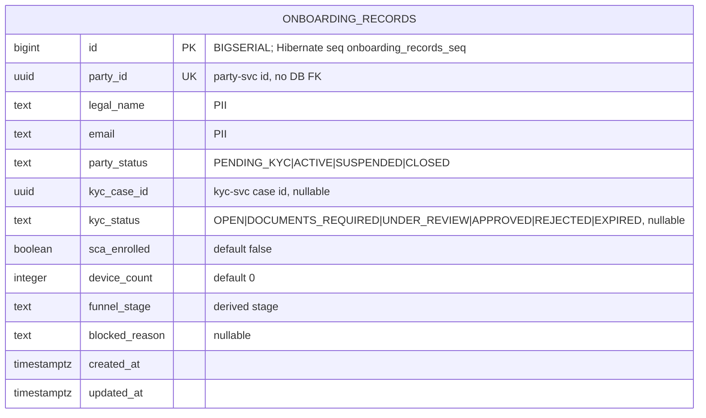

# Data

## Schema

The service uses the PostgreSQL database `openbank_onboarding` with a single read-model table, `onboarding_records`. (The `governance.yaml` manifest names the logical schema `onboarding_schema`; the running configuration connects to the `openbank_onboarding` database — both refer to this service's isolated store.)

This is a **flat, single-table projection** — one row per party, no child tables, no outbox table (the service publishes nothing).

## Migrations

Flyway, `migrate-at-start: true`, forward-only:

| Script | What it does | Rollback note |
|---|---|---|
| `V1__create_onboarding_records.sql` | Creates `onboarding_records` with a unique `party_id`, plus indexes on `funnel_stage` and `updated_at DESC` | `DROP TABLE onboarding_records;` |
| `V2__onboarding_records_seq.sql` | Creates sequence `onboarding_records_seq` (start 1, increment 50, pooled) that Hibernate's `PanacheEntity` id allocator expects | `DROP SEQUENCE onboarding_records_seq;` |

> **V2 background:** V1 created `id` as `BIGSERIAL`, whose implicit sequence is `onboarding_records_id_seq`, but Hibernate ORM 6 (PanacheEntity) allocates ids from `onboarding_records_seq`. Without V2 inserts failed with `relation "onboarding_records_seq" does not exist` and the read-model never persisted. V2 creates the sequence Hibernate expects. Per the project Flyway rule, neither migration may be rewritten after it is applied to a live DB.

## Indexes

- `onboarding_records(party_id)` — UNIQUE, the projection key (`upsert`/`findByPartyId`)
- `onboarding_records(funnel_stage)` — list-by-stage and per-stage counts (`idx_onboarding_funnel_stage`)
- `onboarding_records(updated_at DESC)` — recency ordering for the board (`idx_onboarding_updated_at`)

## Retention

| Table | Retention | Reason |
|---|---|---|
| `onboarding_records` | **7 years** (per `governance.yaml: retentionPolicy`) | KYC/AML record-keeping obligation; the row mirrors a regulated onboarding journey |

Because the table is a pure projection, it can be truncated and **rebuilt** at any time by replaying the source event log from `earliest` — retention here is a regulatory floor for the operational view, not the system of record (which lives in party/kyc/sca).

## PII fields (GDPR)

| Field | Classification | Notes |
|---|---|---|
| `legal_name` | PII (direct identifier) | sourced from `PARTY_CREATED`; ADR-0068 §6 prescribes role-based `PiiMask` (COMPLIANCE unmasked, OPERATOR/VIEWER masked) — masking-by-role is a documented target, not yet implemented in this version (TBD) |
| `email` | PII (direct identifier) | as above |
| `party_id` | pseudonymized id | foreign reference to party-service, no DB FK |
| `kyc_case_id` | pseudonymized id | foreign reference to kyc-service |
| others (`party_status`, `kyc_status`, `funnel_stage`, counts, timestamps) | non-PII | operational state |

The overall data classification for the service is **confidential** (`governance.yaml: dataClassification`).

GDPR **erasure (Art. 17)** of an applicant is, per ADR-0068 §5, an irreversible, four-eyed, operator-step-up-gated action performed in the owning service; the projection row would be removed/rebuilt as a consequence. AML/KYC record-keeping (7-year retention) constrains erasure where a regulated record exists.

## Consistency

The read-model is **eventually consistent** with party/kyc/sca. The cockpit renders "as of last event"; a projection-rebuild path (replay from the source topics, `auto.offset.reset=earliest`) is the reconciliation mechanism. On divergence the source services are the truth — `onboarding_records` is always reconstructable.

## Size (rough estimate)

One row per party (~1 KB). For 1M onboarded customers that is **~1 GB** for `onboarding_records` — small, since there are no child tables and no outbox.
