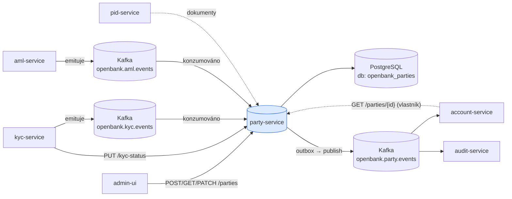
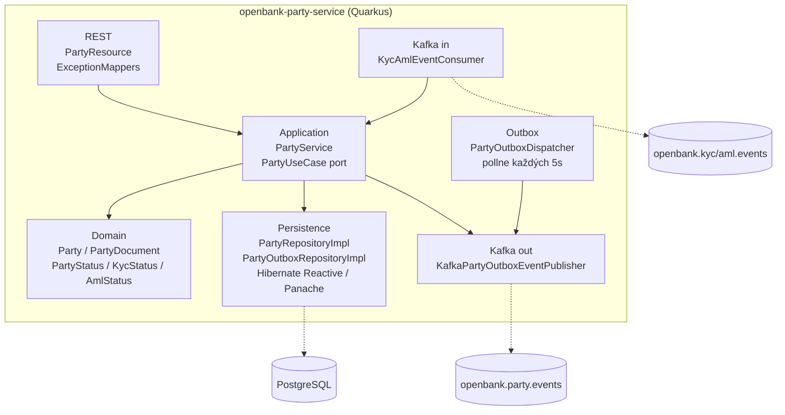
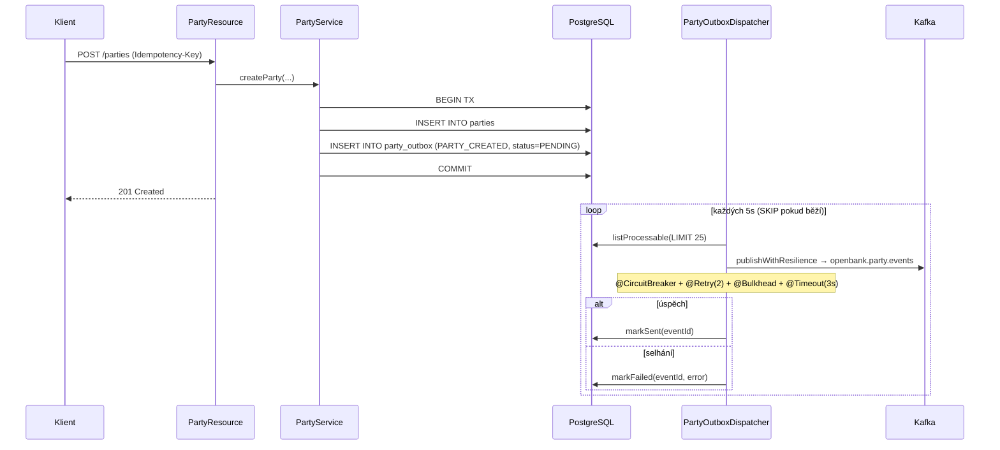

# Architektura

Služba následuje hexagonální (ports-and-adapters) uspořádání vyžadované [ADR 0002](../../../../docs/adr/0002-hexagonal-architecture-per-service.md).

## C4 — Kontext systému



## C4 — Kontejner (vnitřní struktura)



## Hexagonální vrstvy

```
com.openbank.party/
├── domain/                          ◄── jádro — žádné framework závislosti
│   └── model/                       Party, PartyDocument, Address,
│                                    PartyType, PartyStatus, KycStatus, AmlStatus
│
├── application/                     ◄── orchestrace use-case
│   ├── port/in/                     PartyPort (PartyUseCase, příkazy, dotazy)
│   ├── port/out/                    PartyRepository, PartyDocumentRepository,
│   │                                PartyOutbox* porty
│   └── usecase/                     PartyService (createParty, updateParty,
│                                    addDocument, updateKycStatus, updateAmlStatus,
│                                    searchParties, eraseParty, deriveStatus brána)
│
└── infrastructure/                  ◄── adaptéry
    ├── rest/                        PartyResource (JAX-RS), ExceptionMappers
    ├── persistence/entity/          PartyEntity, PartyDocumentEntity, PartyOutboxEntity
    ├── persistence/repository/      *RepositoryImpl (Panache reactive)
    ├── outbox/                      PartyOutboxDispatcher (@Scheduled)
    ├── kafka/                       KafkaPartyOutboxEventPublisher, KycAmlEventConsumer
    ├── authz/                       AuthzProducer (OPA, ADR-0034)
    └── flags/                       FlagdProducer (OpenFeature, ADR-0067)
```

**Pravidlo závislostí:** `domain` ← `application` ← `infrastructure`. Doménový kód nikdy neimportuje JPA, Kafka ani JAX-RS.

## Klíčové porty

| Port (out) | Adaptér | Účel |
|---|---|---|
| `PartyRepository` | `PartyRepositoryImpl` | persist/find/search/anonymize party |
| `PartyDocumentRepository` | (Panache) | persist/list dokumentů party |
| `PartyOutboxRepository` | `PartyOutboxRepositoryImpl` | životní cyklus outbox řádku |
| `PartyOutboxEventPublisher` | `KafkaPartyOutboxEventPublisher` | emise uloženého outbox payloadu |

| Port (in) | Adaptér |
|---|---|
| `PartyUseCase` | `PartyResource` (REST), `KycAmlEventConsumer` (Kafka) |

## Outbox tok



**Proč outbox:** transakční konzistence mezi zápisem do DB a publikací do Kafky. At-least-once doručení; dispatcher je fault-tolerantní (circuit breaker, omezený retry, bulkhead, timeout) a `@Scheduled` běh se přeskočí, dokud dávka stále probíhá.

## Zpracování příchozích eventů — dvouklíčová aktivační brána

`KycAmlEventConsumer` konzumuje dva compliance streamy a je **poison-pill safe**: chyby parsování/zpracování se zalogují a zpráva se ackne, takže jeden vadný event nemůže zaseknout consumer group (kyc-/aml-service zůstávají zdrojem pravdy a mohou přehrát).

- `openbank.kyc.events` → `KYC_CASE_APPROVED` → `kycStatus=APPROVED`; `KYC_CASE_REJECTED` → `REJECTED`. Ostatní typy eventů jsou ignorovány (žádné koncové rozhodnutí).
- `openbank.aml.events` → `newStatus/status = CLEARED` → `amlStatus=CLEARED`; `BLOCKED` → `amlStatus=BLOCKED`. Ostatní ignorovány.

`PartyService.deriveStatus(kyc, aml, current)` poté spočítá stav party (fail-closed):

```
CLOSED                                        → zůstává CLOSED (nikdy se znovu neotevře)
kyc == REJECTED  NEBO  aml == BLOCKED         → SUSPENDED
kyc == APPROVED  A  aml == CLEARED            → ACTIVE
jinak                                          → PENDING_KYC
```

## Komponenty z `openbank-libs`

| Modul | Využití zde |
|---|---|
| `libs.api.error.ApiError` | jednotný chybový model v `ExceptionMappers` |
| `libs.api.pagination.CursorPage / PageInfo / CursorEncoder` | keyset-cursor vyhledávání podle jména |
| `libs.api.search.SearchRequest` | DB-safety pojistky (omezení velikosti stránky, min. délka termu, escapování LIKE) pro vyhledávání ADR-0055 |
| `libs.flags.FeatureClient / @FeatureFlag` | vyhodnocení feature flagů (ADR-0067) |
| `libs.authz.@Authorize` | OPA autorizace (ADR-0034) |
| `libs.docs.DocsResource` | **tato dokumentace** (`/q/openbank/docs`) |
| `libs.web.ServiceInfoResource` | `/api/v1/info` build metadata |

## Principy

1. **Hranice agregátu = Party** — dokumenty a stav životního cyklu jsou děti party.
2. **Aktivace má jedinou autoritu** — pouze party-service překlopí party na ACTIVE, s bránou na KYC i AML.
3. **Doménové eventy jako první** — každá změna stavu emituje doménový event; outbox garantuje doručení.
4. **Minimalizace PII** — rodné číslo zde není nikdy uloženo ani vyhledatelné; vyhledávání podle jména je jediný fuzzy lookup.
5. **Fail-static závislosti** — bez flagd / bez OPA služba stále obsluhuje provoz (defaulty volajícího / advisory režim).
