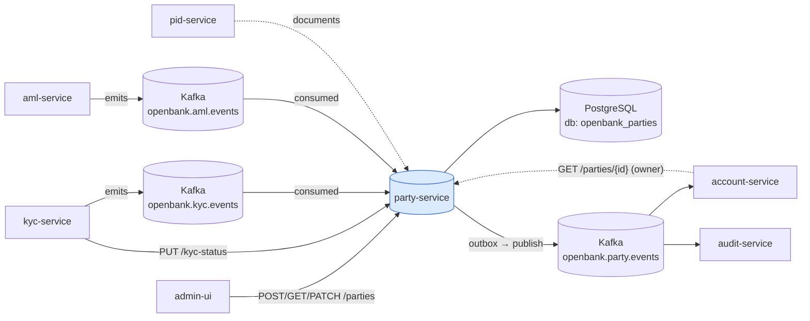
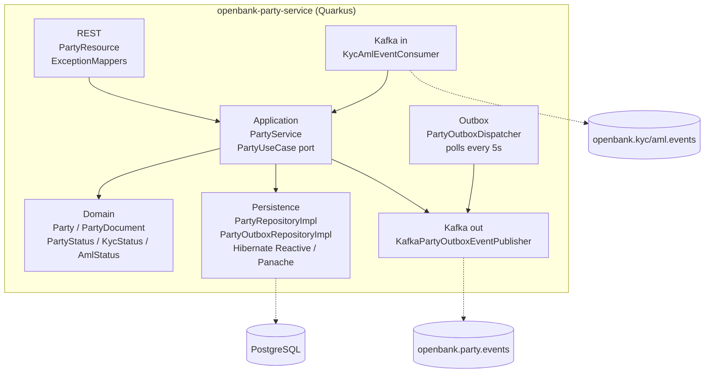
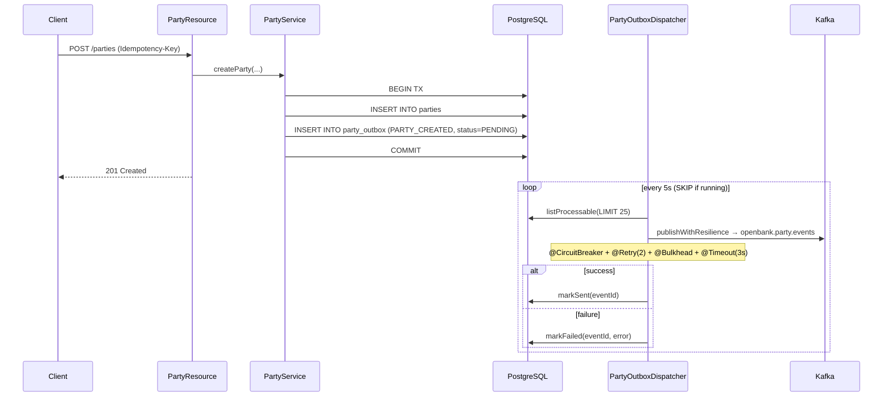

# Architecture

The service follows the hexagonal (ports-and-adapters) layout mandated by [ADR 0002](../../../../docs/adr/0002-hexagonal-architecture-per-service.md).

## C4 — System Context



## C4 — Container (internal structure)



## Hexagonal layers

```
com.openbank.party/
├── domain/                          ◄── core — no framework dependencies
│   └── model/                       Party, PartyDocument, Address,
│                                    PartyType, PartyStatus, KycStatus, AmlStatus
│
├── application/                     ◄── use-case orchestration
│   ├── port/in/                     PartyPort (PartyUseCase, commands, queries)
│   ├── port/out/                    PartyRepository, PartyDocumentRepository,
│   │                                PartyOutbox* ports
│   └── usecase/                     PartyService (createParty, updateParty,
│                                    addDocument, updateKycStatus, updateAmlStatus,
│                                    searchParties, eraseParty, deriveStatus gate)
│
└── infrastructure/                  ◄── adapters
    ├── rest/                        PartyResource (JAX-RS), ExceptionMappers
    ├── persistence/entity/          PartyEntity, PartyDocumentEntity, PartyOutboxEntity
    ├── persistence/repository/      *RepositoryImpl (Panache reactive)
    ├── outbox/                      PartyOutboxDispatcher (@Scheduled)
    ├── kafka/                       KafkaPartyOutboxEventPublisher, KycAmlEventConsumer
    ├── authz/                       AuthzProducer (OPA, ADR-0034)
    └── flags/                       FlagdProducer (OpenFeature, ADR-0067)
```

**Dependency rule:** `domain` ← `application` ← `infrastructure`. Domain code never imports JPA, Kafka, or JAX-RS.

## Key ports

| Port (out) | Adapter | Purpose |
|---|---|---|
| `PartyRepository` | `PartyRepositoryImpl` | persist/find/search/anonymize parties |
| `PartyDocumentRepository` | (Panache) | persist/list party documents |
| `PartyOutboxRepository` | `PartyOutboxRepositoryImpl` | outbox row lifecycle |
| `PartyOutboxEventPublisher` | `KafkaPartyOutboxEventPublisher` | emit a stored outbox payload |

| Port (in) | Adapter |
|---|---|
| `PartyUseCase` | `PartyResource` (REST), `KycAmlEventConsumer` (Kafka) |

## Outbox flow



**Why outbox:** transactional consistency between the DB write and the Kafka publish. At-least-once delivery; the dispatcher is fault-tolerant (circuit breaker, bounded retry, bulkhead, timeout) and `@Scheduled` execution is skipped while a batch is still in flight.

## Inbound event handling — the two-key activation gate

`KycAmlEventConsumer` consumes two compliance streams and is **poison-pill safe**: parse/handle failures are logged and the message is acked, so one bad event cannot wedge the consumer group (kyc-/aml-service remain the source of truth and can replay).

- `openbank.kyc.events` → `KYC_CASE_APPROVED` → `kycStatus=APPROVED`; `KYC_CASE_REJECTED` → `REJECTED`. Other event types are ignored (no terminal decision).
- `openbank.aml.events` → `newStatus/status = CLEARED` → `amlStatus=CLEARED`; `BLOCKED` → `amlStatus=BLOCKED`. Others ignored.

`PartyService.deriveStatus(kyc, aml, current)` then computes the party status (fail-closed):

```
CLOSED                                        → stays CLOSED (never re-opened)
kyc == REJECTED  OR  aml == BLOCKED           → SUSPENDED
kyc == APPROVED  AND  aml == CLEARED          → ACTIVE
otherwise                                      → PENDING_KYC
```

## Components from `openbank-libs`

| Module | Use here |
|---|---|
| `libs.api.error.ApiError` | unified error model in `ExceptionMappers` |
| `libs.api.pagination.CursorPage / PageInfo / CursorEncoder` | keyset-cursor name search |
| `libs.api.search.SearchRequest` | DB-safety guardrails (page-size clamp, min term length, LIKE escaping) for ADR-0055 search |
| `libs.flags.FeatureClient / @FeatureFlag` | feature-flag evaluation (ADR-0067) |
| `libs.authz.@Authorize` | OPA authorization (ADR-0034) |
| `libs.docs.DocsResource` | **this documentation** (`/q/openbank/docs`) |
| `libs.web.ServiceInfoResource` | `/api/v1/info` build metadata |

## Principles

1. **Aggregate boundary = Party** — documents and lifecycle state are children of a party.
2. **Activation is single-authority** — only party-service flips a party to ACTIVE, gating on both KYC and AML.
3. **Domain events first** — every state change emits a domain event; the outbox guarantees delivery.
4. **PII minimisation** — birth number is never stored or searchable here; name search is the only fuzzy lookup.
5. **Fail-static dependencies** — no flagd / no OPA still serves traffic (caller defaults / advisory mode).
