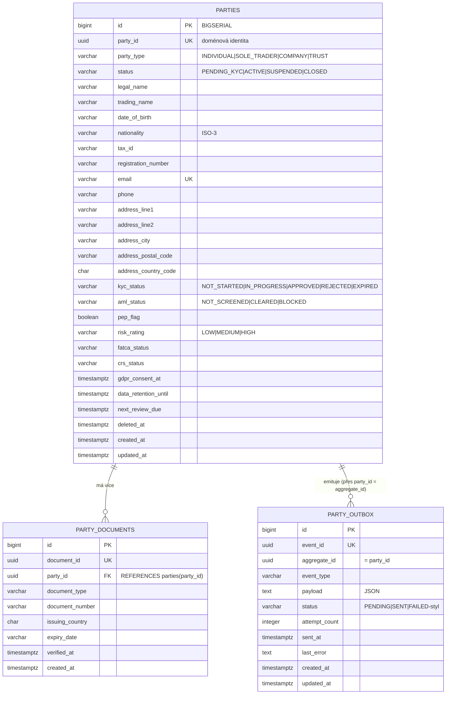

# Data

## Úložiště

Dedikovaná PostgreSQL databáze `openbank_parties` (reaktivní PostgreSQL klient + JDBC pro Flyway). Generování schématu Hibernate ORM je **vypnuté** (`generation: none`) — schéma vlastní Flyway a spouští `migrate-at-start`.

## Migrace

Flyway, neměnné forward-only skripty (`db/migration/`):

| Skript | Co dělá |
|---|---|
| `V1__create_parties.sql` | tabulky `parties` + `party_documents`, základní indexy (email, status, party_id FK), schema granty |
| `V2__compliance_fields.sql` | AML/GDPR/CNB sloupce: PEP příznak & kategorie, metadata sanctions kontroly, GDPR souhlas, marketingový souhlas, data-retention-until, onboarding kanál/agent, rizikové hodnocení + termíny revizí, FATCA/CRS status, soft-delete (`deleted_at`/`deletion_reason`) na obou tabulkách; indexy PEP/risk/review/sanctions/deleted; COMMENTy sloupců citující regulaci |
| `V3__create_party_outbox.sql` | tabulka `party_outbox` + indexy `(status, created_at)` a `(aggregate_id)` |
| `V4__gdpr_erasure_index.sql` | indexy na `status` a `updated_at` (podpora erasure sweep) |
| `V5__hibernate_sequences.sql` | Hibernate `*_SEQ` sekvence (INCREMENT BY 50) — nahrazeno |
| `V6__fix_hibernate_sequences.sql` | dropne uvozovkované uppercase sekvence, znovu vytvoří lowercase `*_seq` |
| `V7__party_name_search_trgm.sql` | rozšíření `pg_trgm` + GIN trigramové indexy na `lower(legal_name)` a `lower(trading_name)` (ADR-0055 omezené vyhledávání podle jména) |
| `V8__party_aml_status.sql` | přidá `aml_status` (default `NOT_SCREENED`) — druhý klíč aktivační brány |

> Dle projektového pravidla: **nikdy nepřepisuj migraci, která už byla aplikována na živou DB** (checksum mismatch → selhání startu). V5→V6 je příklad opravy-dopředu místo editace V5.

## Indexy

- `parties(email)` — UNIQUE + sekundární `idx_parties_email` (kontrola duplicit, lookup)
- `parties(status)` — list-by-status / funnel
- `parties(updated_at)` — erasure / review sweepy
- `idx_parties_legal_name_trgm`, `idx_parties_trading_name_trgm` — GIN trigram, vyhledávání podle jména
- `idx_parties_pep` (partial WHERE pep_flag), `idx_parties_risk`, `idx_parties_review` (partial), `idx_parties_sanctions`, `idx_parties_deleted` (partial) — AML/compliance dotazy
- `party_documents(party_id)` — výpis dokumentů
- `party_outbox(status, created_at)` — poll dispatcheru; `party_outbox(aggregate_id)` — lookup eventů per party

## PII pole (GDPR)

| Pole | Klasifikace |
|---|---|
| `legal_name`, `trading_name` | PII (přímý identifikátor) |
| `email`, `phone` | PII (kontakt) |
| `address_*` | PII (lokace) |
| `date_of_birth`, `nationality`, `tax_id`, `registration_number` | PII (identita) |
| `party_id` | pseudonymní identifikátor |
| `pep_flag`, `risk_rating`, `fatca_status`, `crs_status` | zvláštní compliance metadata |

Klasifikace dat služby je **restricted** (`governance.yaml`). **Rodné číslo se zde záměrně NEUKLÁDÁ** — zůstává šifrované v `pid-service`, nikdy se neduplikuje jako plaintext ani není vyhledatelné (GDPR minimalizace dat, scope poznámka ADR-0055).

## Výmaz (GDPR čl. 17)

`PartyRepositoryImpl.anonymize(id)` v transakci:
- `legal_name = "ANONYMIZED"`
- `email = "erased-<random-uuid>@erased.invalid"` (zachová splnitelnost UNIQUE omezení, nekorelovatelné)
- `phone, trading_name, date_of_birth, nationality, tax_id, registration_number, address_*` → null
- `status = CLOSED`, `updated_at = now()`

Poté se emituje `PARTY_ERASED`, aby downstream konzumenti mohli vymazat své projekce.

## Retence

| Data | Retence | Důvod |
|---|---|---|
| `parties` (aktivní vztah) | trvale | systém záznamů |
| `parties` (uzavřené/vymazané) | dle AML retence (`data_retention_until`; `governance.yaml` deklaruje 10 let; GDPR `retention-days=2555` ≈ 7 let konfigurováno) | AMLD record-keeping přebíjí GDPR výmaz faktu vztahu |
| `party_documents` | s party (podpora soft-delete přes `deleted_at`) | KYC důkaz |
| `party_outbox` | do SENT + okno pro troubleshooting | replay / audit |

> Hodnoty 10 let (`governance.yaml`) vs 2555 dní (`openbank.gdpr.retention-days`) jsou dva různé knoby — deklarovaná politika vs default konfigurační property. Narovnat před go-live (TBD).
