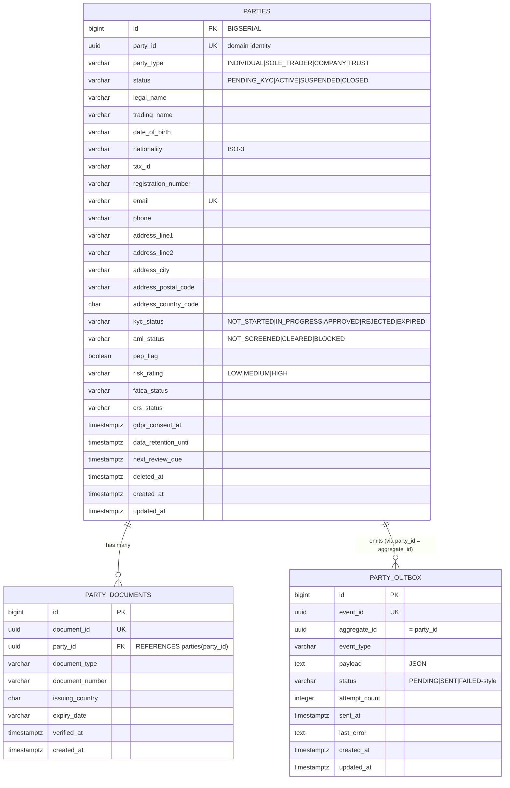

# Data

## Datastore

Dedicated PostgreSQL database `openbank_parties` (reactive PostgreSQL client + JDBC for Flyway). Hibernate ORM schema generation is **off** (`generation: none`) — Flyway owns the schema and runs `migrate-at-start`.

## Migrations

Flyway, immutable forward-only scripts (`db/migration/`):

| Script | What it does |
|---|---|
| `V1__create_parties.sql` | `parties` + `party_documents` tables, base indexes (email, status, party_id FK), schema grants |
| `V2__compliance_fields.sql` | AML/GDPR/CNB columns: PEP flag & category, sanctions check metadata, GDPR consent, marketing consent, data-retention-until, onboarding channel/agent, risk rating + review dates, FATCA/CRS status, soft-delete (`deleted_at`/`deletion_reason`) on both tables; PEP/risk/review/sanctions/deleted indexes; column COMMENTs citing the regulation |
| `V3__create_party_outbox.sql` | `party_outbox` table + `(status, created_at)` and `(aggregate_id)` indexes |
| `V4__gdpr_erasure_index.sql` | indexes on `status` and `updated_at` (erasure sweep support) |
| `V5__hibernate_sequences.sql` | Hibernate `*_SEQ` sequences (INCREMENT BY 50) — superseded |
| `V6__fix_hibernate_sequences.sql` | drops the quoted-uppercase sequences, recreates lowercase `*_seq` |
| `V7__party_name_search_trgm.sql` | `pg_trgm` extension + GIN trigram indexes on `lower(legal_name)` and `lower(trading_name)` (ADR-0055 bounded name search) |
| `V8__party_aml_status.sql` | adds `aml_status` (default `NOT_SCREENED`) — second key of the activation gate |

> Per the project rule: **never rewrite a migration that has been applied to a live DB** (checksum mismatch → startup fail). V5→V6 is an example of fixing-forward rather than editing V5.

## Indexes

- `parties(email)` — UNIQUE + secondary `idx_parties_email` (duplicate check, lookup)
- `parties(status)` — list-by-status / funnel
- `parties(updated_at)` — erasure / review sweeps
- `idx_parties_legal_name_trgm`, `idx_parties_trading_name_trgm` — GIN trigram, name search
- `idx_parties_pep` (partial WHERE pep_flag), `idx_parties_risk`, `idx_parties_review` (partial), `idx_parties_sanctions`, `idx_parties_deleted` (partial) — AML/compliance queries
- `party_documents(party_id)` — list documents
- `party_outbox(status, created_at)` — dispatcher poll; `party_outbox(aggregate_id)` — per-party event lookup

## PII fields (GDPR)

| Field | Classification |
|---|---|
| `legal_name`, `trading_name` | PII (direct identifier) |
| `email`, `phone` | PII (contact) |
| `address_*` | PII (location) |
| `date_of_birth`, `nationality`, `tax_id`, `registration_number` | PII (identity) |
| `party_id` | pseudonymous identifier |
| `pep_flag`, `risk_rating`, `fatca_status`, `crs_status` | special compliance metadata |

The service data classification is **restricted** (`governance.yaml`). The **birth number (rodné číslo) is deliberately NOT stored here** — it stays encrypted in `pid-service` and is never duplicated as plaintext, nor made searchable (GDPR data-minimisation, ADR-0055 scope note).

## Erasure (GDPR Art. 17)

`PartyRepositoryImpl.anonymize(id)` in a transaction:
- `legal_name = "ANONYMIZED"`
- `email = "erased-<random-uuid>@erased.invalid"` (keeps the UNIQUE constraint satisfiable, non-correlatable)
- `phone, trading_name, date_of_birth, nationality, tax_id, registration_number, address_*` → null
- `status = CLOSED`, `updated_at = now()`

Then `PARTY_ERASED` is emitted so downstream consumers can erase their projections.

## Retention

| Data | Retention | Reason |
|---|---|---|
| `parties` (active relationship) | ongoing | system of record |
| `parties` (closed/erased) | per AML retention (`data_retention_until`; `governance.yaml` declares 10 years; GDPR `retention-days=2555` ≈ 7 years configured) | AMLD record-keeping overrides GDPR erasure of the relationship fact |
| `party_documents` | with the party (soft-delete support via `deleted_at`) | KYC evidence |
| `party_outbox` | until SENT + troubleshooting window | replay / audit |

> The 10-year (`governance.yaml`) vs 2555-day (`openbank.gdpr.retention-days`) values are two different knobs — declared policy vs the configured property default. Reconcile before go-live (TBD).
