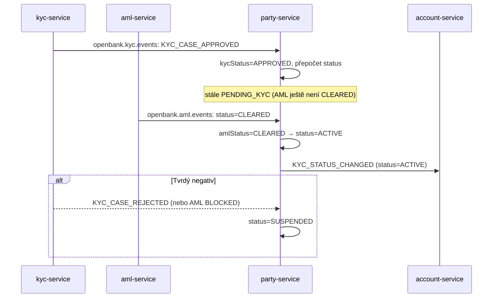

# Compliance

party-service drží identitu zákazníka (PII) a životní cyklus KYC/AML, takže spadá do rozsahu GDPR, AML a režimů provozní odolnosti — i když to **není** money-path služba (neproudí přes ni žádné prostředky).

## Regulatorní rámec

| Regulace | Vztah k této službě | Implementace |
|---|---|---|
| **GDPR** (Nař. (EU) 2016/679) | Drží kanonický PII záznam o každém zákazníkovi | Endpoint Práva na výmaz (`DELETE /parties/{id}` → anonymizace + tombstone), minimalizace dat (žádné rodné číslo, vyhledávání jen podle jména), pole explicitního souhlasu (`gdpr_consent_at/version`), retenční okna |
| **AMLD** (4./5./6. AML směrnice) | Zaznamenává výsledky KYC + AML, PEP, rizikové hodnocení; pohání aktivační bránu | `kyc_status`/`aml_status`, dvouklíčová aktivační brána (v kódu, bez ADR), `pep_flag`, `risk_rating`, `next_review_due`, metadata sanctions kontroly; COMMENTy sloupců citují články |
| **PSD2** (Nař. (EU) 2015/2366) | Identita pod účet/consent toky | party je read-only resolvována `account-service`; žádný přímý TPP přístup |
| **FATCA / CRS** | Reporting daňové rezidence | sloupce `fatca_status`, `crs_status` na party |
| **DORA** (Nař. (EU) 2022/2554) | Provozní odolnost | health probes, fault-tolerantní outbox (circuit breaker/retry/bulkhead/timeout), poison-pill-safe consumer, audit eventy, SLO, runbooky |
| **NIS2** | Bezpečnost sítí a informací | OIDC, bezpečnostní response hlavičky (CSP/HSTS/…), in-cluster mTLS, rate limiting |
| **ČNB customer due-diligence** | Vedení záznamů o zákazníkovi | zachycení onboarding kanálu/agenta, rizikové hodnocení, periodické termíny revizí |

## Mapování GDPR

### Právní základ (čl. 6)

- **Smlouva** (čl. 6(1)(b)) — vedení záznamu party je nezbytné pro plnění bankovní smlouvy.
- **Právní povinnost** (čl. 6(1)(c)) — AML CDD, FATCA/CRS, daňové záznamy.
- **Souhlas** (čl. 6(1)(a)) — pouze `marketing_consent`; zaznamenán s `gdpr_consent_at/version`.

### Práva subjektu údajů

| Právo | Aplikace |
|---|---|
| Přístup (čl. 15) | `GET /api/v1/parties/{id}` vrací plný záznam subjektu |
| Oprava (čl. 16) | `PATCH /api/v1/parties/{id}` (auditováno přes event) |
| Výmaz (čl. 17) | `DELETE /api/v1/parties/{id}` — anonymizuje PII, zachová nekorelovatelný tombstone e-mail, nastaví `status=CLOSED`, emituje `PARTY_ERASED`. *Fakt* vztahu je zachován pro AML, kde je výmaz přebit |
| Omezení (čl. 18) | `status=SUSPENDED` |
| Přenositelnost (čl. 20) | strukturované JSON přes `GET /parties/{id}` (export nástroje TBD) |
| Námitka (čl. 21) | `marketing_consent=false` |

### Minimalizace dat

- **Rodné číslo se zde nikdy neukládá ani není vyhledatelné** — pouze šifrované v `pid-service`.
- Vyhledávání podle jména (ADR-0055) indexuje jen právní/obchodní název; odmítá prázdné/`*`/sub-2-znakové termy proti full-table enumeraci a vrací **minimalizovaný** souhrn.

### Toky dat ven

- → **account-service** (Kafka `openbank.party.events` + read API): `partyId`, status, jméno, e-mail — stejný správce, intra-OpenBank.
- → **audit-service** (Kafka): plný payload eventu — stejný správce, důkazní stopa.
- → **pid-service**: vazba dokumentů (downstream), data rodného čísla tam šifrovaná.

Data zůstávají v rámci EU/EHP (Česká republika primárně).

### Retence (čl. 5(1)(e))

| Stav | Retence |
|---|---|
| Aktivní vztah | trvale |
| Uzavřeno / vymazáno | AML record-keeping okno (`data_retention_until`; deklarováno 10 let v `governance.yaml`; konfigurováno `gdpr.retention-days=2555`) — narovnat před go-live |

## AML — KYC + AML aktivační brána

Životní cyklus party je hradlen dvěma nezávislými compliance signály; party-service je **jediná autorita**, která party aktivuje.

Logika brány (`deriveStatus`, fail-closed):
- `CLOSED` party se nikdy znovu neotevřou.
- KYC `REJECTED` **nebo** AML `BLOCKED` → `SUSPENDED`.
- KYC `APPROVED` **a** AML `CLEARED` → `ACTIVE`.
- jinak → `PENDING_KYC`.

## Mapování DORA (Nař. (EU) 2022/2554)

| Článek | Téma | Implementace |
|---|---|---|
| čl. 9 | Identifikace | `/api/v1/info` (gitCommit, buildTime, version) |
| čl. 10 | Detekce | Micrometer/Prometheus metriky, OTLP traces |
| čl. 11 | Reakce & obnova | runbooky v `05-operations.md`; fault-tolerantní outbox; poison-pill-safe consumer |
| čl. 16 | Řízení incidentů | doménové eventy do audit-service |
| čl. 28 | Riziko třetích stran | vše self-hosted (Postgres/Kafka/Keycloak/flagd/OPA), žádný third-party SaaS |

## Auditní stopa

Každá mutace emituje doménový event na `openbank.party.events`, konzumovaný `audit-service` po zákonnou dobu retence. Outbox garantuje at-least-once doručení; eventy jsou append-only (opravy novým eventem, nikdy přepisem).

## Bezpečnostní kontroly

- ✅ AuthN: Keycloak OIDC (RS256 JWT)
- ✅ AuthZ: `@RolesAllowed` per endpoint + OPA `@Authorize` (advisory, ADR-0034)
- ✅ Idempotence na create + deduplikace přes unikátnost e-mailu
- ✅ Rate limiting (`openbank.rate-limit`, 150 souběžných)
- ✅ Bezpečnostní hlavičky (CSP, HSTS, X-Frame-Options, X-Content-Type-Options, Referrer/Permissions-Policy)
- ✅ Tajemství musí být v prod přepsána (placeholdery `CHANGE_ME_LOCAL_DEV_ONLY` mají fail-fast záměr)
- ✅ Minimalizace dat: rodné číslo mimo systém; vyhledávání jen podle jména
- ✅ Poison-pill-safe Kafka consumer
- ⚠️ OPA je advisory (zatím nevynucuje) — překlopení je pozdější fáze ADR-0034
- ⚠️ Contract drift OpenAPI vs implementace — k narovnání (viz `03-api.md`)
- ⚠️ Hodnoty retence (10 let vs 2555 dní) je třeba narovnat před go-live
