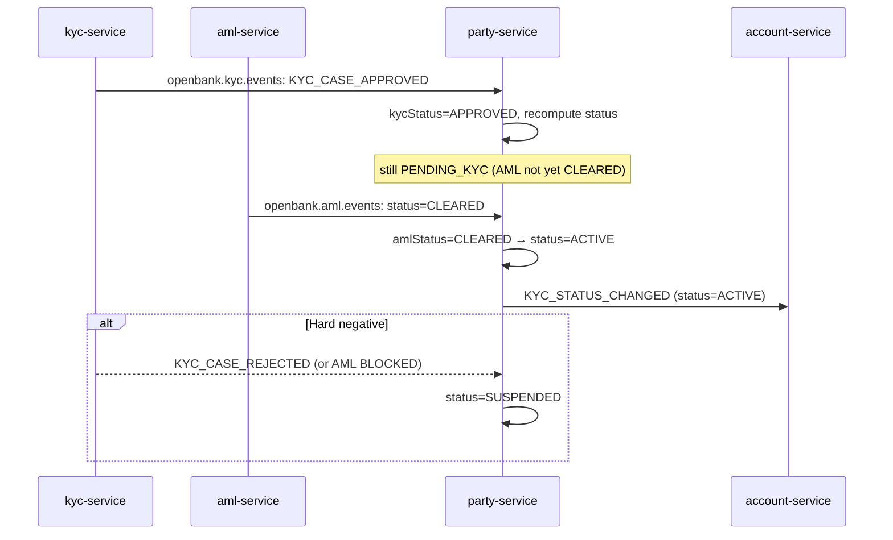

# Compliance

party-service holds customer identity (PII) and the KYC/AML lifecycle, so it is in scope for GDPR, AML, and the operational-resilience regimes — even though it is **not** a money-path service (no funds move through it).

## Regulatory framework

| Regulation | Relation to this service | Implementation |
|---|---|---|
| **GDPR** (Reg. (EU) 2016/679) | Holds the canonical PII record of every customer | Right-to-erasure endpoint (`DELETE /parties/{id}` → anonymise + tombstone), data-minimisation (no birth number, name-only search), explicit consent fields (`gdpr_consent_at/version`), retention windows |
| **AMLD** (4/5/6 AML Directives) | Records KYC + AML outcomes, PEP, risk rating; drives activation gate | `kyc_status`/`aml_status`, two-key activation gate (in code, no ADR), `pep_flag`, `risk_rating`, `next_review_due`, sanctions-check metadata; column COMMENTs cite the articles |
| **PSD2** (Reg. (EU) 2015/2366) | Identity backing account/consent flows | party is read-only resolved by `account-service`; no direct TPP access |
| **FATCA / CRS** | Tax-residence reporting | `fatca_status`, `crs_status` columns on the party |
| **DORA** (Reg. (EU) 2022/2554) | Operational resilience | health probes, fault-tolerant outbox (circuit breaker/retry/bulkhead/timeout), poison-pill-safe consumer, audit events, SLO, runbooks |
| **NIS2** | Network & info security | OIDC, security response headers (CSP/HSTS/…), in-cluster mTLS, rate limiting |
| **CNB / ČNB customer due-diligence** | Customer record-keeping | onboarding channel/agent capture, risk rating, periodic review dates |

## GDPR mapping

### Lawful basis (Art. 6)

- **Contract** (Art. 6(1)(b)) — maintaining the party record is necessary to perform the banking contract.
- **Legal obligation** (Art. 6(1)(c)) — AML CDD, FATCA/CRS, tax record-keeping.
- **Consent** (Art. 6(1)(a)) — `marketing_consent` only; recorded with `gdpr_consent_at/version`.

### Data subject rights

| Right | Application |
|---|---|
| Access (Art. 15) | `GET /api/v1/parties/{id}` returns the subject's full record |
| Rectification (Art. 16) | `PATCH /api/v1/parties/{id}` (audit-logged via event) |
| Erasure (Art. 17) | `DELETE /api/v1/parties/{id}` — anonymises PII, keeps a non-correlatable tombstone email, sets `status=CLOSED`, emits `PARTY_ERASED`. The *fact* of the relationship is retained for AML where erasure is overridden |
| Restriction (Art. 18) | `status=SUSPENDED` |
| Portability (Art. 20) | structured JSON via `GET /parties/{id}` (export tooling TBD) |
| Object (Art. 21) | `marketing_consent=false` |

### Data minimisation

- The **birth number (rodné číslo) is never stored or searchable here** — encrypted in `pid-service` only.
- Name search (ADR-0055) only indexes legal/trading name; it refuses blank/`*`/sub-2-char terms to prevent full-table enumeration, and returns a **data-minimised** summary.

### Data flows out

- → **account-service** (Kafka `openbank.party.events` + read API): `partyId`, status, name, email — same controller, intra-OpenBank.
- → **audit-service** (Kafka): full event payload — same controller, evidence trail.
- → **pid-service**: document linkage (downstream), birth-number data held there encrypted.

Data stays within the EU/EEA (Czech Republic primary).

### Retention (Art. 5(1)(e))

| State | Retention |
|---|---|
| Active relationship | ongoing |
| Closed / erased | AML record-keeping window (`data_retention_until`; declared 10 years in `governance.yaml`; configured `gdpr.retention-days=2555`) — reconcile before go-live |

## AML — KYC + AML activation gate

The party's lifecycle is gated by two independent compliance signals; party-service is the **single authority** that activates a party.

Gate logic (`deriveStatus`, fail-closed):
- `CLOSED` parties are never re-opened.
- KYC `REJECTED` **or** AML `BLOCKED` → `SUSPENDED`.
- KYC `APPROVED` **and** AML `CLEARED` → `ACTIVE`.
- otherwise → `PENDING_KYC`.

## DORA mapping (Reg. (EU) 2022/2554)

| Article | Topic | Implementation |
|---|---|---|
| Art. 9 | Identification | `/api/v1/info` (gitCommit, buildTime, version) |
| Art. 10 | Detection | Micrometer/Prometheus metrics, OTLP traces |
| Art. 11 | Response & recovery | runbooks in `05-operations.md`; fault-tolerant outbox; poison-pill-safe consumer |
| Art. 16 | Incident management | domain events to audit-service |
| Art. 28 | Third-party risk | all self-hosted (Postgres/Kafka/Keycloak/flagd/OPA), no third-party SaaS |

## Audit trail

Every mutation emits a domain event on `openbank.party.events`, consumed by `audit-service` for the statutory retention period. The outbox guarantees at-least-once delivery; events are append-only (corrections via a new event, never by rewriting).

## Security controls

- ✅ AuthN: Keycloak OIDC (RS256 JWT)
- ✅ AuthZ: `@RolesAllowed` per endpoint + OPA `@Authorize` (advisory, ADR-0034)
- ✅ Idempotency on create + email-uniqueness de-dup
- ✅ Rate limiting (`openbank.rate-limit`, 150 concurrent)
- ✅ Security headers (CSP, HSTS, X-Frame-Options, X-Content-Type-Options, Referrer/Permissions-Policy)
- ✅ Secrets must be overridden in prod (`CHANGE_ME_LOCAL_DEV_ONLY` placeholders fail-fast intent)
- ✅ Data-minimisation: birth number off-system; name-only search
- ✅ Poison-pill-safe Kafka consumer
- ⚠️ OPA is advisory (not yet enforcing) — flip is a later ADR-0034 phase
- ⚠️ OpenAPI contract drift vs implementation — to reconcile (see `03-api.md`)
- ⚠️ Retention figures (10y vs 2555d) need reconciliation before go-live
