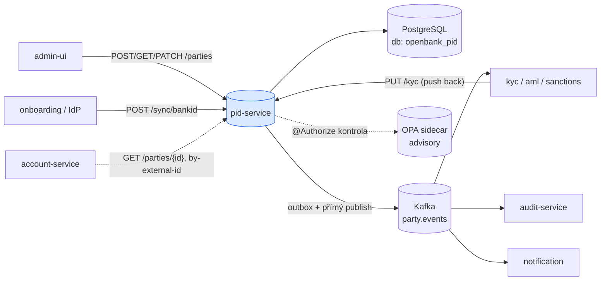
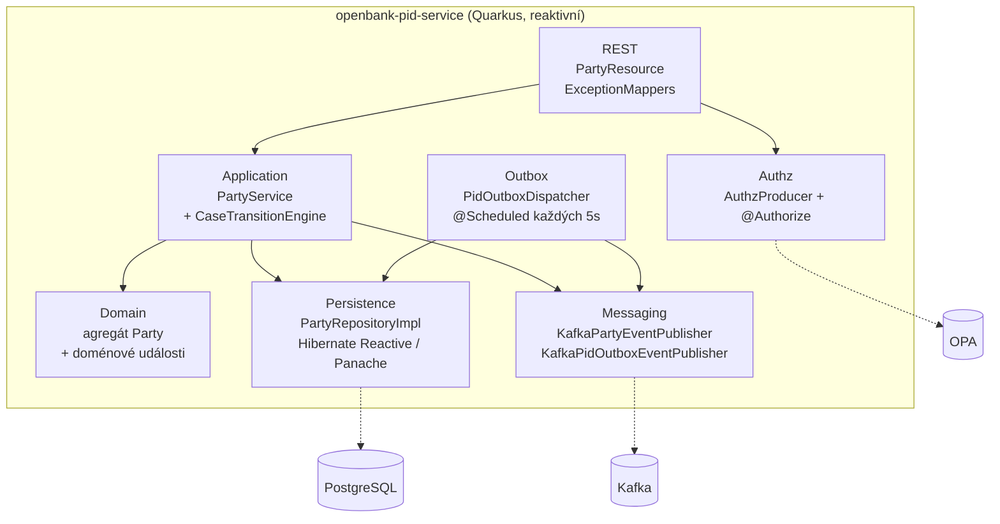
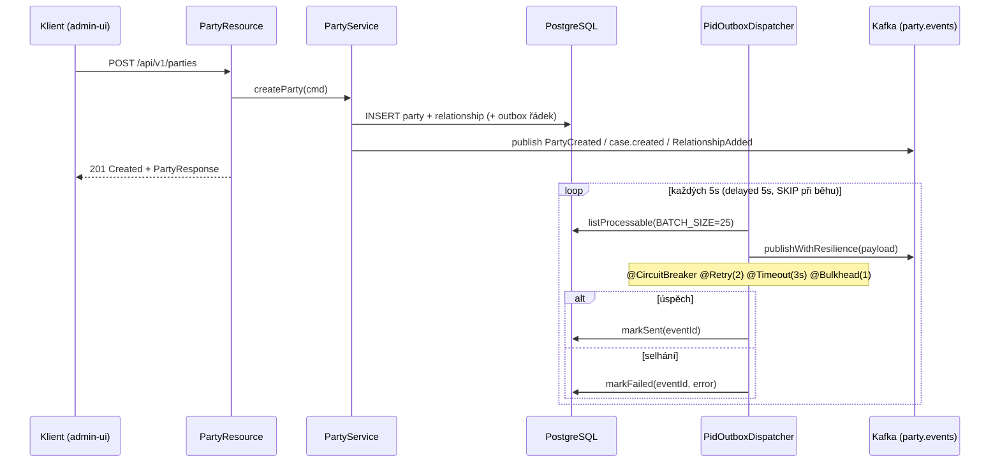

# Architektura

## C4 — Kontext systému



## C4 — Kontejner (vnitřní struktura)



## Hexagonální vrstvy

Struktura balíčků odráží **ports-and-adapters** (ADR-0002):

```
com.openbank.pid/
├── domain/                     ◄── jádro — bez frameworkových závislostí
│   ├── model/                  Party, CoreAttributes, KycAttributes,
│   │                           ExternalId, PartyRelationship, PartyCaseLifecycle, enumy
│   └── event/                  PartyCreated, PartyVerified, KycLevelChanged,
│                               PartyStatusChanged, RelationshipAdded/Terminated,
│                               AddressUpdatedFromRob, case.created/transitioned/evidence.linked
│
├── application/                ◄── orchestrace use case
│   ├── port/in/                CreatePartyUseCase, GetPartyUseCase, UpdatePartyUseCase,
│   │                           ManageRelationshipUseCase + command/query záznamy
│   ├── port/out/               PartyRepositoryPort, PidOutboxPort, PartyEventPublisher,
│   │                           PidOutboxEventPublisher
│   └── usecase/                PartyService (implementuje všechny čtyři vstupní porty)
│
└── infrastructure/             ◄── adaptéry
    ├── rest/                   PartyResource (JAX-RS), dto/, ExceptionMappers
    ├── persistence/            PartyRepositoryImpl, PidOutboxRepositoryImpl, entity/
    ├── outbox/                 PidOutboxDispatcher (scheduled, fault-tolerant)
    ├── messaging/              Kafka producenti
    └── authz/                  AuthzProducer (napojení na OPA)
```

**Pravidlo závislostí:** `domain` ← `application` ← `infrastructure`. Doménový kód nikdy nevidí Hibernate, Kafku ani REST DTO. CI vynucuje nulové frameworkové importy v doménové vrstvě.

## Doménový model — agregát Party

`Party` je immutable Kotlin `data class` (viz `domain/model/Party.kt`). Všechny mutace jdou přes `PartyService`, který agregát `.copy(...)`-uje, zvedne `version`, uloží a poté publikuje události. Pozoruhodné chování:

- `hasRole(role)` / `isCustomer()` / `isEmployee()` — odvozeno z aktivních vztahů.
- `externalId(type)` — rozlišení jednoho externího identifikátoru.
- `PartyCaseLifecycle` — vkládá case z `libs.domain.case`; přechody validuje `CaseTransitionEngine`, který vrací `Applied` (nový stav + timeline událost) nebo `Rejected` (→ `InvalidPartyCaseTransitionException` → HTTP 400).

## Outbox + tok událostí

V kódu existují dvě publikační cesty:

1. **Přímý publish doménových událostí** — `PartyService` volá `PartyEventPublisher` (`KafkaPartyEventPublisher`), který serializuje `{eventType, aggregateId, occurredAt, payload}` a posílá do kanálu `party-events-out` (topic `party.events`), klíčováno přes `aggregateId`.
2. **Transakční outbox** — tabulka `pid_outbox` + `PidOutboxDispatcher` (úloha `@Scheduled(every = "5s")`) čte zpracovatelné řádky a re-publikuje je přes `KafkaPidOutboxEventPublisher` (kanál `pid-events-out`) s fault-tolerance anotacemi.



**Resilience:** dispatcher obaluje každý publish přes `@CircuitBreaker(requestVolumeThreshold=10, failureRatio=0.5, delay=5000ms, successThreshold=2)`, `@Retry(maxRetries=2, delay=200ms, jitter=100ms)`, `@Timeout(3000ms)`, `@Bulkhead(1)`. Scheduler polyká výjimky, aby smyčka nikdy nespadla. Doručení je at-least-once → konzumenti musí být idempotentní (události nesou klíč `aggregateId` pro pořadí).

## Klíčové porty

| Port (rozhraní) | Směr | Adaptér |
|---|---|---|
| `CreatePartyUseCase` / `GetPartyUseCase` / `UpdatePartyUseCase` / `ManageRelationshipUseCase` | vstupní | `PartyResource` → `PartyService` |
| `PartyRepositoryPort` | výstupní | `PartyRepositoryImpl` (Hibernate Reactive / Panache) |
| `PidOutboxPort` | výstupní | `PidOutboxRepositoryImpl` |
| `PartyEventPublisher` | výstupní | `KafkaPartyEventPublisher` |
| `PidOutboxEventPublisher` | výstupní | `KafkaPidOutboxEventPublisher` |

## Komponenty z `openbank-libs`

| Modul | Použití zde |
|---|---|
| `libs.domain.case.*` | `CaseTransitionEngine`, `CaseId`, `CaseStatus`, `CaseReasonCode`, `CaseType` — životní cyklus PID verifikačního případu |
| `libs.domain.event.DomainEvent` | bázová třída všech party událostí (aggregateId, eventType, version, occurredAt) |
| `libs.authz.@Authorize` | autorizace přes OPA na citlivých mutacích (např. `changeStatus`) |
| `libs.api.error.ApiError` / `ErrorCode` | jednotné chybové tělo |
| `libs.web.ServiceInfoResource` | `/api/v1/info` (build metadata) |
| `libs.docs.DocsResource` | **tato dokumentace** na `/q/openbank/docs` |

## Principy

1. **Hranice agregátu = Party** — identita, KYC, adresy, kontakty a vztahy jsou jedna konzistenční jednotka; optimistické zamykání přes `version`.
2. **Immutable doména, události při každé změně** — `PartyService` agregát rekonstruuje a vyšle doménovou událost na každý přechod.
3. **KYC/AML uložené, nikoli počítané** — riziková rozhodnutí dělají nadřazené služby; pid-service ukládá výsledek a vyšle `KycLevelChanged`, když se úroveň skutečně změní.
4. **Vysvětlitelný case lifecycle** — verifikační přechody hlídá `CaseTransitionEngine`, který zamítá nelegální přechody už v doménové vrstvě.
5. **Minimalizace PII** — rodné číslo se ukládá jen jako `birth_number_encrypted`; logy musí maskovat osobní data.
