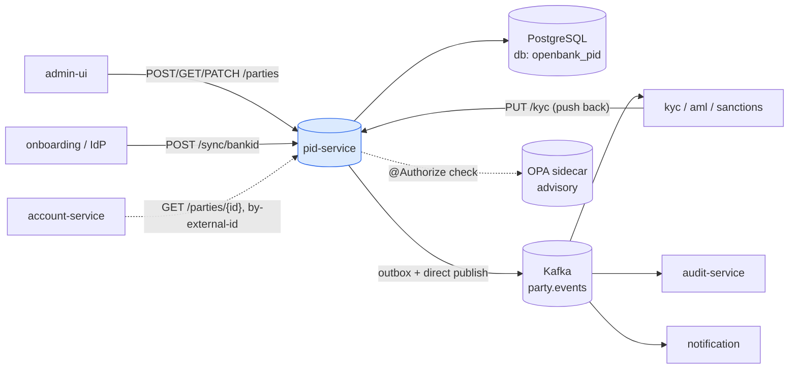
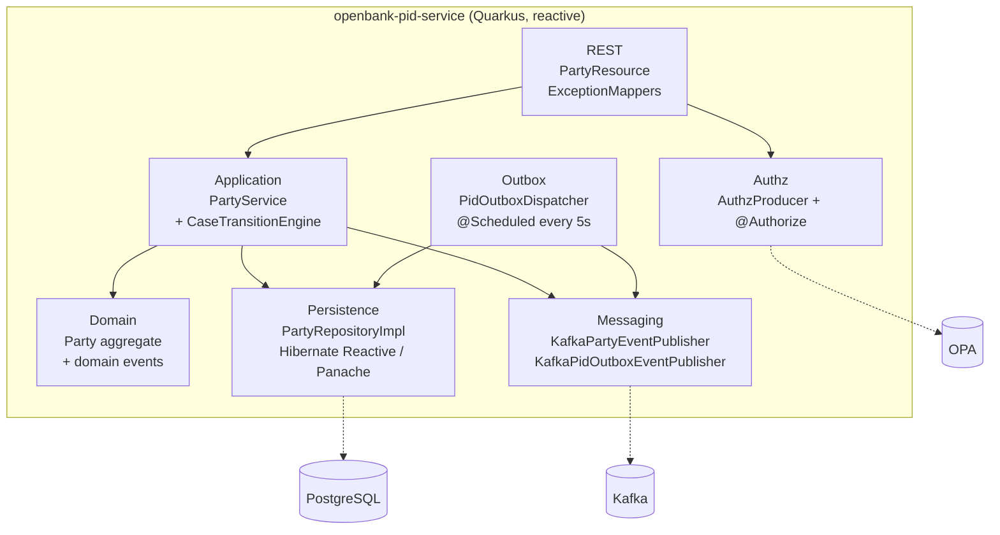
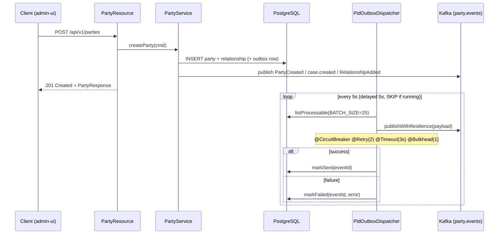

# Architecture

## C4 — System Context



## C4 — Container (internal structure)



## Hexagonal layers

The package structure reflects **ports-and-adapters** (ADR-0002):

```
com.openbank.pid/
├── domain/                     ◄── core — no framework dependencies
│   ├── model/                  Party, CoreAttributes, KycAttributes,
│   │                           ExternalId, PartyRelationship, PartyCaseLifecycle, enums
│   └── event/                  PartyCreated, PartyVerified, KycLevelChanged,
│                               PartyStatusChanged, RelationshipAdded/Terminated,
│                               AddressUpdatedFromRob, case.created/transitioned/evidence.linked
│
├── application/                ◄── use-case orchestration
│   ├── port/in/                CreatePartyUseCase, GetPartyUseCase, UpdatePartyUseCase,
│   │                           ManageRelationshipUseCase + command/query records
│   ├── port/out/               PartyRepositoryPort, PidOutboxPort, PartyEventPublisher,
│   │                           PidOutboxEventPublisher
│   └── usecase/                PartyService (implements all four inbound ports)
│
└── infrastructure/             ◄── adapters
    ├── rest/                   PartyResource (JAX-RS), dto/, ExceptionMappers
    ├── persistence/            PartyRepositoryImpl, PidOutboxRepositoryImpl, entity/
    ├── outbox/                 PidOutboxDispatcher (scheduled, fault-tolerant)
    ├── messaging/              Kafka producers
    └── authz/                  AuthzProducer (OPA wiring)
```

**Dependency rule:** `domain` ← `application` ← `infrastructure`. Domain code never sees Hibernate, Kafka, or REST DTOs. CI enforces zero framework imports in the domain layer.

## Domain model — the Party aggregate

`Party` is an immutable Kotlin `data class` (see `domain/model/Party.kt`). All mutations go through `PartyService`, which `.copy(...)`-es the aggregate, bumps `version`, persists, then publishes events. Notable behaviour:

- `hasRole(role)` / `isCustomer()` / `isEmployee()` — derived from active relationships.
- `externalId(type)` — resolve a single external identifier.
- `PartyCaseLifecycle` — embeds a `libs.domain.case` case; transitions are validated by `CaseTransitionEngine` which returns `Applied` (new status + timeline event) or `Rejected` (→ `InvalidPartyCaseTransitionException` → HTTP 400).

## Outbox + event flow

Two publication paths exist in the code:

1. **Direct domain-event publish** — `PartyService` calls `PartyEventPublisher` (`KafkaPartyEventPublisher`), which serializes `{eventType, aggregateId, occurredAt, payload}` and sends to channel `party-events-out` (topic `party.events`), keyed by `aggregateId`.
2. **Transactional outbox** — the `pid_outbox` table + `PidOutboxDispatcher` (a `@Scheduled(every = "5s")` job) reads processable rows and republishes them through `KafkaPidOutboxEventPublisher` (channel `pid-events-out`) with fault-tolerance annotations.



**Resilience:** the dispatcher wraps each publish with `@CircuitBreaker(requestVolumeThreshold=10, failureRatio=0.5, delay=5000ms, successThreshold=2)`, `@Retry(maxRetries=2, delay=200ms, jitter=100ms)`, `@Timeout(3000ms)`, `@Bulkhead(1)`. The scheduler swallows exceptions so it never crashes the loop. Delivery is at-least-once → consumers must be idempotent (events carry `aggregateId` keys for ordering).

## Key ports

| Port (interface) | Direction | Adapter |
|---|---|---|
| `CreatePartyUseCase` / `GetPartyUseCase` / `UpdatePartyUseCase` / `ManageRelationshipUseCase` | inbound | `PartyResource` → `PartyService` |
| `PartyRepositoryPort` | outbound | `PartyRepositoryImpl` (Hibernate Reactive / Panache) |
| `PidOutboxPort` | outbound | `PidOutboxRepositoryImpl` |
| `PartyEventPublisher` | outbound | `KafkaPartyEventPublisher` |
| `PidOutboxEventPublisher` | outbound | `KafkaPidOutboxEventPublisher` |

## Components from `openbank-libs`

| Module | Use here |
|---|---|
| `libs.domain.case.*` | `CaseTransitionEngine`, `CaseId`, `CaseStatus`, `CaseReasonCode`, `CaseType` — PID verification case lifecycle |
| `libs.domain.event.DomainEvent` | base class for all party events (aggregateId, eventType, version, occurredAt) |
| `libs.authz.@Authorize` | OPA-backed authorization on sensitive mutations (e.g. `changeStatus`) |
| `libs.api.error.ApiError` / `ErrorCode` | uniform error body |
| `libs.web.ServiceInfoResource` | `/api/v1/info` (build metadata) |
| `libs.docs.DocsResource` | **this documentation** at `/q/openbank/docs` |

## Principles

1. **Aggregate boundary = Party** — identity, KYC, addresses, contacts, and relationships are one consistency unit; optimistic locking via `version`.
2. **Immutable domain, events on every change** — `PartyService` recreates the aggregate and emits a domain event per transition.
3. **Stored, not computed, KYC/AML** — risk decisions are made upstream; pid-service persists the result and emits `KycLevelChanged` when the level actually changes.
4. **Explainable case lifecycle** — verification transitions are gated by `CaseTransitionEngine`, rejecting illegal moves at the domain layer.
5. **PII minimisation** — birth number is stored only as `birth_number_encrypted`; logs must mask personal data.
