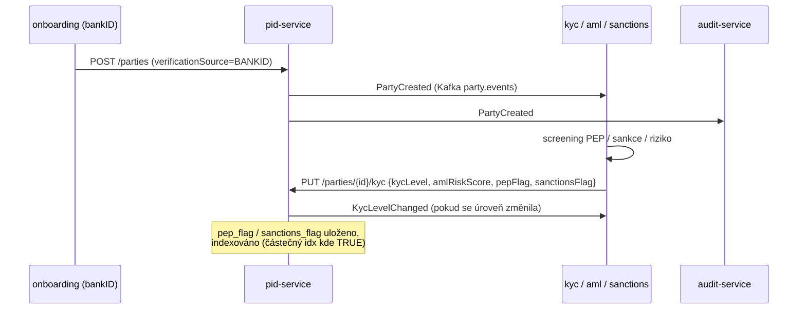

# Compliance

> pid-service je **identitní / referenční** služba (`dataClassification: restricted`, `evidenceExported: true`). **Není** v `rules.yaml: money_path_services`, takže nevyžaduje money-path bránu 2 schválení + threat-model — jako správce osobních a KYC/AML dat ale nese těžkou GDPR a AML stopu.

## Regulatorní rámec

| Regulace | Vztah ke službě | Implementace |
|---|---|---|
| **GDPR** (Nař. (EU) 2016/679) | Drží osobní data každého party (jméno, datum narození, rodné číslo, kontakty, adresa, národní ID) | přístup omezen rolemi; rodné číslo uloženo jen šifrovaně; 10letá AML retence; maskování PII v logu |
| **AMLD** (směrnice proti praní peněz, vč. AMLD 6) | Ukládá výsledek KYC/AML a CDD identifikátory | `kyc_level`, `aml_risk_score`, `pep_flag`, `sanctions_flag`, `ubo_verified_at`, `last_aml_review_at`; události `PartyVerified` / `KycLevelChanged` krmí AML pipeline; 10letá retence |
| **eIDAS** (Nař. (EU) 910/2014) + český bankID | Prokázání identity přes bankID (kvalifikovaná el. identifikace) | `verificationSource=BANKID`, externí id `BANKID_SUB`, `/sync/bankid` přijímá ověřené atributy |
| **Český AML zákon 253/2008 + ZoB** | Due diligence klienta, záznam dokladů | `party_id_documents`, zacházení s rodným číslem, datová schránka |
| **PSD2** (Nař. (EU) 2015/2366) | Identita podkládá SCA + consent rozhodnutí | identita party referencovaná `consent-service` / `sca-service`; bez přímého TPP přístupu zde |
| **DORA** (Nař. (EU) 2022/2554) | Provozní odolnost | health probes, fault-tolerant outbox dispatcher, audit události, SLO, runbooky |
| **NIS2** | Síťová a informační bezpečnost | OIDC autentizace, bezpečnostní hlavičky (CSP/HSTS), in-cluster mTLS, audit log |
| **České základní registry (ROB/ISZR, RUIAN)** | Autoritativní adresní / populační data | `/sync/rob`, externí id `ROB_AIFO`, `ruian_code` na adresách |

## Mapování GDPR

### Právní základ (čl. 6)

- **Smlouva** (čl. 6(1)(b)) — vedení identity klienta je nezbytné pro plnění bankovní smlouvy.
- **Právní povinnost** (čl. 6(1)(c)) — AML/CDD, retence dokladů, daňové/FATCA-CRS reportingy řídí identitní a KYC pole.

### Práva subjektu údajů

| Právo | Aplikace |
|---|---|
| Přístup (čl. 15) | `GET /api/v1/parties/{id}` vrátí záznam subjektu (šifrované rodné číslo se nevystavuje) |
| Oprava (čl. 16) | `PATCH /contact`, `/sync/bankid`, `/sync/rob` — vše audit-logováno přes události |
| Výmaz (čl. 17) | **Omezeno** — AMLD 6 (10 let po ukončení vztahu) přebíjí výmaz pro identitní/KYC data |
| Omezení (čl. 18) | `PATCH /status` → `SUSPENDED`; vztahy lze ukončit |
| Přenositelnost (čl. 20) | osobní data jsou strukturované JSON přes read API (dedikovaný export endpoint dnes není — TBD) |
| Námitka (čl. 21) | N/A (v této službě není marketing/profilování) |

### Zvláštní zacházení — rodné číslo

České rodné číslo je citlivý národní identifikátor. Ukládá se **pouze** jako `birth_number_encrypted` (`pgcrypto` k dispozici ve schématu), nikdy se neserializuje do `PartyResponse` a musí být maskováno v logu. Jde o nejsilnější PII kontrolu ve službě.

### Toky dat ven

- → **Kafka `party.events`** (stejný správce, intra-OpenBank): `PartyCreated`/`PartyVerified`/`KycLevelChanged`/… konzumováno kyc/aml, audit, notification. Payloady událostí nesou identitní/KYC pole — přenos v rámci stejného správce.
- → **account / platební služby** (REST, stejný správce): `partyId` + rozlišení externího id; minimální identitní plocha.
- Žádná data neopouštějí region EU/EHP (primárně Česká republika). bankID a ROB/ISZR jsou české národní systémy.

### Retence (čl. 5(1)(e))

| Záznam | Retence po skončení vztahu |
|---|---|
| Identita party + KYC/AML | 10 let (AMLD 6 čl. 40, český AML zákon) |
| Doklady totožnosti | dle retence AML zákona |
| řádky `pid_outbox` SENT | jen provozní, prunable |

## Mapování DORA (Nař. (EU) 2022/2554)

| Článek | Téma | Implementace |
|---|---|---|
| čl. 5/6 | Řízení ICT rizik | hexagonální izolace, centralizované `openbank-libs` |
| čl. 9 | Identifikace | `BuildInfo` (gitCommit, buildTime, version) v `/api/v1/info` |
| čl. 10 | Detekce | metriky Micrometer/Prometheus, OpenTelemetry trasy |
| čl. 11 | Reakce & obnova | fault-tolerant outbox (circuit breaker/retry/timeout), runbooky v `05-operations.md` |
| čl. 16 | Řízení incidentů | doménové události → audit-service (důkazy) |
| čl. 28 | Riziko třetích stran | bankID / ROB jsou regulované národní systémy, ne third-party SaaS; žádná externí SaaS závislost v této službě |

## Interakce AML / KYC

pid-service je **úložiště**, ne rozhodovací engine. Tok:

**Životní cyklus PID verifikačního případu** (`PATCH /case`, `CaseTransitionEngine`) dává compliance auditovatelný, vysvětlitelný záznam průběhu každé verifikace (OPEN → IN_REVIEW → APPROVED/REJECTED), s aktérem a reason code na každém přechodu (událost `case.transitioned`).

## Audit trail

Každá mutace vyšle doménovou událost do `party.events`; `audit-service` ji uloží (tamper-evident řetězec, zákonná retence). Události: `PartyCreated`, `PartyVerified`, `KycLevelChanged`, `PartyStatusChanged`, `RelationshipAdded/Terminated`, `AddressUpdatedFromRob`, `case.created/transitioned/evidence.linked`.

## Bezpečnostní kontroly

- ✅ AuthN: Keycloak OIDC, RS256 JWT
- ✅ AuthZ: Quarkus `@RolesAllowed` (employee/admin/customer) + OPA `@Authorize` na `changeStatus` (advisory → enforce, ADR-0034)
- ✅ Omezení self-service zákazníka: `openbank-customer` jen na `GET /{id}` a `PATCH /contact`
- ✅ Rodné číslo šifrované at-rest, nikdy nevracíno, maskováno v logu
- ✅ Unikátní `(id_type, id_value)` brání kolizi identity / duplicitnímu party
- ✅ Bezpečnostní hlavičky: CSP `default-src 'self'`, HSTS, X-Frame-Options DENY, nosniff, Referrer-Policy, Permissions-Policy
- ✅ Resilience: fault-tolerant outbox dispatcher (circuit breaker / retry / timeout / bulkhead)
- ✅ Tajemství: dev placeholdery (`CHANGE_ME_LOCAL_DEV_ONLY`) musí být v prod přepsány přes Vault
- ⚠️ Idempotence na mutacích: zatím bez cache `Idempotency-Key` (vytvoření deduplikováno na bankID `sub`) — evidované vylepšení
- ⚠️ Dedup přes blind-index rodného čísla (skutečné párování jeden člověk = jeden party): položka roadmapy, neimplementováno
- ⚠️ Drift `openapi.yaml` vs živý resource — evidovaný follow-up (viz [03 — API](./03-api.md))
