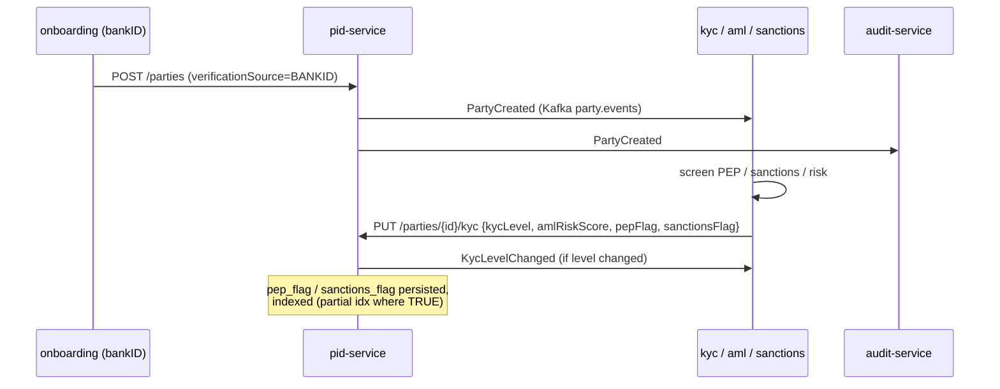

# Compliance

> pid-service is an **identity / reference-data** service (`dataClassification: restricted`, `evidenceExported: true`). It is **not** in `rules.yaml: money_path_services`, so it does not require the 2-approval + threat-model money-path gate — but as the custodian of personal and KYC/AML data it carries a heavy GDPR and AML footprint.

## Regulatory framework

| Regulation | Relation to this service | Implementation |
|---|---|---|
| **GDPR** (Reg. (EU) 2016/679) | Holds personal data of every party (name, birthdate, birth number, contacts, address, national IDs) | restricted access by role; birth number stored encrypted only; 10-year AML-driven retention; PII masking in logs |
| **AMLD** (Anti-Money-Laundering Directives, incl. AMLD 6) | Stores the KYC/AML outcome and CDD identifiers | `kyc_level`, `aml_risk_score`, `pep_flag`, `sanctions_flag`, `ubo_verified_at`, `last_aml_review_at`; `PartyVerified` / `KycLevelChanged` events feed the AML pipeline; 10-year retention |
| **eIDAS** (Reg. (EU) 910/2014) + Czech bankID | Identity proofing via bankID (qualified electronic identification) | `verificationSource=BANKID`, `BANKID_SUB` external id, `/sync/bankid` ingests verified attributes |
| **Czech AML Act 253/2008 + ZoB** | Customer due diligence, ID document capture | `party_id_documents`, birth number (rodné číslo) handling, data-box (datová schránka) |
| **PSD2** (Reg. (EU) 2015/2366) | Identity backs SCA + consent decisions | party identity referenced by `consent-service` / `sca-service`; no direct TPP access here |
| **DORA** (Reg. (EU) 2022/2554) | Operational resilience | health probes, fault-tolerant outbox dispatcher, audit events, SLO, runbooks |
| **NIS2** | Network & information security | OIDC auth, security headers (CSP/HSTS), in-cluster mTLS, audit log |
| **Czech basic registers (ROB/ISZR, RUIAN)** | Authoritative address / population data | `/sync/rob`, `ROB_AIFO` external id, `ruian_code` on addresses |

## GDPR mapping

### Lawful basis (Art. 6)

- **Contract** (Art. 6(1)(b)) — maintaining a customer's identity is necessary to perform the banking contract.
- **Legal obligation** (Art. 6(1)(c)) — AML/CDD, ID-document retention, tax/FATCA-CRS reporting drive the identity and KYC fields.

### Data subject rights

| Right | Application |
|---|---|
| Access (Art. 15) | `GET /api/v1/parties/{id}` returns the subject's record (encrypted birth number is not exposed) |
| Rectification (Art. 16) | `PATCH /contact`, `/sync/bankid`, `/sync/rob` — all audit-logged via events |
| Erasure (Art. 17) | **Restricted** — AMLD 6 (10 years after relationship termination) overrides erasure for identity/KYC data |
| Restriction (Art. 18) | `PATCH /status` → `SUSPENDED`; relationships can be terminated |
| Portability (Art. 20) | personal data is structured JSON via the read API (no dedicated export endpoint today — TBD) |
| Object (Art. 21) | N/A (no marketing/profiling processing in this service) |

### Special handling — birth number (rodné číslo)

The Czech birth number is a sensitive national identifier. It is stored **only** as `birth_number_encrypted` (`pgcrypto` available in the schema), is never serialized into `PartyResponse`, and must be masked in logs. This is the strongest PII control in the service.

### Data flows out

- → **Kafka `party.events`** (same controller, intra-OpenBank): `PartyCreated`/`PartyVerified`/`KycLevelChanged`/… consumed by kyc/aml, audit, notification. Event payloads carry identity/KYC fields — same-controller transfer.
- → **account / payment services** (REST, same controller): `partyId` + external-id resolution; minimal identity surface.
- No data leaves the EU/EEA region (Czech Republic primary). bankID and ROB/ISZR are Czech national systems.

### Retention (Art. 5(1)(e))

| Record | Retention after relationship end |
|---|---|
| Party identity + KYC/AML | 10 years (AMLD 6 Art. 40, Czech AML Act) |
| ID documents | per AML Act retention |
| `pid_outbox` SENT rows | operational only, prunable |

## DORA mapping (Reg. (EU) 2022/2554)

| Article | Topic | Implementation |
|---|---|---|
| Art. 5/6 | ICT risk management | hexagonal isolation, centralized `openbank-libs` |
| Art. 9 | Identification | `BuildInfo` (gitCommit, buildTime, version) in `/api/v1/info` |
| Art. 10 | Detection | Micrometer/Prometheus metrics, OpenTelemetry traces |
| Art. 11 | Response & recovery | fault-tolerant outbox (circuit breaker/retry/timeout), runbooks in `05-operations.md` |
| Art. 16 | Incident management | domain events → audit-service (evidence) |
| Art. 28 | Third-party risk | bankID / ROB are regulated national systems, not third-party SaaS; no external SaaS dependency in this service |

## AML / KYC interaction

pid-service is the **store**, not the decision engine. The flow:

The **PID verification case lifecycle** (`PATCH /case`, `CaseTransitionEngine`) gives compliance an auditable, explainable record of each verification's progress (OPEN → IN_REVIEW → APPROVED/REJECTED), with actor and reason code on every transition (`case.transitioned` event).

## Audit trail

Every mutation emits a domain event to `party.events`; `audit-service` persists it (tamper-evident chain, statutory retention). Events: `PartyCreated`, `PartyVerified`, `KycLevelChanged`, `PartyStatusChanged`, `RelationshipAdded/Terminated`, `AddressUpdatedFromRob`, `case.created/transitioned/evidence.linked`.

## Security controls

- ✅ AuthN: Keycloak OIDC, RS256 JWT
- ✅ AuthZ: Quarkus `@RolesAllowed` (employee/admin/customer) + OPA `@Authorize` on `changeStatus` (advisory → enforce, ADR-0034)
- ✅ Customer self-service scoping: `openbank-customer` limited to `GET /{id}` and `PATCH /contact`
- ✅ Birth number encrypted at rest, never returned, masked in logs
- ✅ Unique `(id_type, id_value)` prevents identity-collision / duplicate-party
- ✅ Security headers: CSP `default-src 'self'`, HSTS, X-Frame-Options DENY, nosniff, Referrer-Policy, Permissions-Policy
- ✅ Resilience: fault-tolerant outbox dispatcher (circuit breaker / retry / timeout / bulkhead)
- ✅ Secrets: dev placeholders (`CHANGE_ME_LOCAL_DEV_ONLY`) must be overridden via Vault in prod
- ⚠️ Idempotency on mutations: no `Idempotency-Key` cache yet (creation deduplicated on bankID `sub`) — tracked enhancement
- ⚠️ Birth-number blind-index dedup (true one-person = one-party matching): roadmap item, not implemented
- ⚠️ `openapi.yaml` drift vs the live resource — tracked follow-up (see [03 — API](./03-api.md))
